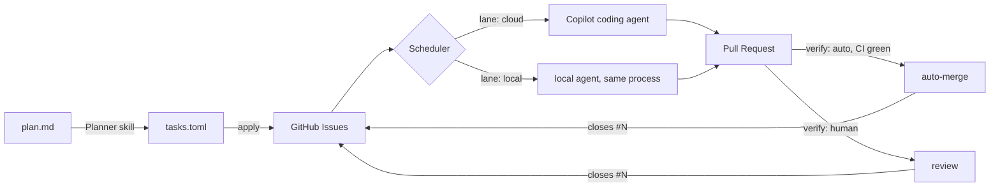

# Context

Agentic coding is really good at doing tasks with clear boundaries. So the daily routine of a developer becomes more and more like project management, where tasks are broken into smaller sub-tasks, and these sub-tasks are dispatched, tracked, reviewed and completed manually.

To make it more efficient, an automated pipeline can be established to handle the dispatch, tracking, and completion of these sub-tasks, reducing the manual overhead and improving overall productivity.

## Current GitHub Utilities

- **GitHub Actions**: Automates workflows for CI/CD, testing, and deployment.
- **GitHub Projects**: Provides project management features like task boards, issue tracking, and automation for organizing and prioritizing work.
- **GitHub Issues**: Allows for tracking tasks, bugs, and feature requests, with support for labels, milestones, and assignees to manage workflow efficiently.

## What we need

- A skill to create GitHub Issues for the sub tasks defined in a plan, carrying their dependencies
  with them.
- A dispatcher that could assign dependency-resolved sub-tasks to the appropriate coding agents automatically: cloud agents, local agents.

---

# Technical Design

## Overview

Three pieces, each with a single responsibility:

| Piece         | Where                                                           | Responsibility                                                                |
| ------------- | --------------------------------------------------------------- | ----------------------------------------------------------------------------- |
| **Planner**   | `.agents/skills/task-dispatch/SKILL.md`                         | Plan markdown → task graph file → GitHub Issues (one-shot, human-reviewed)    |
| **Scheduler** | `src/dispatchkit/`, run locally by `dispatchkit watch`          | Recompute the ready set from issue state; assign ready tasks to an agent lane |
| **Runners**   | Copilot coding agent (cloud) / local agent, in the same process | Execute one issue, open a PR that closes it                                   |

GitHub is the only state store — no external DB, and no board either. The issues _are_ the state:
open or closed, assigned or not, labelled, with their task definition in the body. Everything the
scheduler needs is recomputed from them on every pass.



## Scope

The scope is deliberately small: **one local process, and nothing on GitHub that schedules.**
`dispatchkit watch` watches the graph file, polls GitHub, resolves readiness, dispatches, and runs
the local lane itself. No workflow, no cron, no daemon, no second party — which is what makes the
question it exists to answer answerable at all: does one local agent plus several remote agents
actually reduce project overhead on a real plan?

`lane` is untouched by this. It is decided in the planning phase and recorded on GitHub — in the
machine block and mirrored by a `lane:*` label — because it describes **where the runner runs**,
not where the scheduler runs. Collapsing the scheduler into one process is not an argument for
collapsing the lanes, and conflating the two is the mistake this section exists to prevent.

Everything a distributed version would need — an agent registry, discovery, liveness, a scheduler
somewhere other than here — is out of scope, and is not designed, planned or scheduled. If this
loop works, it may never be wanted; if it does not work, it would have been built for a thing that
did not pay. Either way the cost of designing it now is paid before the question is answered.

## Planner: deriving the graph

Decomposition quality decides everything downstream — an over-split plan drowns in per-task
overhead, an under-split one runs serially and buys nothing. Neither is fixed by asking a model
for "the right number of subtasks", so the planner is grounded in rules that are checkable
instead.

### From requirements to milestones

**No acceptance criterion, no plan.** A requirement is only plannable once it can be stated as a
command with a binary exit code. If that command can't be written yet, the requirement goes back
for sharpening rather than into a graph. This is the same discipline as
[implementation_plan.md](implementation_plan.md)'s "every milestone ends in one command with a
binary exit code", and it is what later makes `verify: auto` possible at all.

From there:

- **A milestone is one acceptance criterion flipping red to green.** Each milestone names the
  AC(s) it turns. A milestone that turns none is scaffolding — permitted, but it must say which
  later AC it unblocks.
- **Verifiers land before the code they guard**, and are observed failing first. A gate that has
  never been seen to fail proves nothing, and auto-merge is only safe on gates that have.
- Existing plans are the calibration fixtures. [refactor_requirements.md](refactor_requirements.md)
  (R1–R8, AC1–AC10) and its M0–M9 execution plan are fed to the planner as worked examples, not
  described in prose.

### Milestone is not task

A **milestone is a verification checkpoint**; a **task is a dispatch unit**. Keeping them as two
layers is what allows a legible proof narrative _and_ a wide dispatch graph at the same time —
one milestone may fan out into five parallel tasks, and three tiny serial milestones may collapse
into one task. Conflating them forces a choice between the two.

### When a task boundary is justified

Tasks are the unit of routing and verification, not of work. A boundary between two adjacent
pieces of work must earn itself on at least one of:

1. **Parallelism** — they can run concurrently, widening the graph
2. **Routing** — different `requires`/lane, so a different runner is needed
3. **Verification** — different `verify` or `spend`, so a different gate is needed
4. **Size** — merged, they would not fit one cloud agent session
5. **Revertability** — they should be independently revertable

If none applies, merge them. The cost model behind the rule is blunt: makespan is roughly
critical-path length × (work + overhead), where overhead — issue, agent boot, clone, install, CI,
merge queue — is fixed and far from free. Splitting one node into two **parallel** nodes shortens
the schedule; splitting it into two **serial** nodes lengthens it by exactly one overhead and buys
nothing. Hence the flat rule: **never split a serial chain.**

### Manufacturing parallelism

Width is designed, not discovered. The reliable move is **interface-first**: land the shared
contract as one small task, then fan out implementations that depend on it and not on each other.
The layering already gives the seams — `application/ports.py` first, then every adapter in
`infrastructure/adapters/` in parallel with disjoint `touches`.

The counterpart is the `for` field on every dependency edge. Ordering things by narrative
plausibility rather than data dependency is the most common decomposition error, and it silently
serialises the graph. Requiring each edge to name the artifact, interface, or file it waits on
makes spurious edges visible; every one deleted widens the graph.

### Structural lints

`validate` computes and reports, so the review gate is quantitative rather than a vibe check:

| Signal                                         | Meaning                                |
| ---------------------------------------------- | -------------------------------------- |
| `count == 1`                                   | No decomposition happened              |
| `width == 1` (max antichain)                   | A chain wearing a graph's clothes      |
| `depth` close to `count`                       | Mostly serial; look for spurious edges |
| Serial pair, no other dependents, same routing | Merge candidate                        |

Every one of these is computed from the graph. Nothing here asks the planner to estimate how long
a task will take: the economic floor is real, but it is measured after the fact rather than
guessed before it — see
[The economic floor is measured, not estimated](#the-economic-floor-is-measured-not-estimated).

These are warnings, not hard errors — the human ratifies the graph anyway, and the point is to
make that ratification informed. Alongside them the planner emits the plan's shape:
`12 tasks, depth 4, width 5, 3 human-verify, est. 2 review sessions`.

### Calibration from outcomes

Dispatch history is the feedback loop, and the two failure modes have distinct signatures:

| Too coarse                      | Too fine                          |
| ------------------------------- | --------------------------------- |
| Tasks hit the agent session cap | Overhead dominates wall-clock     |
| High `Attempts`, large diffs    | Many trivial PRs                  |
| Scope drift against `touches`   | High depth, low width             |
| —                               | Merge-queue churn on shared files |

"Share of tasks hitting the session cap" is the single most useful dial: it measures the ceiling
directly. Once enough history exists, a calibration summary is folded back into the planner skill
so later plans are sized against observed behaviour rather than a guess.

**The economic floor lives here, not in the lints.** Both of its terms are already in the issue
timeline, derivable exactly the way `Attempts` is: overhead is dispatch to first commit plus CI
duration, work is dispatch to close. A finished plan can therefore report what a guess never
could — _9 of 12 tasks completed inside 2× their own dispatch overhead_ — with no schema key, no
planner input, and nothing stored. It is retrospective, so it improves the next plan rather than
gating this one.

None of this makes the planner correct. It makes it auditable and self-correcting — which is the
achievable bar, and the reason the human ratification gate stays.

## Task graph format

The planner's intermediate artifact, committed under `docs/plans/<plan>.tasks.toml`. It is the
reviewable unit: a human edits this, not the issues.

```toml
plan = "refactor"
doc  = "docs/plans/refactor.md"    # the plan this graph came from: context, never contract

[[task]]
id        = "m5a-values"          # stable slug, unique per plan
title     = "Value objects for ClipId/Duration"
milestone = "M5a"                 # the verification checkpoint this serves
lane      = "cloud"               # cloud | local — planner proposes, human ratifies
requires  = []                    # capability tags the runner must provide
verify    = "auto"                # auto | human — governs merge, default human
spend     = false                 # true → needs `spend:approved` before dispatch
touches   = ["src/podkit/domain/**"]     # advisory file scope — see conflicts
acceptance = "uv run pytest -m unit && uv run lint-imports"
body_file = "docs/plans/m5a-values.md"   # the task's own spec — see the body contract

# every edge names the artifact it waits on — unjustifiable edges get deleted
depends = [{ on = "m2-cassette", for = "CassetteStore.get() signature" }]
```

Invariants checked before anything is pushed: unique ids, every `depends` resolves, the graph
is acyclic (Kahn's algorithm; a cycle is a hard error naming the cycle), every edge carries a
non-empty `for`, and `acceptance` is non-empty. `id` is the idempotency key — re-running `apply`
updates the existing issue rather than creating a second one.

`lane` and `verify` are both **planner proposals**. The planner emits its best guess with a
one-line rationale in a `# why:` comment; neither takes effect until a human has reviewed and
merged the graph file. This is the single human gate in the whole pipeline, and it is placed
here deliberately — reviewing one table of routing decisions up front is cheap, whereas
reviewing every PR afterwards is the bottleneck we are trying to remove. The `requires` tags
make that review checkable rather than a matter of opinion: the validator rejects
`lane = "cloud"` on any task whose `requires` the cloud lane cannot satisfy.

## GitHub representation

- **Issue** — one per task. Body ends with a fenced machine block so the scheduler never has to
  parse prose:

  ```yaml
  <!-- dispatchkit
  v: 1
  id: m5a-values
  plan: refactor
  milestone: M5a
  lane: cloud
  requires: []
  verify: auto
  spend: false
  depends: [m2-cassette]
  touches: ["src/podkit/domain/**"]
  -->
  ```

  Labels mirror it for cheap filtering: `dispatchkit`, `plan:refactor`, `lane:cloud`,
  `verify:auto`.

  Above the block, the body is the task's **contract**: goal, what it unblocks, the non-obvious
  constraints, the definition of done, and a pointer to the plan document for background. It never
  restates the plan and never repeats what the block already holds. See
  [The body is the contract, the plan is context](#the-body-is-the-contract-the-plan-is-context).

- **No Project board.** Status is derived on every pass and printed; it is never written anywhere.
  `Blocked`, `Ready`, `Dispatched`, `In Review`, `Auto-merging`, `Done`, `Stuck` and `Cancelled`
  are names for what the issues already say, so storing them would be storing a copy of a
  computation. See [The board was the only stale artifact](#the-board-was-the-only-stale-artifact).

- **Dependency edges** live only in the machine block. GitHub's native "blocked by" links are
  intentionally not used: they are not exposed uniformly across REST/GraphQL and cannot be
  round-tripped from a committed file.

## Scheduler

A single idempotent pass, safe to run repeatedly:

1. **Load** — one GraphQL query pulls all `label:dispatchkit` issues with state, assignees and
   linked PRs.
2. **Resolve** — a task is _ready_ iff it is open, unassigned, and every id in `depends` maps to
   a closed issue. Everything else is `Blocked`.
3. **Report** — print the derived status of every task, not just the ones being dispatched, so an
   idle pass explains itself.
4. **Admit** — pool every plan in the repository, take ready tasks in issue-number order, subject
   to per-lane concurrency caps (`cloud: 3`, `local: 1` by default, configurable in
   `.github/dispatchkit.toml`) and the file-scope exclusion below. The caps bound review load and
   machine load, both of which belong to the repository rather than to any one plan, so they are
   counted across all of them.
5. **Dispatch** — per lane, below.

Dispatch is the only mutating step, and it is guarded by assignment: assigning the issue _is_
the lock. Two concurrent scheduler runs converge because step 2 re-reads assignees, and a
double-assign attempt is a no-op.

### Lane routing

Lanes differ by **runner capability**, not by subject matter or by cost. A cloud coding agent is
an ephemeral, sandboxed, time-boxed container; the local lane is a real workstation. That is the
whole distinction:

| Constraint         | cloud (hosted coding agent)        | local (dev workstation)                |
| ------------------ | ---------------------------------- | -------------------------------------- |
| Session wall-clock | hard cap around an hour            | unbounded                              |
| OS                 | ephemeral Linux container          | whatever the workstation runs          |
| Network            | firewall allowlist, no free egress | unrestricted                           |
| Filesystem         | fresh clone, no host state         | full tree, caches, large local data    |
| Hardware           | no GPU, no peripherals             | GPU, audio/video devices, peripherals  |
| Secrets            | only what the platform injects     | the workstation's own credential store |

A task declares what it needs as `requires` tags — `long-run`, `os:macos`, `os:windows`, `gpu`,
`device`, `net:unrestricted`, `local-data`. The routing rule is one line:

> A task may run in the cloud lane iff its `requires` is empty. Any tag that no cloud runner
> advertises forces `local`.

Stating it as capabilities rather than as a hand-maintained list of "local-ish work" is what
keeps this general: a runner advertising `gpu` or `os:macos` would slot in by changing no task
definitions.

There is deliberately no `interactive` tag. Both of this system's human touchpoints — reviewing
the graph and reviewing the pull request — are asynchronous, and a task that needs someone at the
keyboard while it runs would introduce a synchronous one. Such a task is not a dispatch unit at
all; it is an ad-hoc session, and it should be held outside this product.

Dispatch per lane:

- **cloud** — assign the issue to the coding agent via the GraphQL `replaceActorsForAssignable`
  mutation. The agent opens a draft PR; CI is the gate.
- **local** — label the issue `dispatch:local`; the executor picks it up on its own schedule
  (see [Local lane execution](#local-lane-execution)). The label stands in for an assignee, so
  in-flight local work is recorded on GitHub even though it never leaves the machine.

### Spend is orthogonal to lane

Cost is a separate axis. A cloud task can burn paid API credits and a local task can be free, so
`spend` is its own flag rather than a reason to route somewhere. When `spend = true`, **either**
lane refuses to dispatch until a human adds the `spend:approved` label. Conflating the two would
mean either that paid work is stuck on one machine or that free work inherits an approval gate
it doesn't need.

### Triggers

The pass is driven by `dispatchkit watch`, a foreground process on the workstation. Two clocks,
for two sources of change:

- **The graph file** is local, so it is watched, and a save re-validates and re-plans immediately.
- **GitHub** offers nothing to subscribe to from a laptop, so it is polled on an interval.
  Backing off while nothing changes and tightening while work is in flight keeps a pass well
  inside the rate limit; a keypress forces one, for the moment you have just merged something
  yourself and do not want to wait out the interval.

Because the pass is idempotent, an extra run costs one API round trip and changes nothing — which
is what makes both a hair-trigger watcher and a manual nudge safe.

There is no cron and no workflow. See [The scheduler moves into the local process](#the-scheduler-moves-into-the-local-process).

## Parallel work and file conflicts

Non-overlapping file scope is **not** a hard requirement, and trying to make it one would be a
mistake. File sets can't be known accurately before an agent starts work, so a declared scope is
either over-broad (serialising everything and destroying the parallelism we're buying) or
under-broad (giving false confidence). Worse, the granularity is wrong in both directions: two
tasks can edit different functions in one file and merge cleanly, while two tasks in entirely
separate files can still conflict semantically when one renames a symbol the other calls.

So conflicts are handled in four layers, weakest and cheapest first:

1. **Decomposition (primary).** `depends` is the real conflict-avoidance lever, not just logical
   ordering. If two tasks would rewrite the same module, the planner should chain them instead of
   letting them race. Reviewing that is part of the graph review gate.
2. **Advisory exclusion (scheduling hint).** `touches` holds glob patterns. Admission skips a
   ready task whose `touches` intersects that of any already-`Dispatched` task; it waits for the
   next pass. Cheap, and it degrades gracefully — worst case is extra serialisation, never a bad
   merge. Omitting `touches` means "unknown scope", which excludes nothing.
3. **Merge queue (authoritative).** Required-up-to-date branch protection plus a GitHub merge
   queue means every PR is rebased onto the tip and re-tested in order before it lands. A textual
   conflict becomes a mechanical failure; a semantic conflict becomes a red test. This is the
   layer that actually guarantees correctness, and it is why layer 2 can stay advisory.
4. **Scope drift report.** After a PR opens, the scheduler diffs its changed files against the
   declared `touches` and reports the difference. It does **not** withhold the merge: a file list
   predicted before the work began cannot hold merge authority, and trying it produced a green
   pull request that was refused for ever — see [D9.2](#d92--the-scope-check-gives-back-the-authority-it-should-never-have-had).
   What the report is for is layer 2: the exclusion admitted the task on a declaration reality has
   contradicted, and only the author can fix the graph. Over time this also tells us which planner
   decompositions were wrong — which is why the agent is not told its `touches` in the first
   place. Drift is only evidence about the decomposition while nobody has shown the subject the
   probe.

A PR that can't be rebased cleanly is returned to the agent as a normal failure: comment,
unassign — which spends an attempt, because the timeline records the dispatch — and after the
retry budget it lands in `dispatch:stuck` for a human.

## Local lane execution

The `local` lane exists because a workstation provides capabilities the cloud sandbox does not —
time beyond the session cap, a specific OS, a GPU, unrestricted network, local data. It is a
**capability escape hatch, not a throughput mechanism**: parallelism is the cloud lane's job, and
it is better at it in every respect. One local task runs at a time, and that is a rule rather than
a default — see [One local task, and one dispatcher](#one-local-task-and-one-dispatcher).

**Two components in one process.** The executor is deployed with the scheduler and is logically
separate from it. The scheduler emits `dispatch:local` and moves on; the executor discovers work
by reading issue state, exactly as a cloud agent does. They share no queue and no memory, so a
long local task cannot hold up a pass, and the executor never holds information the next pass
could not recompute.

**Marking.** A local task has no assignee to take, so `dispatch:local` stands in for one, and the
resolver already treats it exactly as it treats assignment. It is not a lock — one dispatcher
means there is nothing to lock against — it is what makes in-flight local work legible on GitHub
and keeps the two lanes symmetric.

**Isolation.** Each task runs in its own `git worktree` under
`~/.dispatchkit/work/<plan>/<task-id>` on a branch fetched from `origin/main`, removed on success
and retained on failure for inspection. The worktree isolates the repository and deliberately
nothing else: the machine is what the task came here for. The child process gets an explicit
environment allowlist, so the `gh` credential is not in scope for agent-authored `acceptance`
commands.

**The executor owns everything but the change.** It fetches, creates the branch, creates the
worktree, builds the prompt from the issue's prose, invokes the agent, runs `acceptance`, pushes,
and opens the pull request. The agent is handed a prepared, disposable tree and asked to do
exactly one thing. `Closes #N` in particular is written by the executor and never left to a prompt
— an agent that forgot it would merge a pull request while leaving the issue open, stalling every
dependent with no error anywhere.

The machine block is not part of that prompt. `depends`, `touches`, `verify` and `spend` are
scheduling inputs the agent cannot act on, and one of them actively misleads — see
[Constrain the outcome, not the route](#constrain-the-outcome-not-the-route).

The runner itself is named in `.github/dispatchkit.toml` as an argv template with a closed set of
substitutions and an allowlist of model names; a task may override `model` or `effort` from the
graph, validated against that allowlist at `validate` time. Substitution replaces a whole argv
element and never splits one, so there is no path back to a shell.

**Built (D6.4): recovery preserves, then releases, then discards — and never another order.**
Removing the worktree before the push destroys the thing being preserved, so a failed push keeps
its tree: it is then the only copy left. The mark still comes off, because one bad push must not
strand a task for ever, which is the entire class of bug recovery exists to end. Commits are
pushed even for a *closed* task, since a branch costs nothing and silently deleting somebody's
work does not; the comment is not, because a closed task closed when its pull request merged and
there is nothing true left to say on it.

**And recovery is scoped, not swept, before a run.** It runs at startup and again before every
run — one function, two callers — because a retained failure sits at `<plan>/<id>`, which is not
attempt-scoped, so `git worktree add` would fail on the retry. But the *second* call sweeps only
that task's own leftovers. A full sweep there would find the mark the scheduler set moments
earlier, see no worktree behind it, call it abandoned and release it, and the lane would mark and
unmark for ever without running anything. Startup is the only moment at which "every mark is
abandoned" is true, because that is the only moment at which nothing is ours.

**Built (D6.5): the thread is a worker, not a place decisions live.** `watch --local` runs the
dispatcher in the same process on a daemon thread, and the pass asks it exactly one question — is
it still going? Every other fact is re-derived from GitHub each pass, so a restart loses the run
and nothing else, and recovery is what turns a lost run back into a queued task. Ctrl-C therefore
needs to be no more graceful than killing the process: the mark stays on the issue and the next
startup sweep releases it.

One wrinkle the tests found. The dispatcher reads the items the pass just resolved, and those were
read *before* the pass wrote its mark — so a `watch --once --local` would have marked a task and
then found nothing to run. The plan carries the refs it marked alongside them, which keeps the
handoff explicit rather than papering over it with a second fetch.

**Serving the lane and admitting to it are one switch.** D6.0 refuses a lane nothing runs; turning
the executor on is exactly what makes that refusal wrong. `served_lanes(dispatcher)` is the only
place that decides, so the two cannot disagree. `doctor --local` asks the remaining question one
step earlier — is `argv[0]` actually installed — because finding that out when a task is already
marked costs a dispatch and a comment on somebody's issue. It is opt-in: an adopter who never uses
the lane has no runner and is not unhealthy for it, and a check that is red for everybody is a
check nobody reads.

**Three defects found by running it, none of which a test would have caught unprompted.** The
whole of D6 was built test-first against fakes, and the fakes were faithful to the design rather
than to `git`, which is exactly the gap an end-to-end run exists to close.

*`git worktree list` reports the canonical path.* On macOS `/tmp` is a symlink to `/private/tmp`,
so a worktree created at one is listed at the other and the literal string match found nothing.
Recovery therefore saw an empty machine: retained worktrees were never cleared, and every retry
would then have failed on `git worktree add` with the path already in use.

*`--porcelain` does not report commit counts*, so every recovered worktree looked empty — and
recovery would have discarded the commits it exists to preserve, silently, with no error anywhere.
The count is now a second command per worktree, which is the price of the only question recovery
asks.

*A failed `git worktree add` was swallowed.* A leftover branch from a killed run makes it fail, and
dropping the result launched the agent into a directory that did not exist, so the issue was told
`[Errno 2] No such file or directory` — true, and useless to whoever reads it. The port returns
the result now, and the run stops at a `worktree` stage that names git's own message.

**Recovering its own work.** Startup reconciles from the local disk outward. A worktree holding
commits has its branch pushed and referenced in a comment on the issue; a worktree holding none is
discarded; either way the mark comes off and the task returns to the ready set, where the next
pass re-marks it and starts a clean run. A marked issue with no worktree is released too — with a
single dispatcher, a mark this process cannot account for is by definition abandoned. There is no
adoption, no heartbeat and no reclaim timeout; a hung run is killed by its own supervisor, which
needs no help from GitHub.

**One at a time, enforced.** A pid lockfile under `~/.dispatchkit/` refuses a second `watch` on
the same repository and names the process already holding it, because two of them would both mark
and both run with no error anywhere. *Built (D6.4):* the lockfile is held for the whole
loop rather than per pass, since the window between passes is exactly when the second process
would slip in, and a lockfile whose process is gone is taken over rather than obeyed — refusing
for ever on a stale number would need a human to delete a file they were never told existed.

**Built (D6.1): the runner is a list, and substitution cannot change its length.** The template
lives in `.github/dispatchkit.toml` as an argv list, and the property tested is arithmetic rather
than a filter: `n` template elements produce exactly `n` arguments, whatever a substituted value
contains. A prompt holding `; rm -rf /` is one argument that happens to have a semicolon in it,
because nothing downstream parses it again. That is what makes it safe to let a graph file — an
agent-authorable file — name a model at all.

Two smaller rules fell out while building it. A placeholder with no value is an **error**, not an
empty string: dropping the element changes the argument count and an empty one is a different
command from the one written, and neither is ours to choose. And `runner.argv` given as a *string*
is refused by type rather than split on whitespace, because that spelling is the one path back to
a shell.

**Built (D6.2/D6.3): the executor owns everything except the change itself.** It fetches,
branches, makes the worktree, builds the prompt, invokes the agent, runs `acceptance`, pushes and
opens the pull request; the agent is handed a prepared, disposable tree and asked to do one thing.
Three orderings carry the design rather than merely implementing it.

*`acceptance` runs before the pull request is opened.* A pull request is a claim that the work is
done, and for `verify: auto` the next pass merges it. Opening one and letting CI find out would be
true only when CI happens to run the same command, which is precisely the assumption
`acceptance-not-in-ci` exists to refuse.

*The push happens in the parent, never the child.* This is not a rule anybody has to remember: the
allowlist omits `SSH_AUTH_SOCK` and every credential marker, so the child physically cannot reach a
remote. The separation falls out of the environment rather than being enforced on top of it.

*`Closes #N` is written by the executor and never asked of the agent.* An agent that forgot it
would merge a pull request while leaving the issue open, stalling every dependent with no error
anywhere — a silent failure in the one place the whole system reads state from.

**The prompt is the issue's prose, with the machine block cut out.** `depends`, `touches`,
`verify` and `spend` are scheduling inputs the agent cannot act on, and one of them actively
misleads: `touches` is an advisory exclusion hint, not a permission boundary, so handing it over
invites an agent to treat a scheduling guess as a constraint on its work. `acceptance` is the
exception — it goes to the agent because it is the definition of done, and it is read back out of
the body prose rather than the block, since that is where `apply` writes it and where a human
reviewer reads it. That parse is deliberately the narrowest one that works: find the heading, take
the first fenced block, accept nothing else. A body with no acceptance in it does not run at all,
because nothing could then decide whether the task was finished.

**A failed run keeps its worktree and pushes whatever it committed — as evidence, not state.** A
human may read that branch; nothing in the system ever does. Resuming a dead agent's run is not
reliably possible, so the retry starts clean, which is also what keeps the retry budget honest.
The branch carries the attempt number for the same reason: a second run would otherwise force-push
over the only thing the first one produced.

**Found while building it: a local dispatch was charged no attempt at all.** `attempts` derives
from `ASSIGNED_EVENT`s, because a cloud dispatch *is* an assignment. Nobody is assigned to a local
task — it is marked — so the count stayed at zero, `dispatch:stuck` was never reached, and a task
that could never pass would have been retried for ever. The mark is the event, so
`_parse_dispatches` now folds `dispatch:local` labellings into the same ordered sequence: one
budget, spent by either lane, still ordered so the hold discount can pair each dispatch with the
one that superseded it.

**A second adapter, and the reason there is one.** `gh_cli.py` was the only module allowed to
shell out. `workstation_cli.py` is the second, and it exists because it runs a *different kind* of
child: `gh` is ours, whereas the agent is the thing being supervised — trimmed environment, no
credential, killed by the clock rather than trusted to stop. A timeout is returned as a result
rather than raised, because the caller has to report it and take the mark off either way; losing
the run to a traceback would leave the task claimed for ever.

**The environment allowlist has a floor an adopter may extend but not breach.** The child gets
`PATH`, `HOME`, `LANG`, `LC_ALL`, `TERM`, `TMPDIR`, `SHELL`, `USER`, `LOGNAME` and whatever
`runner.env` adds — except that a name matching a credential marker (`TOKEN`, `SECRET`, `KEY`,
`PASSWORD`, `CREDENTIAL`, `AUTH`, `COOKIE`, `SESSION`) is **refused at load**. An allowlist that
can be told to allow the token is not an allowlist, and this config file is as editable by a pull
request as any other file in the tree.

`SSH_AUTH_SOCK` is absent deliberately, and it is the load-bearing omission: with no agent socket
the child cannot authenticate to a remote at all, which forces the executor to push from the
**parent** through `gh`. The credential and the untrusted command never share a process, and that
falls out of the allowlist rather than having to be remembered.

**The shipped template passes the prompt as text, not as a path.** The first draft used
`{prompt_file}` against `copilot -p`, which takes the prompt *itself* — it would have run whatever
the filename happened to say. Both substitutions exist, because a CLI that reads a file is
equally plausible; the default matches the CLI it names. The template is written out in full in
the config rather than left implicit, since it is the one default that executes something, and an
adopter should not have to read our source to learn what `lane = "local"` starts on their machine.

**Found before D6 was built: marking for an absent executor is worse than doing nothing.** The
dispatcher labelled a ready `lane: local` task `dispatch:local` and moved on, on the two-component
reasoning above — the executor discovers work by reading issue state, so the label *is* the
handover. With no executor deployed, that handover went nowhere, and the mark is a claim: the task
reported `Dispatched` for ever. The stall timeout could not reclaim it, because that timeout asks
whether an *assignment* produced a pull request and there was no assignee. So a graph stopped, and
every part of the report agreed it was healthy.

Two consequences beyond the one task, both silent. It held the only `caps.local` slot, so every
other local task deferred on `lane-cap` in perpetuity. And because admission is also where file
scope is claimed, it went on excluding overlapping **cloud** tasks on `file-scope-conflict` —
a task that does not exist blocking one that could have run.

The fix is a `SERVED_LANES` constant naming the lanes the running build can hand work to, checked
in `_gate` as the *first* gate. First, because every gate below it describes a queue this task is
not in: `lane-cap` would send the reader off to raise a cap that would change nothing. Refusing at
admission rather than at the dispatch is the part that matters — a task admitted and then quietly
not dispatched is exactly the file-scope harm above.

Marks left by the earlier behaviour are **reported, not repaired**. `unserved-lane-claim` names
the issue and says the label is the whole problem. Removing it here would be a guess at what a
process this build knows nothing about was doing; releasing an orphaned mark is startup
reconciliation, and it has to reconcile against the worktrees, so it arrives with the executor
that creates them.

The general rule this leaves: **a dispatch is only legible if something is listening.** A mark for
an absent listener is indistinguishable from work in progress, and there is no timeout that can
tell them apart, because a timeout measures a thing that never started.

**Observability.** Each run appends to a local JSONL log and streams to the terminal; on
completion the tail is posted to the issue, so the trace lives on GitHub rather than only on one
workstation. A `dispatch:pause` repo label, checked every poll, stops the loop without anyone
having to find the process.

## Completion and unblocking

A task is done when its PR merges with `Closes #N`, which closes the issue, which makes
dependents ready on the next pass. There is no separate "mark complete" step to forget.

The `acceptance` command from the task graph is injected into the issue body as the definition
of done, so both agent lanes run the same check the reviewer will run. A PR that fails CI leaves
the issue open and assigned — it stays out of the ready set until a human intervenes, which is
the intended failure mode.

## Merge policy

Human review on every PR would cap the pipeline's throughput at the reviewer's attention, which
defeats the point. So merge authority is per-task, decided by `verify`:

- **`verify = "auto"`** — the task is fully machine-verifiable. Once the PR is non-draft and all
  required checks are green, the scheduler enables GitHub auto-merge (squash). The issue closes,
  dependents unblock, no human touches it.
- **`verify = "human"`** — the task's correctness is not expressible as a check: prompt/voice
  quality, API design, anything judged by taste or by listening to output. The scheduler requests
  a reviewer, sets `Status: In Review`, and stops. It never merges.

`human` is the default; `auto` must be opted into in the graph file and survive the review gate.

Three guardrails keep `auto` honest:

1. **Acceptance must be a subset of CI.** The validator rejects `verify = "auto"` unless the
   task's `acceptance` command is one the CI workflow already runs, so "green CI" literally
   means "acceptance passed" rather than "some unrelated checks passed".
2. **Blast-radius fence.** Auto-merge is refused for any PR touching a path in `fence.paths`,
   which defaults to `.github/workflows/**`, the config file itself and
   `<paths.plans>/*.tasks.toml` — the pipeline may not rewrite its own rules, its own routing, or
   its own merge permissions unattended. It is configuration, and it is derived from the settings
   it protects, so moving the plans directory moves the fence with it.
3. **Branch protection is the real enforcement.** The scheduler's token has no admin bypass, so
   auto-merge can only ever fire on a genuinely green, protected branch. A misconfigured
   scheduler fails closed.

Any task whose acceptance can only be stated in prose is a signal the task was decomposed too
coarsely — splitting it until the machine-checkable part can be `auto` is what actually grows
throughput over time.

## Failure handling

| Failure                         | Behavior                                                              |
| ------------------------------- | --------------------------------------------------------------------- |
| Agent opens no PR in 24h        | A later pass unassigns; the attempt is spent, task returns to `Ready` |
| 3 attempts spent                | Label `dispatch:stuck`, never auto-dispatched again                   |
| Dependency issue deleted        | Dependents stay `Blocked`; validator flags the dangling id            |
| Cycle introduced by hand-edit   | `apply` refuses to push and names the cycle                           |
| Rate limit / partial write      | Next pass reconciles; no local state to go stale                      |
| `auto` PR red, or fence tripped | Auto-merge withheld, falls back to `In Review` for a human            |
| PR conflicts / fails rebase     | Merge queue ejects it; comment, unassign, back to the agent           |
| `watch` dies mid-local-task     | Next start pushes any commits, releases the mark, re-runs clean       |
| Two tasks race the same files   | `touches` exclusion defers one; merge queue catches the rest          |
| Cloud agent hits its time cap   | No PR → normal retry; repeated hits mean `requires` was wrong         |
| `watch` is not running          | Nothing advances; the issues remain the truth, unchanged              |

## Intervening by hand

Four things a human may want to do to a task in flight, each with its own mechanism:

| Intent                 | Mechanism                                          | Dependents                |
| ---------------------- | -------------------------------------------------- | ------------------------- |
| Stop this run, requeue | Kill the child or unassign; push, unmark           | Unaffected                |
| Not now                | The above, plus `dispatch:hold`                    | Wait                      |
| Never                  | The above, plus close the issue as **not planned** | Blocked forever, reported |
| I did it myself        | Close the issue normally                           | Unblocked                 |

Cancellation borrows GitHub's own vocabulary rather than inventing a label: an issue closed as
_not planned_ resolves to `Cancelled`, which satisfies no dependency. Its dependents are reported
as permanently blocked, because a graph that quietly stops is the failure this system exists to
prevent.

None of these needs the CLI. They are ordinary GitHub state, so adding a label or closing an issue
from the web UI produces exactly the result a command would; `watch` offers keystrokes for the
running task only because it already holds the child process. Stopping a cloud task is
best-effort — unassigning does not end a session that has already started — but a pull request
arriving late lands the task in `In Review` rather than back in the ready set, which bounds the
damage to one wasted session.

## Security

- No token is ever stored. The pass runs on the workstation against `gh`'s own keychain
  credential, so there is no secret in a repository and no long-lived PAT to leak. Nothing in the
  pipeline needs `contents: write` — only PRs mutate the tree.
- Issue bodies are attacker-influencable text. The machine block is parsed by a closed grammar of
  its own in `block.py` — never a YAML loader, never `eval`, never a regex that accepts unknown
  keys — and validated against a strict schema; unknown keys and non-slug ids are rejected.
  Nothing from an issue body is ever interpolated into a shell command — `acceptance` is
  executed as an argv list by the runner, not through a shell.
- The process holds the workstation's credentials and the cloud lane never sees them; it
  authenticates via `gh`'s keychain credential, not a PAT sitting in a file. Paid work in either
  lane additionally requires the human-applied `spend:approved` label. The local lane executes a
  task's `acceptance` on the workstation from a body an agent may have influenced, so that command
  is run as an argv list in a worktree, never through a shell.

## Verification

Three separable things get verified, and only the last one needs real work dispatched:

| What                                                        | Verified by                             | Cost          |
| ----------------------------------------------------------- | --------------------------------------- | ------------- |
| **Mechanism** — graph → issues → dispatch → merge → unblock | Synthetic graphs, recorded API fixtures | Free, offline |
| **Planner judgment** — is the decomposition any good        | Diff against known-good human plans     | Free, offline |
| **End-to-end value** — does it reduce project overhead      | One real plan, actually executed        | Real          |

### Synthetic tasks, but never no-ops

A test task that appends a line to a file exercises the state machine and proves nothing. Every
interesting failure is about friction — the agent overruns its session, two PRs conflict, CI goes
red, the diff drifts outside `touches`, the issue body was ambiguous — and a no-op passes all of
them by construction. So test tasks are drawn from **real, small, independently useful chores**
that produce real diffs, real CI time and real review load.

### Verify the failures, not the successes

"A task completed" is the least informative outcome available. The acceptance list for dispatchkit is
therefore the failure table, each row provoked deliberately:

| Scenario                         | Provocation                                                 |
| -------------------------------- | ----------------------------------------------------------- |
| Agent never opens a PR           | Dispatch, then never produce a branch; assert reclaim       |
| `watch` dies mid-local-task      | `kill -9` it; assert commits survive and the mark comes off |
| Acceptance fails                 | A task whose `acceptance` exits non-zero                    |
| Scope drift                      | A task that edits a file outside its `touches`              |
| Concurrent edit of the same file | Two overlapping tasks dispatched deliberately               |

Most of these run against recorded fixtures rather than live.

### Dogfooding, safely

The remaining deliverables are dispatched by the partially built system itself. The obvious
hazard — a buggy dispatcher merging its own broken fix — is already closed by the blast-radius
fence: anything touching `.github/workflows/` or `dispatchkit.toml` can never auto-merge, so
dispatchkit's own tasks are `verify: human` by construction.

Live trials run in **dispatchkit's own repository**, not in a project it is managing. Failed
experiments otherwise leave permanent debris in someone's issue numbers, Project board and
`main` history. Here, debris is on-brand: the issues are the tool's own backlog, and they are
real chores on real code rather than no-ops.

## Build order

Shipped, each with a decision record below:

| Step | Deliverable                                                   | Proven by                                                                |
| ---- | ------------------------------------------------------------- | ------------------------------------------------------------------------ |
| D1   | Task graph schema + validator (parse, cycle, dangling)        | Unit tests, no network                                                   |
| D2   | Structural lints + plan-shape metrics                         | Synthetic graphs: chain, star, diamond, singleton                        |
| D3   | `apply` (graph → issues/project), idempotent                  | Live: 5 issues created, then a second run planned nothing                |
| D4   | Readiness resolver as a pure function                         | Unit tests over synthetic graphs incl. diamond, cycle                    |
| D5   | Cloud dispatch                                                | Live: two tasks dispatched, two agent PRs, no double-dispatch            |
| D5.5 | Block version key, configurable fence/paths, `doctor`, `init` | Live: `doctor` red, `init --push` green, a second `init` planned nothing |
| D5.6 | `Auto-merging` claimed only when CI can reach a verdict       | Live: a held run resolves to `In Review` rather than to a merge          |
| D5.7 | A draft pull request merges nothing                           | Live: `verify: auto` clears its own draft, `verify: human` untouched     |
| D7   | Timeout, retry budget, `Stuck`                                | Attempts derived from the timeline; the budget terminates                |
| D9   | `verify: auto` merge                                          | Live: `stopwords` merged and closed with no human                        |
| D9.1 | Acceptance-subset-of-CI and scope-drift guardrails            | Both failed against the live graph first, which is the point             |
| D14  | Retire the Project board                                      | Live: `doctor --repo` green on a token with no `project` scope           |
| D13  | `watch`: the scheduler moves local; repo-wide admission       | Live: a pass against the sandbox from a terminal, on `gh`'s credential   |
| D13.1a | The looping report prints what moved, not everything         | An unchanged pass prints one heartbeat line, and still does its work     |
| D13.1b | `Cancelled`: closed as not planned satisfies nothing         | A dependent of a cancelled task is never dispatched, and is reported     |
| D13.1c | `dispatch:hold`: the human's "not now"                       | A held task is not dispatched or merged, and is charged no attempt       |
| D6.0 | A lane with no executor is refused at admission               | A `lane: local` task defers on `no-executor` and reserves nothing        |
| D6.1 | The runner: argv template, model allowlist, env floor, `caps.local` invariant | A value holding `; rm -rf /` is one argument; a named credential is refused |
| D6.2 | The `Workstation` port, its pure helpers, and the second adapter | Every command is an argv list; a worktree path reads back as its task |
| D6.3 | The executor: worktree, prompt, runner, acceptance, push, PR   | Acceptance gates the pull request; the mark comes off however it ends     |
| D6.4 | Recovery from the disk outward, and the one-dispatcher lockfile | A failed push keeps its tree and still releases; recovering twice is a no-op |
| D6.5 | `watch --local`: the lane served, without holding up a pass    | A running task starts nothing else and stops no merge; `doctor --local` |
| D13.1d | The clean-tree gate: `verify: auto` needs a committed graph file | A dirty plan degrades to `human`; a clean one merges as before          |
| D13.1e | The graph watcher: a save cuts the wait short and re-plans      | A saved graph re-plans in place; nothing is written, and a typo is not fatal |
| D9.2 | Scope drift advises rather than vetoes; the fence keeps the authority | A drifting green pull request merges and is reported; a fenced one still refuses |
| D10  | Plan-authoring contract: schema page, body lints, authoring guide | An agent given only the two docs produces a graph `validate --strict` accepts |

Remaining, in build order:

| Step | Deliverable                                                          | Proven by                                                                  |
| ---- | -------------------------------------------------------------------- | -------------------------------------------------------------------------- |
| D11  | `doctor` completeness, then interactive gated `init`                 | `doctor` red on each defect in turn; `init` refuses to advance past one    |
| D15  | Plan retrospective: overhead and work measured from the timeline     | A finished plan reports its own floor; the numbers come from no schema key |

D14 came first because D13 should not be built against something that is being deleted: the
terminal view is what replaces the board, and writing one to feed the other would be work done
twice. D13 then replaced the workflow, taking D5's `.github/workflows/dispatch.yml`, the `init`
template that writes it, its token and its plan variable, and the three `doctor` checks that
looked for them; `tick` went with them, returning as `watch --once` so a terminating pass is a
flag rather than a second command. D13 also pooled admission across every plan in the repository,
which is where the caps stopped being per-plan.

D13.1 is the half held back deliberately, and it is being taken in pieces. The **report** is
shipped: a looping pass prints the full picture once and only what moved thereafter. So are
**`Cancelled`**, which was the live correctness bug in the set, and **`dispatch:hold`**. What
remains is the clean-tree gate and the **graph watcher**.
D6 is what makes `caps.local = 1` mean anything: the label nothing consumes finally gets
a consumer, and it is where a per-task `model` or `effort` lands. D10 belongs after them rather
than before, because the graph a planner has to produce is now one a watcher reloads — and it is
where `estimate_minutes` leaves the schema. D15 is last because it has nothing to measure until a
plan has finished.

Two deliverables are dropped rather than deferred, which is why the numbering has gaps.
**Alerting** — a Lark bot with transition-only dedupe — existed to push failures somewhere a human
would see them, and a pass running in a terminal a human is sitting at has already done that; its
channel is stdout. **Org + GitHub App auth** existed because user-owned Projects reject
fine-grained tokens, which forced a broad classic PAT into Actions secrets; a process
authenticating through `gh`'s keychain credential has no secret to place anywhere. Both were
argued to a conclusion before being dropped, and it is the same conclusion in each case: they
solved for a participant that no longer exists.

The numbers are stable identifiers, not a sequence. They anchor the decision records below, so
they are never reordered and never reused — which is why D14 sits below D9.1 in the shipped table
and D13 below it, in the order they were built rather than the order they were numbered.

### What the remaining steps need from a human

Distinct from the review gate above, which is about running a plan. This is about building the
tool, and it is worth stating because the load is front-loaded — heaviest exactly where the system
is least able to help itself.

| Step | Human act                                                                            | Kind                   |
| ---- | ------------------------------------------------------------------------------------ | ---------------------- |
| D13.1 | Decide what the terminal report looks like, and what a save is allowed to redraw    | Taste                  |
| D6   | Name the runner CLI, its argv template and model allowlist; ratify the env allowlist | Environment + security |
| D10  | Write the body contract; choose which existing plans are the known-good fixtures     | Judgement              |
| D11  | Configure branch protection and the merge queue; decide what gated `init` asks       | Privileged + UX        |
| D15  | Supply a finished plan to measure, and fold the result back into the skill           | Prerequisite           |

The privileged acts are unavoidable and trivial — narrowing a token, setting branch protection so
`doctor`'s merge-gate check can pass. They need no thought, only an account,
and they are best batched rather than hit one at a time. The judgement is concentrated in three
places: the runner config, the report format and the body contract. Everything else is execution
against a decision already argued to a conclusion here. Of the three, only the **report** resists
testing — it is what replaces the board, and "legible at a glance" is not a property a convergence
test can assert, so it ships as a plain table and is refined after a real pass has been watched.

Two things follow. **The first three steps cannot be dispatched by the system**, because `watch` is
what would dispatch them and it does not exist yet; from D10 onward the cloud lane can carry its
own backlog. And **dispatchkit cannot demonstrate its main claim on itself**: the blast-radius
fence makes every one of its own tasks `verify: human`, so auto-merge — the thing that removes the
reviewer as the throughput ceiling — is fenced off from this repository by design. Measured value
has to come from the first adopter plan, not from this backlog.

### D1 decision record — schema + validator (shipped)

`src/dispatchkit/` splits along the same seam the rest of the repo uses: `model.py` holds pure
frozen value objects (`TaskId`, `Lane`, `Verify`, `Dependency`, `Task`, `TaskGraph`) with no I/O,
`parse.py` does strict TOML → graph, `validate.py` does semantic invariants, and `cli.py` is the
only module that touches argv or the filesystem. `make dispatch-validate GRAPH=<file>` (or
`uv run dispatchkit validate <file>`) is the binary-exit-code command: 0 valid,
1 invalid graph, 2 unreadable file — "couldn't read it" is kept distinct from "read it and it's
wrong" because a workflow wants different responses to the two.

Four choices worth recording:

- **The schema is closed.** Unknown keys are errors, not ignored. A typo'd `verifiy = "auto"`
  that silently parses as `human` would only surface as a merge that never happens.
- **Both halves report every issue at once.** The graph file is the human review gate, so
  fail-fast would turn one review into N. Parse-level problems (shape, type, enum, unknown key)
  raise `GraphError` carrying the whole list; semantic ones are returned as a list.
- **Cycle detection is suppressed when an edge is dangling or self-referential.** Those already
  explain the malformed shape, and a cycle report on top of them is noise. Reported cycles name
  the path (`a -> b -> a`), per "a cycle is a hard error naming the cycle".
- **The routing rule is checked, not just documented.** `lane = "cloud"` with any `requires` tag
  is `lane-capability-mismatch`; unknown tags are rejected against the capability list, so the
  lane review is checkable rather than a matter of opinion.

`empty-acceptance` is an error rather than a lint, since "no acceptance criterion, no plan" is
what makes `verify: auto` possible at all. Structural lints and plan-shape metrics stay out of
D1 on purpose: they are warnings that inform a human, which is a different contract from an
invariant that blocks a push, and they are D2.

### D2 decision record — lints + plan shape (shipped)

`metrics.py` computes the shape (`plan_shape`, `levels`, `max_antichain`), `lints.py` the
warnings; both are pure functions over a validated graph, and `validate` now prints the shape
line plus any lints. Lints stay warnings — `--strict` promotes them to exit 1 for a caller that
wants the harder gate, but the default keeps D1's invariants as the only thing that blocks.

- **`width` is the exact maximum antichain, not the widest layer.** Longest-path layering is only
  a lower bound on how wide a graph can run (`a→b→c`, `d→c`, `a→e` layers 2 wide but has the
  antichain `{b, d, e}`), and a metric whose whole job is to expose parallelism must not
  under-report it. Computed via Dilworth — max antichain = n − maximum bipartite matching on the
  transitive closure — with König's construction returning the witness set, so a report can name
  which tasks the claim rests on. Graphs are dozens of nodes, so the cubic cost is free.
- **`depth` counts tasks on the critical path**, using longest-path levels: a task is only
  reachable once its slowest prerequisite chain lands.
- **Review sessions are batched by level, not counted per task.** Human-verify tasks sitting at
  the same level are reviewable in one sitting, so the estimate counts distinct levels — which is
  what makes the documented `12 tasks, depth 4, width 5, 3 human-verify, est. 2 review sessions`
  arithmetic work.
- **`merge-candidate` is suppressed on a chain.** Every adjacent pair of a chain is a merge
  candidate, so emitting them alongside `chain-graph` would bury one real finding under N
  restatements of it. Same reason `mostly-serial` defers to `chain-graph`.
- **The economic-floor lint needs an estimate, so `estimate_minutes` became an optional schema
  key.** Where estimates come from is open question 3; absent one the lint says nothing rather
  than guessing, and the floor is derived (`floor_multiple × overhead_minutes`, default 3 × 10m)
  rather than hard-coded, so it can be recalibrated from dispatch history later.

### D3 decision record — `apply` (shipped)

`block.py` renders and parses the machine block, `github.py` holds the state snapshot, the
operation union and the `GitHubApi` port, `apply.py` is the pure planner plus a thin executor,
and `gh_cli.py` is the adapter. `dispatch apply <graph>` is a **dry run unless `--push`** is
given, and on a dry run no client is constructed at all, so it cannot reach the network even by
mistake. Proven by replay tests against a recorded fixture, with the network blocked.

- **Idempotency is proven by convergence, not asserted.** Planning is a pure function of
  `(graph, RepoState)`; the test applies the plan to an in-memory double, re-reads the state,
  plans again, and requires the second plan to be empty. That is a stronger claim than "the code
  looks idempotent", and it is what catches an unstable body renderer — hence the separate test
  that rendering is byte-stable, since `apply` diffs bodies to decide whether to update.
- **The block is parsed by a closed grammar, not a YAML loader.** Issue bodies are
  attacker-influencable, and the block is `key: value` with scalars and flow lists — a fixed key
  set plus a fixed value grammar is a smaller attack surface than a safe loader plus a schema
  check, and it needs no dependency. Output remains valid YAML. Two blocks in one body is a hard
  error rather than "use the first", because "the first" is exactly what an injected second block
  would rely on; the free-form `touches` values are escaped so a smuggled `-->` cannot terminate
  the block early.
- **`apply` never writes `Status` or `Attempts`.** They are derived scheduling state the
  scheduler recomputes every pass, so writing a readiness guess here would only create a value
  that goes stale between passes.
- **`apply` never deletes, and never touches a closed issue.** Closed means done; an issue whose
  task has left the graph is reported as `orphan-issue` for a human. Both follow from the
  least-privilege token and from the rule that only PRs mutate the tree.
- **Label ownership is explicit.** `apply` owns `dispatchkit`, `plan:*`, `lane:*` and `verify:*`, and
  an update replaces exactly those while preserving `spend:approved`, `dispatch:stuck` and
  anything else a human or the scheduler applied. Stale owned labels ride along in the operation
  as `remove_labels`, so the adapter needs no extra read.
- **Nothing reaches a shell.** Every `gh` call is an argv list, and issue bodies go over stdin
  rather than argv — they contain newlines and backticks and would otherwise sit in the process
  table.

One honest gap: `tests/fixtures/dispatch/search_issues.json` is GraphQL-shaped but was generated
from the renderer, not recorded from the real API, since no repository or Project board exists
yet. It must be re-recorded from a live `gh api graphql` response when D5 stands up the scratch
repo; until then `GhCli`'s subprocess paths — particularly the Project field/option id lookups —
are unverified, and only its pure halves (payload parsing, argv construction) are under test.

### D4 decision record — readiness resolver (shipped)

`resolve.py` is the scheduler's brain with no I/O in it: `build_items` turns a repo snapshot into
`TaskItem`s, `resolve` derives every task's `Status`, `reconcile_ops` says what the board should
be told, and `admit` chooses what to start. `config.py` reads `dispatchkit.toml`. `dispatch resolve
--state <payload.json> --plan <name>` runs the whole pass against a recorded snapshot and is
read-only in every mode — dispatching is D5's job, so nothing here can start work by accident.
Proven by unit tests over synthetic items (chain, star, diamond, cycle) plus CLI tests over a
recorded payload, with the network blocked.

- **Status is derived, never stored.** It is recomputed from the issues on every pass, so the
  Project board is a projection: delete it and it rebuilds, hand-edit it and the next pass
  overwrites it. There is no state machine to get wedged because there is no state — which is
  what makes the whole scheduler a pure function of GitHub's own data.
- **Assignment is the lock.** A task is ready only while it is _unassigned_, so dispatching it
  removes it from the ready set. Two schedulers racing on one repo therefore converge instead of
  double-dispatching, with no lease, lockfile or mutex: GitHub's own write is the mutual
  exclusion. The local lane has no assignee to use, so it claims with a `dispatch:local` label,
  which the resolver treats identically.
- **Readiness is one step, not a recursive walk.** "Are my direct dependencies closed?" — nothing
  more. A hand-edited cycle (which `validate` would have rejected) is then harmless: every task
  in it stays `Blocked` and the pass still terminates. A dependency with no issue at all — never
  applied, or deleted — is not closed, so its dependents stay blocked. Failing safe beats
  guessing, and both cases are pinned by tests.
- **Admission is separate from status.** A task waiting on spend approval, or sitting at its
  retry budget, is still `Ready`: the work is unblocked, we are simply choosing not to start it.
  Folding those into `Status` would invent board values the plan does not define and would lose
  the distinction between _cannot run_ and _will not run yet_. Deferrals are reported with a
  reason (`stuck`, `awaiting-spend-approval`, `lane-cap`, `file-scope-conflict`) so an idle board
  always explains itself.
- **In-flight work counts against the cap.** Caps bound what an agent is _doing_, not what this
  pass adds, so already-dispatched and in-review tasks occupy slots. Otherwise every pass would
  admit a fresh cap's worth and the queue would grow without bound.
- **File-scope exclusion compares literal prefixes, deliberately crudely.** Two ready tasks whose
  `touches` prefixes nest are serialised; disjoint trees run together; an empty `touches` means
  _unknown scope_ and excludes nothing, because reading it as "conflicts with everything" would
  serialise the entire board. The heuristic errs toward over-serialising: an unnecessary wait
  costs minutes, a bad merge costs a human's afternoon.
- **Plan order is ascending issue number.** That is the order `apply` created them, which is the
  order they appear in the graph file — so the author's ordering is the tie-break and the choice
  is reproducible across passes.
- **`dispatchkit.toml`'s schema is closed, like the graph's.** Caps are the one dial that changes how
  much parallel work exists; a typo'd key silently reverting to a default is exactly the failure
  worth an error. An unconfigured lane admits nothing rather than defaulting to unlimited, and
  `cloud = 0` is the documented way to pause a lane without editing the graph.

The recorded payload gained `assignees` and `timelineItems` so the resolver's inputs are parsed
from realistic shapes, and `parse_state` tolerates their absence — an older recording degrades to
"nothing in flight" instead of failing mid-pass. The fixture is still renderer-generated, so D3's
gap stands: it must be re-recorded live at D5.

### D5 decision record — cloud dispatch + workflow (shipped, pending one live run)

`tick.py` is the pass: `plan_tick` is pure (snapshot in, operations out), `execute_tick` is the
only mutating half, `gh_cli` gained the agent-assignment path, and `.github/workflows/dispatch.yml`
runs it. `dispatch tick --plan <name> --state <payload.json>` is an offline dry run; `--push`
requires `--repo` and `--project` and is the only form that constructs a client.

- **Assignment is the lock, and the mutation is `replaceActorsForAssignable`.** _Replace_, not
  _add_: a pass that loses a race re-sends the same single actor, which is a no-op, rather than
  accumulating assignees. Combined with "ready ⇒ unassigned", that is the whole concurrency
  story — no lease, no lockfile. Proven by a test that runs two passes off the same snapshot and
  asserts exactly one assignment.
- **Operation order is load-bearing: dispatch first, record second.** Dying between the two
  leaves an assigned issue whose board entry is one pass stale, which the next pass fixes. The
  reverse — a board claiming `Dispatched` with nobody assigned — would let the next pass dispatch
  the same task again. The cheap failure is the one we choose.
- **A task dispatched this pass is recorded as `Dispatched`, not `Ready`.** Writing the resolved
  status would leave the board contradicting the issue for up to half an hour. The next pass
  derives the same value from the assignee, so the projection converges without a second write —
  which is what keeps the idempotency test honest.
- **A pass never creates, edits, or closes an issue.** `DispatchOperation` is deliberately
  narrower than `apply`'s `Operation` union: assign, label, set `Status`. `apply` owns the
  graph's shape and only a merged PR closes work, so the type system carries the rule rather than
  a comment.
- **The local lane is dispatched by label and nothing else.** The scheduler cannot reach the
  workstation, so `dispatch:local` _is_ the handover; the daemon picks it up on its own schedule
  (D6). That keeps both lanes on one admission path instead of two schedulers.
- **The node id rides along in the snapshot.** The state query now selects `id`, so assignment
  costs no extra round trip. A snapshot without one — only reachable from a stale recording —
  produces a `missing-node-id` notice and no dispatch, rather than a lookup branch that nothing
  offline could exercise.
- **The workflow installs nothing.** `src/dispatchkit` is pure standard library, so the job that
  holds a token which can assign work runs no freshly resolved third-party tree. A test walks the
  package's imports and fails if that ever stops being true.
- **No `${{ }}` inside a `run:` script.** Expressions are substituted before the shell parses the
  line, so a value carrying a quote becomes a command. Everything arrives through `env:`, and a
  test asserts it. The workflow's permissions (`issues: write`, `repository-projects: write`,
  `contents: read` — never `contents: write`), its cron offset and its `cancel-in-progress: false`
  are asserted the same way, because all three are design decisions rather than formatting.
- **The token is `secrets.DISPATCHKIT_TOKEN`, not `GITHUB_TOKEN`.** The default token cannot assign
  the coding agent and cannot write a user- or org-level Project. `GhCli` fails loudly if the
  agent is not among the repository's assignable actors, naming the local lane as the alternative,
  rather than silently leaving work unassigned.

Two fixture bugs fell out of writing this, both worth naming. The synthetic issues shared one
Project item id, so a status write for one task landed on another — invisible until the
idempotency test refused to converge. And the first draft of the reconciliation test asserted
`Ready` for a task the same pass had just dispatched, contradicting the rule above; the test was
wrong, not the code.

**The gap:** the "one real task end-to-end on a throwaway plan" half of D5 has not been run —
it needs a repository, a Project board and an agent seat that do not exist yet. Everything
mechanical is proven offline, but `GhCli.assign_agent`, the Project field lookups, and the
workflow's own trigger wiring are still unexecuted code. `search_issues.json` also remains
renderer-generated. Standing the board up is the first task of the live run, and re-recording that
fixture from a real `gh api graphql` response is the second.

D1–D4 are pure and testable offline; only D5 onward needs a real repository. The planner skill
itself is evaluated separately and for free: run it against a requirements document that already
has a human-authored milestone breakdown, and diff its graph against that answer key. D9 lands
last on purpose: auto-merge is the only step that can mutate `main` unattended, so it ships only
after the dispatch loop has been observed working with a human on every merge. Enabling the merge
queue and required-up-to-date branch protection is a prerequisite for D9, not part of it.

### Extraction: dispatchkit becomes its own repository (post-D5)

D1–D5 were built inside `art_strategy`, the podcast/video project whose backlog motivated them.
They were extracted into this repository before D6.

- **Extract before D6, not after.** D6 adds a workstation daemon — a second install target with
  its own lifecycle — and the local lane's ergonomics are an adopter concern, not a host-project
  one. More importantly the machine block is a _wire format_ written into other people's issues:
  every decision about it gets more expensive once issues exist. Nothing was live, so this was the
  cheapest hour it would ever be.
- **A tool that manages any repository cannot live inside one repository.** Nothing in D1–D5 knew
  about podcasts, but the packaging did: the CLI was `python -m tools.dispatch`, the config was a
  file in someone else's repo root, and the test tiering inherited the host's conventions.
  Adoption pressure was going to force the split regardless; doing it under pressure means doing
  it with issues already in flight.
- **Renamed in product and distribution.** `taskflow` is taken on PyPI (OpenStack's, 6.4.0).
  `dispatchkit` was free and matches the house style. The rename covered the wire format too —
  label, block marker and query filter — precisely because that is only free while unused.
- **Distribution is a reusable workflow first, a package second.** The unit of distribution should
  match the unit of execution. Most adopters need one workflow file and a config; only the D6
  daemon needs an installable package. The zero-dependency rule is what makes the workflow form
  viable at all.
- **Caps stay per-repo.** Per-owner caps would model spend more accurately but would force the
  state query from `repository.issues` to `ProjectV2.items`, coupling readiness to board hygiene
  rather than to issue truth. An adopter with several repos gets several independent caps; that is
  a documented limit, not a bug.

The extraction left three conventions that are now presumptuous and should become configuration
before the first outside adopter: the root `dispatchkit.toml` location, the
`docs/plans/<plan>.tasks.toml` graph path, and the hardcoded blast-radius fence paths — which,
having been written against the old config filename, no longer cover the config file itself.

### D5.5 decision record — pre-live hardening and the adoption on-ramp (shipped)

D5's remaining half is a live run against a repository, a board and an agent seat that do not
exist yet. Everything that makes that run cheap, safe or repeatable was pulled forward into one
step rather than discovered during it: the wire format got its version key, the three
presumptuous conventions became configuration, and the two commands that stand a repository up —
`doctor` and `init` — got built.

- **The block is versioned, and `v: 1` is the first key.** It is a wire format written into other
  people's issues, so the only free moment to add it is before any issue exists. A block claiming
  a version this build does not know is refused _before its other keys are read_, and reported
  alone: a newer writer may have changed what any other key means, so a partial read is a misread,
  not a degradation. A missing `v` is an ordinary missing key, because nothing in the wild
  predates it.
- **The fence is derived from the config, not written next to it.** The old list named
  `dispatch.toml`, a filename the config had not had since the rename, so the fence did not cover
  its own config file — the one file whose unattended edit would let the pipeline rewrite its own
  routing. It is now built from the settings it protects: both documented config locations, the
  configured plans directory, and `.github/workflows/**`. Moving `paths.plans` moves the fence
  with it, which is the property that makes the coupling worth having.
- **`fnmatch`, not a shell glob.** `*` crosses `/`, so every pattern matches more paths than an
  adopter probably intends. That errs toward fencing, and the only consequence of an
  over-broad fence is a human looking at a PR.
- **`.github/dispatchkit.toml` is the home; the repository root still works.** The config claims a
  filename in somebody else's tree, and `.github/` is the directory already conceded to tooling. A
  root config is still found, and is announced when it is used, because silently reading a
  different file than the one someone edited is worse than a line of output.
- **`set_project_field` fails with the option list in the message.** The silent version fell back
  to `--text` for any value it could not find an option id for, which `gh` rejects with a message
  about neither the field nor the value. It now raises `ProjectFieldError` — its own type because
  it is a _configuration_ failure, where the fix is `dispatchkit init`, not a retry.
- **`doctor` is a pure function of a snapshot, so it is also the live tier's assertion set.** The
  whole check set runs offline against synthetic diagnostics; pointed at a real repository it is
  the same function over a real one. Two checks earn their asymmetry: an undeterminable token
  scope passes (a workflow token has no scope line, and failing every CI run over that is a false
  alarm), and a missing config passes (every setting has a default, so no config is a legitimate
  choice — the check exists to say which file _would_ be read).
- **`init` never mutates a field it did not create, unless the board is empty.** GitHub's built-in
  `Status` ships with `Todo`/`In Progress`/`Done`: right name, wrong options, and no CLI path to
  add options to an existing single select. Fixing it means deleting the field, which deletes its
  values — free on an empty board, destructive on a populated one. So the item count decides, and
  a populated board gets a notice naming the `field-delete` command instead of an operation
  nobody asked for. `gh project view`'s item count is read _fail-safe_: an absent count reads as
  populated, so "unknown" can never license a delete.
- **`init` is split at the token boundary, not at the dry-run boundary.** `--local` writes the
  config, the workflow and the plans directory and touches no board, which is precisely the half
  that works before `gh auth refresh -s project` has been run — the first thing a new adopter
  hits. Ordering inside the board half is load-bearing once: a recreated field is deleted before
  it is created, because two fields cannot share a name.
- **The templates `init` writes are this repository's own files, pinned by a test.** The workflow
  it hands an adopter is byte-identical to the one `tests/test_workflow.py` asserts the
  permissions, cron offset and expression-injection safety of. Any other arrangement means the
  file under test and the file shipped are two files.
- **`doctor` and `init` are tested as one contract.** A test runs `init` against an in-memory
  board and a temporary tree and then asserts `doctor` passes on the result. `init` creating
  something `doctor` still complains about — or `doctor` demanding something `init` never
  creates — is the failure that makes an on-ramp worse than no on-ramp.
- **A separate `BoardApi` port, not more methods on `GitHubApi`.** Standing a board up and running
  a scheduler pass are different jobs with different blast radii; the pass should not be handed a
  client that can delete a field. `board.py` carries the contract and its port, above `resolve`
  because the required `Status` options are generated from the `Status` enum — a new status
  cannot be added without the board growing an option for it.
- **Only what the API reports is checked.** `gh project field-list` cannot distinguish a text
  field from a number field, so the field contract checks presence and, for single selects,
  option coverage — a subset test, since somebody else's extra option on our field costs nothing.
  Claiming to verify a field's kind would be a check that cannot fail.
- **The root join has exactly one owner.** Two bugs found in review, both from the same shape.
  `LocalFacts` is built from `--root`, so its paths are already absolute-or-rooted; `execute_tree`
  joined `--root` on again, and a relative root wrote everything to `<root>/<root>/` while the
  summary printed `<root>/` — reporting one thing and doing another, and never converging. Only
  the absolute `tmp_path` roots in the tests hid it. The fix is that the plan's paths _are_ the
  paths written; `execute_tree` takes no root at all.
- **A `gh` failure is `doctor`'s answer, not its crash.** `token_scopes` was written to survive a
  logged-out `gh`, but `agent_available` and `fetch_board` go through `_run`, which raises. So
  precisely the first-adopter cases the command exists to name — no `project` scope, wrong project
  number, no board yet — produced a traceback. They now come back as a failing `board` check with
  its remedy, alongside the local checks, and exit 2 rather than 1: the board was not read, so the
  verdict is "could not be carried out", not "unhealthy".

**The gap this leaves:** `doctor` still cannot see branch protection or the merge queue, which are
D9's prerequisites; it will grow those checks when D9 needs them.

### D5.5 live correction — the built-in `Status` field cannot be deleted

The first `init --push` against a real board failed on its first operation, and the failure was in
the design, not the code:

```
GraphQL: Only custom fields can be deleted. (deleteProjectV2Field)
```

D5.5 had reasoned that a mis-optioned single select can only be fixed by delete-and-recreate, and
made it safe by gating on an empty board. Both halves were right except for the one field it
actually had to fix. Every Project arrives with a built-in `Status` holding `Todo`/`In Progress`/
`Done`, and GitHub refuses to delete built-in fields at all — empty board or not. So the operation
was unreachable in exactly the case that motivated it, and no offline test could have caught it:
the in-memory double faithfully implemented an API that does not exist.

`updateProjectV2Field` does work on built-in fields, and is the better primitive anyway:

- **The field keeps its id.** Delete-and-recreate would have silently orphaned every saved view,
  grouping and workflow the board had built on `Status` — a cost the old plan never accounted for
  because nothing offline could observe it.
- **The safety argument is unchanged.** Replacing the options still drops any value held under an
  option that goes away, so it stays gated on `board.items == 0`; on a populated board the notice
  now names the project's settings rather than a `field-delete` that would fail anyway.
- **The variables travel in a request body**, not in argv: `-F` cannot carry a list of objects,
  and the option list is one. `gh api graphql --input -` with a `json.dumps`ed body keeps the
  argv rule intact and keeps the field id out of the mutation text.

`delete_field` stays on the port. It is still the right operation for a custom field, and removing
it would trade a real capability for a tidier diff.

**Verified live 2026-09-08** against `bioshrek/dispatchkit-sandbox` and project 2: `doctor` named
the four missing fields and the five missing labels, `init --push` created them and set `Status`'s
options in place, `doctor` returned all `ok`, and a second `init --push` planned nothing. That
last one is the convergence standard met against real GitHub rather than a double.

**The gap this leaves:** `apply` and `tick` still have not run live, so the issue-writing and
dispatch paths — `create_issue`, `item_add`, `item_edit`, `assign_agent` — remain argv-checked and
unexecuted, and `tests/fixtures/search_issues.json` is still renderer-generated rather than
recorded.

### D5 live run record — the first real `apply` (2026-09-08)

Against `bioshrek/dispatchkit-sandbox` and project 2, with the `wordfreq` plan's five tasks.

- **`apply --push` created 5 issues, 5 project items and 15 field values**, then converged: a
  second run planned nothing. In between, a corrected graph produced `0 created, 5 updated, 0
project items, 0 fields set` — the update path touching only what changed, which is the property
  that makes re-applying a reviewed graph safe rather than merely idempotent-looking.
- **The renderer-generated fixture had the right shape all along.** Comparing every path in the
  real GraphQL response against `tests/fixtures/search_issues.json` found _zero_ divergence in
  either direction. That was the largest standing unknown in the project, since the fixture had
  been written from the same code that reads it and so proved only internal consistency.
- **The real response is now recorded** as `tests/fixtures/live_state.json`, with
  `tests/test_live_payload.py` asserting against it in the `replay` tier. It is kept _alongside_
  the generated fixture rather than replacing it: this snapshot is pre-dispatch, so it has no
  assignees and no PRs, and swapping it in would have quietly deleted the coverage of the
  dispatched and in-review states.
- **The machine block survived GitHub.** The block is written into a body that GitHub stores,
  renders and re-serves, which is exactly where an HTML comment or its whitespace could be eaten.
  Parsed back out of the recorded bytes it is intact, `v: 1` included.
- **`apply` writes `Task ID`, `Lane` and `Verify`, and deliberately not `Status`.** Visible in the
  recorded payload, and worth stating: `Status` is a derived view that a scheduler pass owns.

The first `tick` dry run, against that recorded state, is the design's own argument played back:

```
top-n: Dispatched      stopwords: Dispatched      encoding-fallback: Ready
json-output: Blocked   document-flags: Blocked
dispatch: top-n stopwords
  defer encoding-fallback: file-scope-conflict (overlaps top-n)
```

Three tasks were ready and the cloud cap was 3, yet only two dispatched — `encoding-fallback` and
`top-n` both touch `cli.py`, so `touches` deferred it. That is the advisory-scope rule doing on
real data exactly what it was designed to do, and it is the first evidence that the readiness
resolver, the dependency gate and the scope heuristic compose.

**The gap this leaves:** `tick --push` has still not run, so `assign_agent` remains the last
unexecuted mutation — and it is the one that spends a Copilot quota and starts autonomous work,
which makes it the right place to stop and ask.

### D5 complete — the first real dispatch (2026-09-08)

`tick --push` dispatched `top-n` and `stopwords`, deferred `encoding-fallback`, and wrote 5 board
values. The coding agent opened two draft PRs against the sandbox within the minute. The loop the
whole project exists to close — graph → issues → board → readiness → dispatch → agent → PR — has
now run once, unattended, on real infrastructure.

The second pass is the one that matters:

```
top-n: In Review     stopwords: In Review     encoding-fallback: Ready
dispatch: (nothing)
```

- **Assignment is the lock, confirmed against the real API.** Nothing was dispatched a second
  time, because both tasks had left the ready set the moment they were assigned. This is the
  property that lets concurrent passes converge without a lease or a lockfile, and it had never
  been tested anywhere but in memory.
- **`Status` is recomputed, never stored.** Between the two passes nothing wrote `In Review`; the
  status changed because the PRs appeared and the next pass re-derived it from the issues. The
  board is a view, and it moved on its own.
- **The deferral survived the state change.** `encoding-fallback` is still deferred, correctly:
  `top-n` is open, so the file-scope overlap still stands.

**One observation worth carrying into D7.** `replaceActorsForAssignable` is sent a single actor —
the agent — but the issue comes back assigned to _both_ the agent and the human whose token made
the call. That is GitHub attributing the session, not a bug here, but reclaim logic that assumes
"assigned to the agent alone" would be wrong, and the retry/reclaim work should read assignees as
a set that contains the agent rather than equals it.

**The gap this leaves:** the pipeline has never been watched through a _completed_ task. Nothing
has merged, so `verify`, the merge policy, retry and reclaim (D7–D9) remain unexercised, and
`tick`'s handling of a closed dependency releasing its dependents has been seen only in tests.

### D5.6 decision record — `verify: auto` had never been true (2026-09-08)

Watching the first dispatch settle turned up four faults. Every one of them was invisible to the
offline suite and none was a coding error: each was a place where the design had assumed
something about GitHub that is not so.

**`Auto-merging` was a claim nobody had checked.** `_status_of` returned `Auto-merging` for any
`verify: auto` task with an open PR, without ever looking at a check. GitHub classes the coding
agent as an untrusted contributor and parks its workflow runs pending human approval — so the
board would have sat on `Auto-merging` indefinitely for a pipeline that had not started and never
would. That is the board asserting something false, which is worse than the board being silent.

`Auto-merging` is now only claimed while CI can actually reach a verdict. A held or failing run
resolves to `In Review`, which is true in both cases because a human is the next mover either
way. This deliberately avoids inventing a board value: a new `Status` option would be a migration
for every existing board, and `In Review` already means what needs to be meant. The _reason_ is
carried out of band, as a `ci-approval-required` notice — absorbing it into the status alone
would invite someone to go and review a pull request that cannot merge.

**`statusCheckRollup` cannot see this failure.** The obvious place to read CI's verdict returns
`null` for a held run. A run awaiting approval produces a check _suite_ whose conclusion is
`ACTION_REQUIRED` and which contains **zero check runs** — and the rollup is assembled from check
runs. Through the rollup, a stalled pull request is indistinguishable from one in a repository
with no CI at all. The state query therefore reads `checkSuites` directly.

**`Checks.NONE` is not a stall.** Absence is ambiguous: with no stored state there is no way to
tell "the runs have not been created yet" from "this repository has no CI", and the first is the
normal condition in the seconds after a PR opens. Only GitHub saying `ACTION_REQUIRED` is treated
as a stall. An unknown suite conclusion counts as a failure rather than a success, because
GitHub adds enum members and guessing green would auto-merge on a verdict we have never seen.

**The shipped workflow could not run in any repository but this one.** `init` wrote a workflow
setting `PYTHONPATH: src`, with a comment explaining that there was nothing to install. True
here; false in every repository `init` exists to serve. The sandbox scheduler had been dying on
`No module named dispatchkit` on a cron since the moment it was installed, and three separate
things conspired to hide it: `doctor` only asked whether the workflow file existed, the failure
was on a schedule with nobody reading the log, and the one test that covered the template pinned
it byte-for-byte to _this repository's_ workflow — asserting a sameness that cannot hold.

The template now fetches its own pinned source into `.dispatchkit`. Fetching is not installing:
no resolver, no build, no third-party code in a job holding a token that can assign work, so the
zero-dependency rule survives intact. The byte-identity pin is replaced by a shared set of
properties asserted against _both_ files, plus the properties that are true of only one. That is
a weaker-looking guarantee and a stronger real one: the old pin could only have been kept by
breaking the template.

**A field change on an already-boarded issue was unexecutable.** Latent since D3: `apply` learned
board item ids only from the `AddProjectItem` operations it performed in the same run, so a
`SetProjectField` for an item added by an _earlier_ run had no id to write to. Every previous run
either created the issue (id in hand) or changed only the body (no field operation), so the path
was first taken when a task's `verify` was edited in place — and died with `KeyError`. The plan
now carries the ids the board already held.

**The obvious remedy does not work.** `POST /actions/runs/{id}/approve` answers 403 — _"not from
a fork pull request or queued by the Actions bot"_. The Copilot gate is a different class from
the fork gate and that endpoint does not clear it. `gh run rerun <id>` does: it re-queues the run
under the maintainer's own identity. Verified live, and the notice says so, including that
clearing the gate either way is a decision to run agent-authored code rather than a formality.

**What this says about `verify: auto` generally.** It cannot be relied on while the gate stands,
because a green pipeline requires a human click _per run_. There are three ways out and they are
not equivalent: a repository setting that skips approval for coding-agent workflows (a blanket
trust decision, and not exposed over REST, so `doctor` cannot check it and `init` cannot set it);
the agent verifying itself (the agent grading its own homework, which is what `auto` exists to
avoid); or dispatchkit running the verification itself. The last is the only one that both keeps
verification independent and works unattended: a workflow on a _trusted_ trigger is not gated, so
a job that takes a PR number, checks out the merge ref and runs the task's declared `verify`
command would sidestep approval entirely — dispatchkit is asking, not the agent. The condition
that makes it safe is the one already in force elsewhere: that job runs untrusted code, so it
holds no token and no secrets and reports by exit code to the pass that does. This is why
`pull_request_target` is the wrong answer and is ruled out. Left for D9, where its real cost
belongs in the open: it would make `verify` a command dispatchkit executes rather than a claim
about the repository's own pipeline, and two CIs can disagree.

**The first way out was taken on the sandbox, and it works.** The setting is
Settings → Copilot → Cloud agent → "Actions workflow approval" → _Require approval for workflow
runs_; it is per-repository and off by default. Notably it is _not_ the fork-PR control under
Actions → General, which is a genuinely different mechanism — `fork-pr-contributor-approval`
remained `first_time_contributors` throughout and changing it would have done nothing. That
distinction is the same one the 403 was reporting.

Verified by making Copilot push rather than by pushing as a maintainer, since a maintainer push
runs regardless and would have proved nothing: a review comment on PR #7 asking for a missing CLI
test produced a commit whose CI went straight to `success`, no `action_required`, no human move.
Both open PRs then read `COMPLETED/SUCCESS`, the pass reported `top-n: Auto-merging` and
`stopwords: In Review` with zero board writes, and `ci-approval-required` correctly went silent.

This does not retire the D9 argument; it narrows it. The setting is a blanket trust decision
whose cost GitHub states plainly — unreviewed agent code may gain write access or reach Actions
secrets. It is acceptable here because the scheduler runs on `schedule`, not `pull_request`, so
`DISPATCHKIT_TOKEN` never reaches a Copilot PR, and that separation is now load-bearing rather
than incidental. The case it does not cover is a Copilot PR editing `.github/workflows/`, which
then runs unreviewed. So `verify: auto` is now usable unattended for adopters willing to make
that trade, per repository and by hand, while D9 remains the answer for those who are not.

### D5.7 — a draft pull request merges nothing

Found by asking why the two sandbox PRs were still drafts. The answer is that this is correct
behaviour and nothing was stuck: the timeline on #6 reads `copilot_work_started`, `committed`,
`renamed`, `copilot_work_finished`, `review_requested`, with no `ready_for_review` after it.
Copilot finishes, requests review, and deliberately leaves the pull request a draft for a human
to mark ready. GitHub documents this.

The bug was ours, and it is D5.6's bug reached by a second road. `Auto-merging` had just been
taught to check that CI could reach a verdict; it still did not check that a merge was _possible_.
A draft cannot be merged at all, so green CI on a draft merges nothing and the board would sit on
`Auto-merging` forever — the same false claim D5.6 existed to remove, with a different cause.
Confirmed rather than assumed:

```
$ gh pr merge 7 --auto --squash
GraphQL: Pull Request is still a draft (mergePullRequest)
```

**`mergeStateStatus` cannot be used to detect this,** which is the trap worth recording. GitHub
documents a `DRAFT` value for it, but both live PRs reported `mergeable: MERGEABLE` and
`mergeStateStatus: CLEAN` while `isDraft` was true. This is the same shape of failure as
`statusCheckRollup` returning `null` for a held run: the aggregated field looks like the one to
read, and it is quietly wrong for the case that matters. Both times the fix was to stop reading
the summary and ask the specific question. `isDraft` is now a field on `PullRequest`, parsed
verbatim, never inferred. A missing `isDraft` reads as _not_ draft, because the pessimistic
reading would strand `verify: auto` at `In Review` forever over a payload shape we merely failed
to request.

**Clearing the gate is `verify: auto`'s whole meaning.** For `verify: human`, draft is exactly
right and no notice is emitted: marking it ready _is_ the reviewer's act, and a notice on every
such task would be noise. For `verify: auto` there is no reviewer by definition, so leaving the
draft would define a task that can never close. `auto` declares that the pipeline decides, and
the pipeline has decided; the draft is therefore a gate dispatchkit has already been told it may
clear. `ready_ops` emits `MarkReady`, and `gh pr ready` performs it.

Guarded on `Checks.PASSING`, not on "not stalled". `Checks.NONE` is an absence of evidence, and
clearing a merge gate on the strength of no runs at all would be a worse version of the fault
being fixed here. This narrows behaviour for one case — a draft with no CI and `verify: auto`
used to reach `Auto-merging` and now stays `In Review` — which is the honest answer, since
nothing verified it.

`MarkReady` is the first operation a pass performs against a pull request rather than an issue.
The rule it does not break is the one that matters: it changes no content, creates nothing and
closes nothing, so `apply` still owns the graph's shape and only a merged PR still closes work.
It is counted as `readied` rather than `dispatched`, because no work was handed to an agent and
the dispatch count is the number a human skims in the workflow log.

The board is told the status that was true when the state was read, so a pass that clears a draft
still reports `In Review` and the next pass reports `Auto-merging`. That is the same convergence
the resolver relies on everywhere else, and it is proven twice: against the in-memory double, and
live —

```
pass 1: top-n: In Review     0 dispatched, 1 board write(s), 1 PR(s) marked ready
pass 2: top-n: Auto-merging  0 dispatched, 1 board write(s)
pass 3: top-n: Auto-merging  0 dispatched, 0 board write(s)
```

with PR #6 (`auto`) ending `draft=false, mergeable=MERGEABLE` and PR #7 (`human`) untouched at
`draft=true`. `Auto-merging` is now, for the first time, a claim that is true of both the pipeline
and the pull request.

### D5 live: the graph moved

The first task to go all the way through. PR #6 was reviewed against its own declared acceptance
— run locally rather than read off CI, on the principle that a green check is evidence about a
pipeline and not about the work — and against its task body: the limit stayed in `cli.py`,
`count_words` was left returning the unsliced list `json-output` will need, `--top 0` prints
nothing, a negative N exits 2. Squash-merged, and `Closes #1` closed `top-n` without help.

The pass that followed exercised three mechanisms that had only ever run against synthetic
graphs, all at once:

```
top-n: Done
encoding-fallback: Dispatched
json-output: Ready
dispatch: encoding-fallback
  defer json-output: file-scope-conflict (overlaps encoding-fallback)
pass complete: 1 dispatched, 3 board write(s)
```

Dependency unblocking: `json-output` went `Blocked → Ready` because its one dependency closed.
Deferral release: `encoding-fallback` had been held every pass for overlapping `top-n`, and the
moment that overlap merged it was dispatched. And the part worth pausing on — **the file-scope
fence re-formed around the new pair in the same pass.** `json-output` was immediately deferred
against `encoding-fallback`, because both touch `cli.py` and `tests/test_cli.py`. The exclusion is
not a property of any task; it is recomputed from whatever is in flight, so it moves as the front
moves. That is what having no stored state buys, demonstrated rather than argued.

Copilot opened PR #8 within the minute. The next pass dispatched nothing and wrote once:
assignment is still the lock.

**What this did not prove.** `Auto-merging` remains a claim nothing fulfils — there is no merge
code in the package, and the sandbox has `allow_auto_merge: false` and no branch protection, so
no required check exists for a merge to wait on. `top-n` reached `Done` because a human merged
it. That is the same unchecked-claim pattern D5.6 and D5.7 removed, sitting one level up, and D9
is where it gets settled.

One further observation, recorded because it is the next candidate for the same treatment:
`encoding-fallback` reported `In Review` while its pull request was still titled `[WIP]` and the
agent was still pushing to it. Nobody can review that. `draft` alone cannot distinguish it, since
Copilot also leaves a _finished_ PR in draft; the signal that separates them is the
`copilot_work_finished` timeline event, which the state query does not currently request.

### D9 — the merge, and what the repository does not enforce

`Auto-merging` finally does something. `merge_ops` emits a `MergePr` for a `verify: auto` task
whose pull request is out of draft, green, mergeable and outside the blast-radius fence, and the
adapter performs a direct squash merge. Live, `stopwords` went from `Auto-merging` to `Done`
without a human: the pass reported `1 PR(s) merged`, the squash closed issue #2 through
`Closes #2`, the next pass read `Done`, and the one after that wrote nothing.

**The guardrail this deliverable was built on turned out to be false.** The design said branch
protection was the real enforcement and that a misconfigured scheduler fails closed. Probing a
throwaway pull request on the sandbox showed the opposite, in the worst direction:

```
$ gh pr merge 9 --auto --squash      # allow_auto_merge: false, no branch protection
$ gh pr view 9 --json state,mergedAt
{"mergedAt":"...","state":"MERGED"}
```

No output, exit 0, merged instantly, no check consulted. `--auto` does not mean "merge once the
requirements are met"; where there are no requirements it degrades to "merge now". The GraphQL
mutation it is named after refuses that exact case — `Auto merge is not allowed for this
repository` — so **the CLI flag is strictly less safe than the thing it wraps**. That is why the
adapter merges directly and why `merge_command` has a test asserting the _absence_ of `--auto`.

A second flag is absent for a related reason. Branch protection refuses a red pull request even
for a repository admin, and the scheduler's token usually belongs to one — but `--admin`
overrides precisely that. Without omitting it, the second lock would not exist.

The two calls turn out to be complements rather than alternatives, which is worth stating because
it is not documented. `enablePullRequestAutoMerge` is refused on a pull request that is `CLEAN`
("Pull request is in clean status") and accepted on one that is `BLOCKED`; a direct merge is the
reverse. Auto-merge is for the window while checks are _pending_. Dispatchkit polls on a cron and
therefore sees settled states, so the direct merge is the one that fits — and it is the one branch
protection independently gates.

**So the enforcement story is inverted from the design's.** Every gate is checked in `merge_ops`,
which stands on its own; branch protection is a _second_ lock where it exists, never the first.
`doctor` gained `merge-gate`, which reports an unprotected branch not as broken but as
single-gated: dispatchkit's reading of CI is then the only thing between an agent and `main`.
`init` cannot fix this either — it cannot know which status check an adopter's `acceptance` runs —
so it joins `NEXT_STEPS`.

**Then the live run found the same old bug a fourth time.** `stopwords` was green, out of draft,
outside the fence — and `CONFLICTING`. The pass asked GitHub to merge it and took a twelve-frame
traceback, which also discarded every board write queued behind the merge. Two fixes: `merge_ops`
and `_status_of` now require `mergeable`, and a refused merge became a `Notice` rather than an
exception, because a conflict is an ordinary outcome and a pass must survive it.

**Built (D9.1): a withheld merge says why, and the status agrees.** Found live, and the way it was
found is the point — a green, undrafted, mergeable pull request sat on the sandbox until someone
asked out loud why nothing had happened. Every gate had worked exactly as designed: the agent had
touched `tests/test_readme.py` and the graph declared only `README.md`, so the scope check
refused. The pass printed nothing at all, and the board said `Auto-merging` over a pull request
that would never merge.

Silence is the wrong output for a withheld merge. `verify: auto` is a promise that the pipeline
decides, so when the pipeline declines, the reason has to reach the person who can act on it —
the same standard the cancelled-task and dirty-plan notices already meet. `withheld_merges` names
the reason and the fix: `scope-drift` lists the undeclared files, `fenced-path` the fenced ones,
`conflict` asks for a rebase, `empty` for a close, `no-scope` for a `touches` key.

**One decision, read twice.** The notice and the status come from the same `_withheld`, so the
report cannot say a thing will merge on one line and explain why it never will on the next.
`Auto-merging` was already withheld from a stalled check, a draft and a conflict, each time for
the same reason — the report must not assert something false — and scope drift and the fence are
the fourth and fifth routes to that same lie.

**What is deliberately not reported is as much of the design as what is.** A draft is about to be
undrafted by `ready_ops` in this same pass; pending checks are the system working; a failure is
already reported by `ci_notices`; a hold is a person saying "not now"; and a dirty plan has its
own, more actionable line. A report that names every ordinary state is one a reader learns to
skip, and then the line that matters goes unread with the rest.

**Two test fixtures were quietly unrealistic**, and this found them: pull requests with no files
against tasks with no `touches`, which would never have merged in life either. They were about CI
state and the draft flag, so they now declare a scope their pull request stays inside.

That is D5.6 (CI unchecked), D5.7 (draft unchecked) and now mergeability unchecked — three
different fields, one habit. The generalisation is now explicit: _green is not a synonym for
anything else._ Each precondition for a merge is a separate question, and `mergeable` defaults to
`False` on `PullRequest` so that `UNKNOWN` — GitHub still computing — waits a pass rather than
being guessed at.

**What the conflict was actually evidence of.** `stopwords` declared
`touches = ["src/wordfreq/count.py", "tests/test_count.py"]`, and its pull request edited
`src/wordfreq/cli.py` and `tests/test_cli.py`. `top-n` edited `cli.py` too. The file-scope
exclusion never fired, because it reasons about _declared_ scope and the agent had drifted outside
its own — so the two ran concurrently and collided, and a human had to resolve it by hand.

This is the `subset/fence/drift` row of the D9 plan, and only two of the three shipped. Drift is
now the one with live evidence behind it: the check is that a pull request's file list is a subset
of its task's `touches`, and dispatchkit already reads both. It is the next thing to build, and it
would have prevented this conflict rather than merely reporting it afterwards.

### D9.1 — the two guardrails that make `verify: auto` mean something

D9 shipped the merge with one of its three guardrails. The fence was there; `subset` and `drift`
were not, and both turned out to have live evidence waiting for them.

**Acceptance must be a subset of CI.** `merge_ops` merges on green check suites, and nothing
established that those suites run the task's own `acceptance`. On a repository whose CI does not
cover it, "green" means "something unrelated passed" — and dispatchkit would have merged on that.
The validator now refuses `verify = "auto"` unless every `&&`-clause of `acceptance` is covered by
a command CI runs.

Pointed at the live sandbox it failed on its first run, which is the point:

```
acceptance-not-in-ci: [document-flags] `verify = "auto"` merges on green CI, but not run by CI:
  `grep -q -- '--top' README.md`; `grep -q -- '--stopwords' README.md`; ...
```

The graph's own comment had said `auto` was safe "because the acceptance is a grep: there is
nothing here for a human to judge". That reasoning was right about _judgment_ and wrong about _who
runs the grep_ — nobody did. The remedy is the general lesson: **an acceptance CI cannot run is a
sign the acceptance is not a test.** `document-flags` now asserts the README's contents from
`tests/test_readme.py`, so the check lives in the pipeline that decides the merge.

Two details are load-bearing. Coverage is _prefix_-based, so a task may narrow what CI runs
(`uv run pytest -q` covers `uv run pytest -q -k stopword`) but never widen it; that is a
conservative approximation, and it is wrong in the safe direction, since its failure mode is
refusing a task CI does cover. And only workflows that trigger on `pull_request` count —
otherwise the hole reappears in miniature, with a cron-only workflow's `run:` steps satisfying a
rule about checks that never appear on the pull request. Both are scanned off the YAML text rather
than parsed, because `src/dispatchkit` is pure standard library and `pyyaml` is dev-only.

**Scope drift.** `merge_ops` now refuses a pull request whose files are not all inside its task's
declared `touches`. The evidence is the collision from the D9 live run: `stopwords` declared
`count.py` and `test_count.py` and its pull request edited `cli.py` and `test_cli.py`. The
concurrency exclusion reasons about _declared_ scope, so it had nothing to go on, and `stopwords`
ran alongside `top-n` — which was editing `cli.py` — until they conflicted and a human untangled
them.

Checking the rest of the graph afterwards sharpened the point: `encoding-fallback` declared
exactly the two files its pull request touched, and `stopwords` had drifted into _those same
files_. So one agent's undeclared edit defeated two separate exclusions at once. Declared scope is
only as good as the declaration, and this is the check that makes the declaration binding.

An empty `touches` refuses to merge. It reads as "conflicts with nothing" for the concurrency
exclusion, which is the right permissive answer to a scheduling question; here it is an
unanswerable question about whether an agent stayed where it said it would, and the answer to
those is no.

### D9.2 — the scope check gives back the authority it should never have had

**This is a walk-back, and the argument against it was already written down.** The section on
[parallel work and file conflicts](#parallel-work-and-file-conflicts) opens by ruling out exactly
what D9.1 then built:

> Non-overlapping file scope is **not** a hard requirement, and trying to make it one would be a
> mistake. File sets can't be known accurately before an agent starts work, so a declared scope is
> either over-broad (serialising everything and destroying the parallelism we're buying) or
> under-broad (giving false confidence).

That is why the four layers are ordered as they are, why layer 2 is labelled *advisory*, and why
layer 3 is "the layer that actually guarantees correctness, and it is why layer 2 can stay
advisory". Layer 4 then took layer 2's guess and made it a merge gate. The promotion is the
defect. A hint whose worst case was stated as "extra serialisation, never a bad merge" acquired a
much worse one: **a green pull request refused for ever, because a prediction made before the
work was narrower than the work.**

**It fired within a day.** `document-flags` declared `touches = ["README.md"]` while its own body,
in prose, asked the agent to add `tests/test_readme.py` — and the acceptance was
`pytest -q -k readme`, which cannot pass without it. The plan stated its scope twice and
contradicted itself, and the gate sided with the copy the agent had never been shown, since
[the prompt](#the-prompt) withholds `touches` deliberately: it "is an advisory exclusion hint, not
a permission boundary, so handing it over invites an agent to treat a scheduling guess as a
constraint on its work". We refused an agent for breaking a rule we had decided, on purpose, not
to tell it.

**The remedy never fitted the incident it was built for.** D9.1 closed by saying the drift check
"would have prevented this conflict rather than merely reporting it afterwards". That is not true.
`stopwords` and `top-n` collided because both were *dispatched*, and the merge gate runs long after
both branches exist. Nothing about withholding the second merge unmakes the first collision;
decomposition (layer 1) prevents it and the merge queue (layer 3) catches it. What the incident
really showed is that the declaration the exclusion trusted was wrong — which is an argument for
telling somebody, not for a veto.

**So the authority moves to the boundary that can carry it.** The blast-radius fence stays, and is
now the only scope condition on an unattended merge. The two differ in every way that matters
here:

| | `touches` | the fence |
| --- | --- | --- |
| What it is | a prediction about work not yet done | a standing rule about this repository |
| Where it is declared | per task, in the graph | once, in `.github/dispatchkit.toml` |
| Drifts with the implementation | yes, necessarily | no |
| Widenable from an issue body | yes — it is parsed out of one | no |

That last row is the security argument on its own. `touches` arrives through the machine block of
an attacker-influencable issue; a permission boundary that its subject can edit is not one. What
guards an unattended merge is what the design always said guarded it: a green pipeline on a branch
the merge queue rebased, plus the fence.

**Losing the veto is not losing the signal.** `drift_notices` still reports every pull request that
went outside its declared scope, because the fact remains true and actionable: the exclusion
admitted this task on a declaration reality has contradicted, and only the author can correct the
graph. Three details fall out of it being advice rather than a gate:

- It is **not** a `withheld-merge`. Filing it there would report a refusal that no longer happens,
  and `withheld-merge` is a count someone greps.
- It is reported for `verify: human` tasks too. The exclusion does not care who merges.
- It is reported for held tasks. A hold means "do not act on this task"; the notice does not ask
  anyone to act on the task, it says the plan is wrong, which a pause does not change.
- It waits for checks to settle. An agent still pushing has no final file list, and drift measured
  against a half-written branch reports a scope the pull request may never end up having.

An empty `touches` now reports nothing and merges normally, which is the same reading the rest of
the system gives it. A task that *should* have declared a scope is a question to ask once, at
authoring time, not a line in every pass for ever.

**And the contradiction is caught where it was written.** `document-flags` declared
`touches = ["README.md"]` beside an acceptance of `uv run pytest -q -k readme`. Those cannot both
be right — an acceptance that runs a suite is satisfied by a test file, and no test file was in
scope. The plan stated its scope twice and disagreed with itself, and the gate downstream sided
with the copy the agent had never seen. `scope-omits-tests` is a D2-style warning over the two
halves the graph already holds, and it fires on the original file:

```
WARN scope-omits-tests: [document-flags] acceptance runs `pytest` but `touches` declares no test
path (README.md); if the task writes the test its acceptance needs, the declaration is already
wrong and the exclusion will schedule on it
```

It reports what it observed rather than what to do, because a task that only re-runs an existing
suite will also trip it and only the author knows which of the two statements is the wrong one.
The generalisation worth keeping: **wherever a plan states something twice, check the copies
agree.** The prose half is not checked yet — a body naming `` `tests/test_readme.py` `` in
English is the same claim in a third place — because the body lives in a separate file that
`lint_graph` does not read, and giving a pure function a file to open is a bigger change than the
signal is worth today.

**What was rejected: an agent as the merge gate.** The obvious alternative to a rigid rule is
judgment — have a reviewing agent read the diff and decide. It cannot work here, for a reason
particular to this design: *idempotency is proven, not asserted*. Every mutating behaviour must
satisfy the convergence test, and a non-deterministic gate cannot — pass N withholds, pass N+1
merges, and the property that lets concurrent passes converge without a lock is gone. On top of
that it would be an agent auditing an agent from the same attacker-influencable brief, and it
would put a network call, a third-party dependency and a new trust boundary inside the component
that holds assignment authority. Model judgment belongs where a human ratifies it anyway:
advising a `verify: human` reviewer, or reviewing a plan before it is pushed.

**GitHub's own PR review is advisory too.** It produces comments, not a machine-readable verdict a
gate can read, and it has no knowledge of the plan, so it cannot judge scope against intent. It is
useful to a `verify: human` reviewer and cannot be the `auto` gate.

**The general lesson, which is bigger than `touches`.** The graph mixes two kinds of key.
`lane`, `verify` and `milestone` are **authority** — the author's decision, true the moment it is
written. `touches`, `depends` and `estimate_minutes` are **forecasts** — claims about work that
has not happened yet. Only the second kind can drift, and enforcing the two identically is the
category error behind this whole episode. A forecast may inform scheduling and may be reported on;
it may not hold a veto.

### Decisions taken about work not yet built

Recorded here because each was argued to a conclusion, and re-arguing them later without the
reasoning would be waste.

**The local lane is an empty socket, and that is the whole answer to "can we choose the model?"**
`_dispatch_op` handles `Lane.LOCAL` by adding a `dispatch:local` label and nothing else — the
scheduler cannot reach a workstation, so the label _is_ the dispatch, and the claim check treats
it exactly as assignment is treated for cloud. The symmetry is deliberate and preserves the
assignment-is-the-lock property. But no daemon consumes it, so `caps.local = 1` is not a
conservative default, it is moot.

This settles the model/thinking-effort question. For cloud, dispatch is "assign Copilot to this
issue" and there is no parameter to carry a model on. For local, _we_ would write the runner, so
we own the invocation and per-task `model`/`effort` become ordinary graph fields. It is therefore
a local-lane feature, and an argument for building the local executor rather than a separate
deliverable.

**Setup can be gated by `doctor`, except at one step, permanently.** Making `doctor` the single
source of truth and having `init` refuse to advance past a failing check is strictly better than
today's print-and-hope. But the Copilot workflow-approval setting is not exposed over REST, which
is why it already lives in `MANUAL_STEPS` apart from the steps with a copyable command. That step
can only ever be asserted by a human. Since it is also a genuine trust decision — turning it off
lets unreviewed agent code run your workflows — a forced pause there is arguably correct, and the
design should say so rather than imply the gate is complete.

**No external workflow engine.** Temporal, or anything like it, would make scheduling across many
repos look simpler and would contradict the property the design rests on: there is no stored
state. Status is recomputed from the issues every pass, and assignment itself is the lock, which
is why concurrent passes converge with no lease. A workflow engine adds a second source of truth
about what is running, and the moment it disagrees with GitHub there is a reconciliation problem
this design does not currently have. Many repos are already served by addition rather than
coordination: each carries its own loop, independent and stateless. If the pain turns out to be
seeing every board at once, that is a read-side aggregation problem and does not require moving
the scheduler.

### D7 — the stall, and a counter nothing was writing

The retry budget was there from D4: `_gate` refused to admit a task whose
`attempts` had reached `retry.budget`. It read that number off the Project
board's `Attempts` field, **and nothing ever wrote it.** It was zero on every
task on every pass, so the budget could not fire, and a dispatch that produced
nothing sat assigned forever showing `Dispatched`. The gate was real code
guarding a number that was structurally always zero — the same fault as the
board asserting a state it never checked, one layer down.

**Attempts are derived from the issue's assignment history, not stored.**
Writing the counter to the board would have been the obvious fix and the wrong
one: the board is a derived view, so a number only it remembered would be the
single piece of scheduler state GitHub could not rebuild, and the "no stored
state" property would be gone for a `+= 1`. The timeline already records every
assignment, so `attempts` is `len(dispatches)` and the board's `Attempts` field
becomes a display of it.

**Two probes, two traps, both live.** Querying `ASSIGNED_EVENT` on the sandbox
showed that one dispatch produces _two_ `AssignedEvent`s — the bot and the
human who triggered it. Counting events wholesale would have scored every
attempt twice against a budget of three, halving it. Then reading the parsed
state showed the agent appears under **two different logins depending on the
field**: `copilot-swe-agent` in the timeline, `Copilot` in the assignee list.
`AGENT_LOGINS` holds both, which is what makes the count right _and_ keeps a
reclaim from unassigning a human who was watching the issue.

**Releasing the lock is the retry.** Assignment is the dispatch lock, so
`UnassignAgent` is the entire mechanism: the task rejoins the ready set on the
next pass with nothing else written down, and the attempt it just spent is
still counted because the timeline is permanent. The convergence test is
therefore unusual — the second plan is deliberately _not_ empty — so what it
pins is that each cycle costs exactly one attempt and the budget terminates.

**The timeout asks whether anything was produced, not whether it finished.** A
task with an open pull request is never reclaimed however long review takes;
reclaiming there would throw away real work. Only a dispatch with no pull
request at all can stall.

**`Stuck` is a status, not just a label.** A stuck task is unassigned, so
without a status of its own it satisfies every readiness test while never being
dispatched again — the board advertising queued work that cannot move. The cost
is a board migration, and `init` refused to perform it: adding an option to a
populated single-select would delete the values of the 5 items using it. That
refusal is correct, and on the sandbox it also proved cheap to override — the
option was replaced by hand, all 5 values were lost, and the next pass rebuilt
every one of them from the issues alone. A destructive migration of the board
costs nothing precisely because the board never held anything.

### The scheduler moves into the local process

Everything above D7 was built around a scheduler running in GitHub Actions on a cron, with the
`local` lane handed off to a separate daemon. Both collapse into one foreground process,
`dispatchkit watch`. The engine is unchanged — the same pure planners over the same snapshot — and
so is `lane`. What is deleted is the machinery that existed only because the scheduler was
somewhere else.

**The evidence was already in this document.** The Actions scheduler needs `DISPATCHKIT_TOKEN`, a
classic PAT holding broad `repo` and `project` scope, because user-owned Projects reject
fine-grained tokens: the highest-value secret in the system, stored in the place with the widest
blast radius. It also cannot install anything, which is why the shipped template fetches its own
pinned source into `.dispatchkit` — a bootstrap that exists to serve the deployment target, not
the product. And it runs on a `schedule:` that GitHub states is best-effort and disables after 60
days of inactivity, which is why "no scheduler run in 24h" had to become its own alertable
condition. D5.6 recorded the sandbox scheduler dying on `No module named dispatchkit` on a cron
for as long as it took someone to read a log nobody reads. A process in your terminal has none of
these properties: it uses `gh`'s keychain credential, runs from the tree it was installed from,
and reports to a human who is present.

**The dead man's switch is deleted, not simplified.** Heartbeat comments, the 30-minute staleness
window, stale-heartbeat reclaim, and the mutual "each side alerts on the other's silence"
arrangement were all artifacts of two parties on two machines. With the scheduler and the local
runner in one process there is no second party, and a scheduler that has stopped is observable by
the fact that it is not printing. The reasoning is kept here rather than the mechanism, so that a
future with a second party does not have to re-derive it.

**`dispatch:local` stays, and is load-bearing rather than vestigial.** The temptation with one
process is to run the local lane straight out of memory and skip the label. That would make the
claim invisible to everyone but the running process, and it would break the one property the whole
design rests on for the lane that has no assignee to take. The label _is_ the claim, and a second
workstation or a colleague running the same command sees it. Same reason assignment stays the lock
for the cloud lane even though a single process rarely races itself: the property costs nothing to
keep and is the only thing standing between two passes and double-dispatch.

**A reconcile-only cron was considered and rejected.** Splitting the pass at `reconcile | admit`
and leaving the safe half on a schedule would keep the board truthful while nobody is at the desk,
which is a real benefit. It was rejected because any workflow at all brings back the token and the
bootstrap, and because "no remote scheduling" is precisely the property this design is meant to
test — a hybrid would leave it untested and the conclusion unattributable. `sync` survives as a
one-shot command a human can run; it is simply never triggered by GitHub.

**The accepted cost, stated plainly: the graph only moves while `watch` runs.** A Copilot pull
request that goes green at 2am unblocks nothing until the process is next started. The board is a
derived view, so what a bystander sees is not wrong, only as of the last pass — and a pass on
startup makes it current in one round trip. For a tool whose question is whether this reduces a
_developer's_ overhead, work advancing only while that developer is working is a defensible
answer rather than a limitation to apologise for.

**What is borrowed from `vite`, and what does not transfer.** The loop is the borrowed part: the
graph file is local, so a save can re-validate, re-lint and re-plan in milliseconds, and the
planners are already pure functions from `(graph, RepoState)` to a list of operations — so
rendering _what would change_ on every keystroke costs nothing and needs no new architecture. What
does not transfer is the harmlessness of the output. `vite` writes to `dist/`; every operation here
writes to a permanent, public, notifying artifact, and an issue body updated on each keystroke
emails everyone watching it. So validation is live and unconditional, mutation is debounced and
explicit. The `uv` half of the comparison is a different ask and mostly already met: `uv` has no
watch mode, and what makes it feel the way it does is one command with no install step, sub-second
feedback, and errors that name the fix — which is the zero-dependency rule, `validate` reporting
every problem at once, and `doctor` printing a remedy per failure.

**Hot, cold, refused.** Carrying the reload metaphor over precisely, a save's effect on each task
is one of three kinds, and the watcher should say which:

- **hot** — title, body, `touches`, board fields: applied in place, always safe;
- **cold** — `lane`, `depends`, `spend`: affects only future admission, never work in flight;
- **refused** — anything that would contradict work already running, such as a dispatched task's
  `verify`, or a task deleted from the graph while its issue is open — which `apply` already
  refuses to close, reporting `orphan-issue` instead.

**The human gate moves, so it needs a new anchor.** The single review gate was a human ratifying
`lane` and `verify` in a pull request before anything reached GitHub, and apply-on-save deletes
it. The cheapest honest replacement is git itself: `verify: auto` requires the graph file to be
clean in the working tree, and a dirty file degrades that task to `human` for the pass. Merge
authority then cannot leak out of an unsaved experiment, and it costs one `git status`.

**Built (D13.1d): the gate is git, and it degrades rather than refuses.** A plan whose graph file
is dirty in the working tree falls back to `verify: human` for the pass — the task is not blocked,
a person can still merge it, and only the automatic authority is withheld. Plans are independent,
so one unsaved experiment does not stop the rest of the repository.

Three choices the tests forced. *Every kind of dirty counts* — modified, staged, untracked —
because the question is what a reviewer could have seen, not what git calls it, and a plan that
has never been committed has never been reviewed at all. *A rename dirties both names*, since one
plan gained a file and another lost its only one, and a gate fails closed rather than reasoning
about which mattered. But *a repository git cannot read dirties nothing*: failing closed there
would refuse every auto-merge on a machine where `watch` runs outside a checkout, which is a
legitimate way to use it, because the graph lives on GitHub too.

**Dispatch is deliberately untouched.** The gate is about merge authority alone. Refusing to
dispatch from a dirty graph would mean editing a file stops the work already described by it,
which is the opposite of what a graph file is for. And the notice is emitted only for a pull
request that *would* have merged — editing a graph is normal, and saying so every pass would train
the reader to skip the line that matters.

**Built (D13.1e): the wait is polled, and a save cuts it short.** The loop was already sleeping,
so the watcher is the sleep — `wait(interval)` polls the plans directory four times a second and
returns the moment a save settles, and the pass that follows re-reads GitHub and re-plans. Zero
runtime dependencies means no `watchdog`, and none is wanted: a plans directory holds a handful of
files, and one `os.stat` each is cheaper than the machinery for avoiding it.

**Nothing is written.** A save re-validates, re-lints and re-plans; `apply` stays the explicit,
separate act. This is the half of the `vite` comparison that does not transfer — `dist/` is
disposable and an issue body is not.

Four things the tests forced. *The baseline is what was last reported*, not what the disk held
when the wait began, or a graph saved while a pass is talking to GitHub would be swallowed. *A
save must settle* before it is read, because an editor writes in stages and a graph read mid-write
parses as a syntax error the developer did not make. *The interval stays the ceiling* — a file
written on every poll must not hold the loop open, because a pull request that went green is also
a reason to run. And *a graph that does not parse is reported, not fatal*: a file caught
mid-thought is the normal state of one being edited, and a scheduler that exits on a typo is the
most fragile thing on the desk.

**Elapsed time is counted down from what was slept, not read from a clock.** One seam then makes
the whole of it assertable offline, the drift is bounded by a single poll, and an interval is a
rate rather than a deadline — nothing here is owed accuracy a clock would buy.

**Hot, cold and refused are deliberately not built yet.** They classify the effect of a save on
work already in flight, and nothing here applies a save — `watch` re-plans and prints, and `apply`
is still the only thing that writes. The classification becomes necessary the moment apply-on-save
does, and building it before then would be describing a hazard that cannot occur.

**The loop tests had to move their stop seam.** They ended a run by raising on the Nth `sleep`,
which counted passes only while a wait *was* one sleep. It is now many, so the read that begins a
pass is the only thing left that happens exactly once per pass, and that is where stopping went.

**And then they ran on two clocks, which was a time bomb rather than a flake.** `FakeGitHub`
stamps a dispatch with its own fixed instant, while `_pass` reads `datetime.now`. Every loop test
therefore compared a frozen fixture against a moving system clock, and passed only while the two
were within `stall_after` of each other. The day wall-clock time drifted past the double's instant
by more than the timeout, every dispatch in every fixture began to look abandoned, and
`test_a_restart_mid_loop_changes_nothing` started failing on a suite that had not been touched.

The tell is worth keeping: a test that fails on a *date* rather than on a change is a test reading
a clock it did not mean to. The stall timeout is a subtraction between two times, so whatever
records a dispatch and whatever judges it must be the same clock — `_fake_clock` now pins
`cli.datetime` to the instant the double stamps with, and a test asserting that the loop does not
reclaim the dispatch it just made states the property in domain terms, so the next divergence is
caught by something that says what is wrong.

**The rule a long-running process most needs.** "There is no stored state" was easy to hold when
every pass was a fresh job. A loop will want to remember what it saw, and the moment it does, the
board and the issues can disagree with it. The rule is therefore explicit: the process may hold a
snapshot for _rendering_, but every decision is recomputed from a fresh read, and the convergence
standard grows a second case — kill the process mid-loop, restart it, and the next pass must be
identical to the one that would have followed.

**Distribution inverts with it.** The extraction record argued for "a reusable workflow first, a
package second", on the principle that the unit of distribution should match the unit of
execution. The principle stands and the conclusion flips: the unit of execution is now a command
on a workstation, so the package is the product and `uvx dispatchkit` is the install story. The
zero-dependency rule was what made the workflow form viable; it is now what makes the start
instant and the supply chain empty, so it survives the change with a different justification.

**What is deliberately not designed.** No agent registry, no discovery, no scheduler anywhere but
here. The routing rule is already stated as a capability match rather than a list, so none of that
is foreclosed — but designing it now would be building a second system before the first has
answered its question, and the honest answer may be that it never needs one.

### The board was the only stale artifact

The Project board is retired, and with it the `project` token scope. The prompt was a setup
question — `gh auth refresh -s project` is the wall every new adopter hits first — but the setup
saving is the smaller half of the argument.

**Nothing decides on board state, which is checkable rather than asserted.** Three places read a
Project field. `reconcile_ops` reads `Status` only to skip a redundant write. `apply` reads
`issue.fields` only to diff `Task ID`/`Lane`/`Verify` before setting them. And `_attempts` in
`resolve.py` reads `Attempts` — dead code since D7 moved the count to `len(dispatches)`, called
from nowhere. The board is write-only in practice, so removing it cannot change a scheduling
outcome. That it took a grep to establish is itself the finding: a whole subsystem existed that no
decision depended on.

**The board was the only thing here that could be stale.** Issue state — open, closed, assignee,
label, pull request — is maintained by GitHub and is therefore correct at every instant, including
every instant nobody is running anything. `Status` is correct only as of the last pass, and passes
now happen only while someone is at the desk. So the board is a _shared_ view that goes stale
exactly when a shared view earns its keep. That is the same argument that retired the cron,
applied one level up, and it is why this is a design improvement rather than a concession to
setup ergonomics.

**And it was mostly restating the issue.** Of seven statuses, six are already visible:

| Status              | Already visible as            |
| ------------------- | ----------------------------- |
| `Blocked` / `Ready` | dependencies open vs. closed  |
| `Dispatched`        | assigned, or `dispatch:local` |
| `In Review`         | has an open pull request      |
| `Stuck`             | `dispatch:stuck` label        |
| `Done`              | closed                        |
| `Auto-merging`      | — the only synthesized one    |

`Lane`, `Verify` and `Task ID` were duplicates of the machine block, mirrored again by labels. A
saved issue-list URL filtered on `label:dispatchkit label:plan:refactor` gives a colleague a live
view using `repo` scope alone, and it cannot drift because it is a query rather than a copy.

**What goes with it.** `board.py` and the `BoardApi` port, `add_project_item`,
`set_project_field`, the `field-*` commands, `ProjectFieldError`, `--project` everywhere, and the
entire D5.5 built-in-`Status`-field saga — delete-and-recreate, the empty-board gate, the live
`Only custom fields can be deleted` correction, `updateProjectV2Field` with a JSON request body.
The state query loses its `ProjectV2` selection. `doctor` loses its `_fields` check and the exit-2
"board was not read" path. `apply` loses the `item_ids` plumbing whose absence _was_ the D5.6
latent bug, so a class of failure is removed rather than fixed.

**Two smaller things fall out, and both are improvements.** `init`'s `--local` split was made "at
the token boundary, not the dry-run boundary" — and the token boundary _was_ the `project` scope,
so the split loses its reason to exist and `init` becomes one command. And `doctor`'s
`token-scopes` check can stop passing on an answer it does not have: the `None` branch exists
because a workflow token reports no scope line, which made "could not determine" the normal case
in CI — while quietly also covering "not logged in at all". With no workflow and no `project`
scope to verify, that branch is a plain failure with `gh auth login` as its remedy.

**One earlier decision is settled rather than revisited.** The extraction record kept concurrency
caps per-repo, noting that per-owner caps would force the state query from `repository.issues` to
`ProjectV2.items` and couple readiness to board hygiene. There is no board to couple to now, so
the rejected alternative is not merely unattractive but unavailable.

**Two rules held while doing it.** No compensating `status:*` labels: `Status` is derived, a label
is stored, and writing one would reintroduce exactly the stored state this removes — and every
label write notifies whoever is watching the issue. And it happens now rather than later, on the
same reasoning that put `v: 1` in the machine block before any issue existed: one sandbox board
exists, so this is the cheapest it will ever be.

**The cost, stated plainly.** No per-plan burndown, no grouped board view, no place to eyeball
fifty issues at once that GitHub's own issue list does not already provide. If that turns out to
matter, the board can come back as a projection written by a pass that already knows everything it
would contain — but it comes back as an optional output, never as an input.

### D14 decision record — the board is gone (shipped)

Carried out exactly as argued above; three things are worth recording because they were decided
while doing it rather than before.

**`doctor`'s `token-scopes` check fails on `None` now, not at D13.** The argument above conditions
that on "no workflow and no `project` scope", and the workflow only retires at D13 — so the
conservative reading was to leave the branch passing for one more deliverable. It is flipped now
anyway, because the workflow runs `tick`, never `doctor`. The only caller that can reach the
branch is a human at a terminal, and there `None` means "not logged in", which is the failure the
check exists to name. Waiting would have kept a check that passes on the answer it does not have,
in the one context where the answer is knowable.

**`init` is one command, with `--repo` deciding.** The `--local` flag is gone rather than renamed:
`plan_init` takes the labels the repository already defines, and with no credential that is the
empty tuple — so the offline plan is a *superset* of the online one, not a different one. Creating
a label that exists is a no-op (`gh label create --force`), so the two forms converge on the same
repository. `init` also keeps its own one-method `LabelApi` port instead of taking `GitHubApi`:
setting a repository up and running a pass are different jobs with different blast radii, and
setup should not hold a client that can assign work.

**`REQUIRED_LABELS` moved to `github.py` rather than dying with `board.py`.** Labels were never
board state — they are what the state query filters on — and `github.py` already owned
`DISPATCHKIT_LABEL` and the prefixes. The layer contract keeps them below `doctor` and `init`,
which are the two callers.

**The D5.6 latent bug is removed, not fixed.** `apply` no longer has item-id plumbing to get
wrong, so the test that covered it was rewritten to ask the question that outlives the board: does
an edited task converge? Every convergence test in `test_apply.py`, `test_tick.py` and
`test_init.py` survived the deletion unchanged in shape, which is the evidence that nothing
scheduling-related was load-bearing on the board.

**The live half of the proof, and a correction to how it is obtained.** `doctor --repo` ran green
on a token holding `repo`, `read:org`, `gist` and `admin:public_key` — no `project` — and every
remote check answered, with the only failures being that repository's own unconfigured state. But
the way to *get* that token is not `gh auth login`, which is what this record first said: a
re-login re-grants whatever the OAuth app was previously authorised for, so it cannot narrow
anything. Scopes come off with `gh auth refresh --remove-scopes project`, which is idempotent and
refuses to remove the `repo`/`read:org`/`gist` minimum. Worth stating because the whole adoption
argument for D14 is about a scope, and being wrong about how to drop one would undercut it.

Deleting the sandbox board is the only privileged act left. Nothing in the code reads a project
any more, so the board's continued existence cannot affect a pass; deleting it is tidying, not a
step.

### D13 decision record — the scheduler is a command now (shipped)

The design above argued the move; what follows is what building it settled. The engine did not
change: the same pure planners over the same snapshot, still recomputing everything from the
issues. Three things did.

**`TaskRef` — a task's name is not its id.** A `TaskId` is a slug scoped to the graph file it was
written in, so two plans may each contain a `ports`. While a pass took `--plan` that cost nothing,
and pooling made it ambiguous in two ways at once. As a status-map key a bare id silently drops
one of the pair — a task that vanishes from the report rather than an error. As a dependency it is
worse and quieter: one plan's closed `ports` would unblock another plan's `ports`, dispatching
work whose prerequisite was never done. So the repo-wide key is `TaskRef(plan, id)`, and the rule
is *readiness per plan, admission pooled*. `depends` deliberately stays a bare `TaskId`, because
an edge never crosses a plan; it resolves through `ref.sibling(dep)`, which is the whole of the
per-plan scoping — no grouping pass, no partitioning of the state.

**Caps pool, and priority falls out of it.** `caps.cloud` is review capacity and `caps.local` is
one workstation; neither has any notion of a plan. Under per-plan caps, three active plans meant
three times the open pull requests a person had agreed to read, which is the one number the cap
exists to hold. Pooling then needs a tie-break, and it needs no new schema key: FIFO by issue
number, which is repo-global and monotonic, so the task that has been waiting longest goes first.

**`fetch_state(plan=...)` was already a lie.** The GraphQL query fetched every `dispatchkit`
labelled issue and never filtered on the plan; the parameter was accepted and ignored. Dropping it
made the port honest and removed the last place a caller could believe a read was scoped.

**The interrupt is caught around the loop, not around the wait.** The first version wrapped only
`time.sleep`, which handles Ctrl-C in the seconds the process is idle and tracebacks in the
seconds it is talking to GitHub — the more likely of the two, and the one where a stack trace
reads as "the pass broke" rather than "you stopped it". Nothing needs unwinding either way,
because a half-finished pass leaves only the operations it already sent and the next pass
re-derives everything from the issues.

**The second convergence case is now a test, not a promise.** The rule stated above — that a
long-running process may hold a snapshot for rendering but must recompute every decision from a
fresh read — is enforced by killing the loop mid-run, starting a new one, and requiring the pass
that follows to plan nothing. It passes for a boring reason, which is the point: there is still
nothing to carry across a restart.

**What the deletion actually bought.** The old on-ramp asked an adopter for a long-lived classic
PAT with `repo`, installed as a repository secret, read by an unattended job that could assign
work at three in the morning. `watch` runs as the person who started it, on the credential `gh`
already holds, for as long as their terminal is open. `init` no longer writes a workflow, and
`doctor` no longer has a `workflow`, `workflow-source` or `workflow-inputs` check — a check that
outlives its subsystem is worse than no check, because it fails an adopter for not having
something nothing reads.

**Proven live.** `dispatchkit watch --once --push --repo bioshrek/dispatchkit-sandbox`, run from
a terminal on `gh`'s own credential with no `DISPATCHKIT_TOKEN` anywhere, read the repository and
reported every task as `wordfreq/<id>` — the `TaskRef` spelling, from the pooled pass, against
real issues. `json-output` was correctly deferred behind `encoding-fallback` on a file-scope
conflict, and `document-flags` stayed `Blocked`. Exit 0, nothing dispatched, which is the right
answer for that state. The convergence half is the restart test rather than a live observation,
because there is no longer anything a restart could lose.

**One test had to be rescued before its file was deleted.** `tests/test_workflow.py` also carried
the assertion that `src/dispatchkit` imports nothing outside the standard library, which is not
about the workflow at all. It moves to `tests/test_stdlib_only.py`. The original argument was "do
not resolve a fresh dependency tree inside a job holding a token that can assign work"; the
scheduler moving onto a workstation, under a person's own credential, makes that argument stronger
rather than weaker. `pyyaml` had no consumer left and leaves the dev dependencies with it.

### D13.1 — the report, once somebody is reading every pass (shipped)

"Report every task, not just the ones moving, so an idle pass explains itself" was right for a
cron job, whose log entries are each read in isolation. It does not survive the move to a
terminal. At a 60-second interval, work that takes twenty minutes produces twenty identical
blocks, and the one transition the reader is waiting for is buried in them. Same shape of argument
as the dead man's switch above: an artifact of the old deployment, kept out of habit.

So a looping pass prints the full picture once and thereafter only the difference, with a timed
heartbeat when there is none. The transition itself is the thing worth printing —
`In Review → Done` is what somebody is waiting for, and the old report threw it away because it
held no memory.

**This is the licensed use of the snapshot, and the line is worth restating.** D13's rule is that
the process may hold a snapshot for *rendering*, but every decision is recomputed from a fresh
read. A delta view is the first thing that wants a memory, so it is exactly the case the rule was
written for: `summarise` takes the previous plan, `plan_tick` cannot see it.

**The rule was broken within the hour, and the live run caught it.** The first implementation
printed the heartbeat and returned *before* executing, which meant an unchanged pass did no work —
a merge GitHub had refused would never be retried while nothing else moved. The engine could tell
whether anyone was looking. Execution now happens above the printing decision and a pass that
acted is never reported as no change. `TestPrintingNeverGatesWorking` holds the line: a repository
frozen so it cannot move, three passes, three dispatches.

**Deferrals and notices are part of "unchanged", not just statuses.** A task deferred behind an
open pull request stays deferred for as long as that pull request is open. Diffing on statuses
alone would reprint it every 60 seconds, the heartbeat would never fire, and the whole exercise
would buy nothing.

**No dependency graph is drawn, and this is the reason.** The question a status list cannot answer
is *why* a task is blocked — which is one hop, not a graph, so it gets one hop on the line that
raised it: `document-flags   Blocked   ← json-output encoding-fallback`. The live run justified it
immediately by naming two blockers where the old report named none. A drawn graph loses on three
counts: it does not change, because the topology is committed TOML and only the statuses move; an
indented tree is *wrong* for a DAG, since a diamond forces a node to be printed twice or an edge
dropped, and a diamond is the shape D4 was tested against; and orientation to an unfamiliar plan
is a one-time need, which belongs to `validate` and its plan-shape metrics. The graph-shaped thing
still worth showing is downstream reach — when three tasks are ready and the cap admits one, FIFO
picks arbitrarily and `unblocks 3` would say whether it picked well — but that is a D15 question.

**In-place output was considered and rejected.** A redrawn status board erases the answer to the
only question a person comes back with, which is what happened while they were away; it
contradicts "a scheduler that has stopped is observable by the fact that it is not printing", since
a redrawn display is not printing when healthy either; and hand-rolled cursor arithmetic under the
zero-dependency rule breaks on the cases that cannot be tested here — a wrapped line makes every
subsequent "move up N" wrong for the rest of the session. `cargo`, `uv` and `vite` are all
append-only scrollback with at most a transient tail; the feel being borrowed comes from fast
feedback and errors that name the fix, not from repainting.

**The one-shot forms are deliberately untouched.** `--once` and `--state` get no rule, no delta
and no heartbeat. There is nothing on screen above them to separate them from, and
`dispatchkit watch --once | tee` has to stay something you can paste into an issue.

### One local task, and one dispatcher

Two limits are fixed here before D6 is built, because both were about to be designed as tuning
parameters and neither is one.

**`caps.local = 1` is an invariant, not a default.** The local lane is a capability escape hatch,
so "I need more local parallelism" is never a request for more slots — it is evidence that the
task did not need to be local, and the fix is to drop the `requires` that pinned it there. An
isolated, stateless cloud agent is the right answer to concurrency in every case where the task
does not actually need this machine. Config validation should therefore **reject** `caps.local > 1`
and say so, because a silently ignored key is worse than an error and the message is a better
carrier for this decision than a paragraph nobody reads.

Fixing it at 1 keeps the cap useful as an instrument. If a plan is slow because local tasks are
queueing, that latency is the signal that the lane is being over-used or the decomposition is
lazy; raising the cap would suppress exactly the feedback this phase exists to collect. It also
keeps the retry budget interpretable — contention between concurrent local runs would produce
flaky `acceptance` failures, and three flakes park a good task in `dispatch:stuck`, so
non-deterministic failure would become permanent blockage. And it holds the system's only stateful
surface, a directory on a disk, to one directory at a time.

The alternative designs all died here: a machine-level cap distinct from the repo-level one, which
would have put uncommitted local config back into a system whose second property is that there is
no stored state; a semaphore over named exclusive resources (`gpu`, `port:5173`), which invents a
vocabulary before any task needs it; and slot-shaped worktrees with a `git clean -xdff` reset,
whose `--exclude .venv` was a reproducibility hole justified only by the concurrency it enabled.
The accepted cost is that two local tasks needing _different_ exclusive resources serialise for no
physical reason. Rare by construction, and if it stops being rare the instrument has done its job.

**One dispatcher per repository, stated rather than assumed.** The founding property is that
concurrent passes converge, and for the cloud lane it holds exactly — `addAssignee` on an
already-assigned actor is a no-op, so two racing passes both win and one agent session starts.
For the local lane it does not hold, and the reason is worth recording: `dispatch:local` carries
no identity. Two processes both add the label, both re-read, and neither can distinguish _I added
this_ from _they did_. Assignment works as a lock because the assignee names a party; a label
names nothing. Different GitHub users could be separated by the timeline's `LabeledEvent` actor,
but the case most likely to occur — one person on two machines — cannot be.

That could be closed by claiming through the only per-write unique object GitHub offers: post a
comment, keep the node id the mutation returns, lowest id wins, losers delete theirs. A
compare-and-swap built from an append-only log. It is rejected: it costs comment noise on every
dispatch and a second parseable wire format written into other people's issues, to buy a property
we do not want. Multi-machine dispatch is not this product's problem; a dedicated remote
dispatcher is the right answer to it, and that is deliberately not designed.

Declaring the constraint deletes three things. The **re-read after labelling** goes — it existed
only to resolve a race that cannot happen. The **reclaim timeout for local claims** goes, and with
it any liveness bound on the local lane. And **recovery inverts**: it scans the local disk rather
than GitHub.

**Worktree-driven recovery, and why no timeout is left.** The earlier rule read GitHub's claims and
released any whose worktree held no commits, which is only sound if every claim belongs to the
process reading it. Inverted, startup walks `~/.dispatchkit/work/` instead, and every case ends
the same way: preserve whatever exists, then release. A worktree with commits has its branch
pushed and linked from the issue; a worktree without them is discarded; a worktree whose issue has
since closed is cleaned up; a marked issue with no worktree is released, because with one
dispatcher a mark that cannot be accounted for locally is abandoned by definition. The evidence is
on the local disk, so recovery looks there — that is the reason, not safety under concurrent
dispatchers, which is a property we have just declined.

**There is no adoption, which is the simplification.** Resuming a dead agent's run is not
reliably possible — its context is gone — so the pushed branch is **evidence, not state**: never an
input to anything, and the re-run starts from a clean worktree off `origin/main` like any other.
A human can salvage it or ignore it, and nothing in the system reads it. Releasing rather than
resuming is also what keeps the retry budget honest, since the next pass re-marks the task and the
mark is the event `attempts` derives from; a task that crashes the runner repeatedly reaches
`dispatch:stuck` instead of looping forever. The branch name carries the attempt number, or the
second run would force-push over the evidence the first one left.

With one dispatcher this is complete, which is why nothing needs to time out. A `dispatch:local`
mark with no worktree has exactly two causes — the process died before creating one, or the
directory was removed — and both want the same answer, immediately available at startup. There is
no third case for a timeout to catch. The 24-hour no-PR timeout stays for cloud, where the runner
genuinely cannot be observed. This is the dead man's switch argument one level down: liveness
mechanisms exist to monitor a party you cannot see, and a process can always see its own disk.

The one case not covered is a run that hangs rather than crashes — worktree present, label
present, agent wedged — which recovery would adopt forever. That is a child-process timeout, not a
distributed problem: the supervisor kills its own child. GitHub is never involved, and the fix is
smaller for being local.

**Durable execution was considered and is not needed.** A local run is a multi-step activity —
worktree, agent, `acceptance`, push, pull request, comment — and a crash between two steps leaves
a partial result, which is exactly the class of problem a workflow engine such as Temporal solves.
It is the wrong tool here, because every one of those steps is _observable from the truth_: is the
branch pushed, is the pull request open, is the mark present. A step whose completion can be
re-derived does not need a durable log; it needs the next pass to look and continue. Durable
execution earns its keep when state cannot be re-derived, and six re-derivable steps are far below
that line.

The cost settles it regardless. A workflow server is a stateful dependency, which is precisely
what "GitHub is the only store" buys the absence of; the SDK breaks the zero-runtime-dependency
rule outright; and holding workflow state _alongside_ the issues would manufacture the two-copies
problem this design does not currently have — adopting a synchronisation engine and acquiring a
synchronisation problem in the bargain. Replacing the issues with it is worse still: the issues are
not an implementation detail but the product, legible and commentable in the place the team
already works, to people who have never heard of dispatchkit. GitHub stays the system of record.
If durability ever becomes a real bottleneck it is an internal choice for a dispatcher that runs
somewhere else, never a replacement for the issue model.

**A lockfile, because the assumption fails silently.** Two `watch` processes on one machine is the
likely accident, since leaving one running in another terminal is a normal thing to do, and both
would mark and run with no error anywhere. A pid lockfile under `~/.dispatchkit/` refuses the
second start and names the first. That is not stored state in the sense the design forbids: it is
a mutex on a local resource, the same category as the worktree directory it protects. Two machines
stay undetected, and that is the correct place to stop.

**The dispatcher and the executor are logically separate, though they ship together.** The
scheduler does not call the executor, hand it a queue, or share memory with it; it writes
`dispatch:local` and the executor discovers work by reading issue state, the same state every
other reader sees. `tick.py` is a pure planner returning operations, so this is what the existing
structure was going to force anyway. It buys two things today: the pass stays short, so a
forty-minute local task cannot starve cloud dispatch — a real risk, because a cap of 1 makes
running the task inline look reasonable — and the executor holds no privileged information, so
nothing about it can violate the no-stored-state property. The only place the two legitimately
touch is child-process lifecycle: supervise, stream, reap. That is an adapter concern and stays
out of the planner.

**The executor owns everything except the change itself.** It fetches, creates the branch, creates
the worktree, builds the prompt from the issue, invokes the agent, runs `acceptance`, pushes, and
opens the pull request; the agent receives a prepared, disposable tree and one instruction. The
division is not tidiness. Every step with a correctness or security consequence — where the code
lands, what gets pushed, what closes the issue — stays in code we wrote and can test offline.
`Closes #N` is the sharpest case: left to a prompt, an agent that omits it merges a pull request
and leaves the issue open, stalling every dependent silently, which is the worst failure shape
this system has.

That also answers the model question left open by D7. The runner is an argv template in
`.github/dispatchkit.toml` with a declared allowlist of model names; a task may override `model`
or `effort` from the graph, and `validate` rejects a value outside the allowlist, or a field the
configured template has no placeholder for. Graph files are agent-authorable, so a value that
reaches argv must come from a closed set declared in a human-committed file. The human review gate
before `apply` is what already makes graph-sourced `acceptance` commands acceptable; the allowlist
is defence in depth on top of it, and it is cheap enough to be worth having.

**`effort` defaults to `high`, and is never estimated.** The reasoning budget is set once in the
config rather than judged per task, because the arithmetic is lopsided: a dispatch that fails
costs a whole agent session, a review cycle, a retry and the wall-clock between them, while raising
the budget costs a fraction of one session. The only rational default is the expensive one, and
the only reason to lower it is a task already known to be trivial — which is a default-high,
opt-down knob, the same shape as `verify: human` being the default that `auto` is opted out of.
If the per-task override turns out never to be used, it should be deleted; the `Attempts` field
sat unread for a year because nobody checked.

That collides with the effort estimate the economic floor lint wants, which is a size judgement in
human units and an unrelated quantity. The runner knob keeps the name `effort` because that is
what the agent CLIs call it; the lint's input is renamed `size`. Two identically named dials in
one config file is a bug waiting in a text editor.

**One dispatcher, but every plan.** Admission currently runs over the items of a single plan,
which quietly makes both caps per-plan. That is wrong for local, where the resource being bounded
is a machine that knows nothing about plans — and it is equally wrong for cloud, where three
active plans mean nine open pull requests and a cap that has stopped doing its only job. So
`watch` covers every plan in the repository: readiness is still resolved plan by plan, because
`depends` edges never cross plans, but the admitted set is pooled and the caps are counted once.
The file-scope exclusion becomes cross-plan for free.

Priority then falls out as first-in-first-out by issue number, which is repo-global and monotonic:
oldest plan first, task order within it, finish what you started. Rather than a way to promote a
newer plan, the answer is `dispatch:hold` on what should wait — you shrink the queue instead of
reordering it, which needs no priority field and no comparison rule. See
[Stopping, holding, and cancelling](#stopping-holding-and-cancelling).

Two smaller consequences. `tick` disappears as a verb and returns as `watch --once`: the loop is
_run once, wait, repeat_, so a terminating pass is a flag rather than a second command, and the
tests and the convergence standard still get the terminating entry point they need. And worktree
paths and branch names must be qualified by plan, because `TaskId` is only unique within one —
`build_items` filters on `block.plan`, so two plans may both contain `ports`, and
`~/.dispatchkit/work/ports` would be ambiguous the first time they do.

### Stopping, holding, and cancelling

The first sketch of this was a `stash` command: interrupt the running local task, keep the work,
put it back. It does not survive contact with the scheduler, and the reason is worth keeping.
Releasing a task returns it to the ready set, admission takes the oldest ready task, and the
oldest ready task is the one just released — so it restarts immediately and the loop is a loop.

The bug is that `stash` bundled a physical act with a scheduling decision. Stopping a process and
declining to schedule a task are independent, exactly as the per-plan and per-repo caps were, and
once separated there are four intentions rather than one:

| Intent                 | Mechanism                                | Dependents                |
| ---------------------- | ---------------------------------------- | ------------------------- |
| Stop this run, requeue | Kill the child or unassign; push, unmark | Unaffected                |
| Not now                | The above, plus `dispatch:hold`          | Wait                      |
| Never                  | The above, plus close as **not planned** | Blocked forever, reported |
| I did it myself        | Close normally                           | Unblocked                 |

**The name `stash` is dropped.** `git stash` promises that `pop` restores the work; this restarts
from `origin/main`, because resumption was refused deliberately and for good reasons. Borrowing a
name for the one property we declined to provide is a bug report waiting to be filed. `hold` says
what it does.

**Cancellation uses GitHub's vocabulary instead of a new label.** An issue closed as _not planned_
already means "this will not happen", and the resolver cannot currently see it: `_status_of`
returns `Done` for anything closed, so cancelling a task by closing its issue silently satisfies
every dependency waiting on work that never happened. One new distinction fixes it — closed as
completed is `Done`, closed as not planned is `Cancelled` and satisfies nothing — and the state
query gains `stateReason`, which is the whole cost. Dependents then stay blocked forever, which is
correct, and must be _reported_ as such, in the same family as the dangling-dependency error: a
graph that silently stops is the failure this system exists to prevent.

**What `Cancelled` cost, once built.** The read was as cheap as predicted: one field in
`STATE_QUERY`, one `cancelled: bool` on `IssueState` and on `TaskItem`. What was not obvious from
the sketch is that `closed` is asked six different questions in `resolve.py` — is this finished
with, may a dependency discharge against it, is it still merging, could it stall — and only *one*
of them changes. Splitting them out as `_satisfied()`, the set a dependency edge may be discharged
against, keeps the distinction in one named place rather than as five near-identical guards a
later reader has to re-derive. A cancelled task is closed for every other purpose, which is why
`cancelled` is a second field and not a third state.

The default has to be *not* cancelled: every recorded fixture predates the field, and an open
issue reports `stateReason: REOPENED`, which is not a cancellation. Guessing the other way would
strand tasks that were merely done — turning a silent over-release into a silent over-block, which
is quieter but not better.

**Reporting the dead end is transitive, and stops at anything closed.** Naming only the immediate
dependent invites someone to unblock it and expect the rest to follow, so `stranded_notices()`
walks the reverse edges. It stops at a closed task in either sense: somebody did the work anyway,
or decided it was not wanted, and either way its own dependents are released by it rather than
held by the cancellation behind it. The notice names the cancelled task, because the two useful
repairs — reopen it, or close the strandees as not planned too — both start there.

**A hold does not spend an attempt.** The human interrupted; the agent did not fail. `attempts`
derives from mark events, so a naive reading would charge it, but the timeline carries the hold
event too — a mark removal accompanied by a hold is not an attempt. Derived, like everything else,
with nothing new stored.

**Built: a hold is a status, not a deferral.** The two look interchangeable — both mean "not
dispatched this pass" — and they are not. A deferral is the *scheduler's* choice, made against a
cap or a scope conflict, and it clears itself; the report lists deferrals precisely so the reader
knows they need do nothing. A hold is a *standing human decision* that will never clear on its
own. Filing it under deferrals would invite the reader to wait for something that is waiting for
them, so `Held` is the ninth status and `admit` skips it for free, because admission only ever
considers `Ready`.

`Held` outranks `Stuck` where both apply. Both can be true — a task can exhaust its budget and
then be held — but only one is a decision somebody made, and reading `Stuck` over a held task
sends the reader to the wrong repair.

**A hold stops the merge, not only the dispatch.** The tempting reading is that a hold governs
scheduling and leaves work already in flight alone. But auto-merge is the only thing dispatchkit
does that changes `main` without a human; a hold that let a green `verify: auto` pull request land
anyway would fail at exactly the moment the control matters most. So `held` gates `merge_ops`,
`ready_ops` and `stall_ops` as well: the clock keeps running while a task is held, and reclaiming
it as a stall would be the scheduler timing out its own instructions.

**The discount is off the timeline, and the wiring is where it broke.** `attempts` stopped being
`len(dispatches)` and became a walk over runs — each dispatch paired with the moment the next
superseded it, discounted if a `dispatch:hold` event falls inside. That was correct on a
hand-built task and still wrong in production, because `build_items` dropped the new field on the
way past; the unit tests could not see it. The test that caught it resolves a whole `RepoState`
and asserts the budget survives, which is the shape any new derived field needs.

`LABEL_HOLD` lives in `github.py` rather than beside the resolver's other labels, because the
adapter reads it back off the issue timeline as well: a label spelt in two modules is a wire
format spelt twice.

**None of this is a control plane.** Every intent above is ordinary GitHub state, so adding
`dispatch:hold` from the web UI or closing an issue as not planned produces exactly what a command
would. `watch` offers keystrokes for the running task only because it already holds the child
process, not because it owns the decision. That is the same property that made the board
deletable, and it is why intervention needs no protocol.

The label vocabulary now has a rule it had been following without stating: **labels carry human
decisions and dispatch facts, never derived state.** `spend:approved` and `dispatch:hold` are
inputs a human writes and the resolver reads; `status:*` was refused because it would have been a
stored copy of a computation. The distinction is what keeps "there is no stored state" true while
still allowing a human to say something the issues do not already imply.

Stopping a cloud task is best-effort, and should be described that way rather than fixed:
unassigning does not end a session already running, so a pull request can still arrive. The damage
is bounded because `_status_of` tests `open_prs` before readiness, so the late pull request lands
the task in `In Review` rather than back in the ready set. The exposed window — unassigned, session
alive, no pull request yet — costs at worst one duplicated session.

### The body is the contract, the plan is context

Issue bodies in the sandbox were a single line: `build_body` uses `body_file` when the graph names
one and falls back to the title, and those tasks named none. An agent receiving that has the
_what_ and none of the _why_, which is not how anyone briefs an agent by hand — a person writes
"implement milestone 3 of `plan.md`" and lets the document carry the context.

Both halves are needed, and they do different jobs. **The task's own specification is inlined**,
because it is what passed the review gate and a contract that can be edited out from under the
contractor is not one. **The plan document is referenced**, because it is already committed, both
lanes have a checkout, and it is the only place the reasoning exists at full size. Inlining the
plan instead would also churn: `apply` diffs bodies for idempotency and body edits are hot, so one
edit to a plan inlined into twenty issues rewrites twenty bodies and notifies everyone watching
them. A pointer never churns.

Because an agent handed two documents will otherwise average them, `build_body` renders the
precedence itself rather than leaving it to a planner: the issue is the contract, the plan is
background, and a contradiction between them is reported rather than reconciled. That last clause
is free diagnostic value — a reported contradiction means a stale plan or a bad decomposition, the
same kind of signal the scope-drift check produces.

The body contract is five short sections: the goal as an outcome rather than steps; what it
unblocks, which is what tells an agent how much generality to build; the non-obvious constraints
only, which is where a decision made once in the plan gets localised to the task that needs it;
the definition of done; and the context pointer. It must not restate the plan, must not give
step-by-step instructions, and must not repeat `depends`, `touches` or `verify` — prose copies of
structured data drift.

Mechanically this is one optional top-level `doc` key in the graph and a rendered line in
`build_body`. No machine-block key and no version bump: the reference is prose and its reader is a
language model. The reference moves, so a plan edited between review and run gives the agent a
brief nobody approved — accepted, because the plan is only context and the part that binds is
pinned.

This belongs to D10 rather than D6. "What must a task body contain" is the planner's contract, and
the sandbox bodies came out thin because nothing objected: a lint that flags a task whose body is
only its title makes the contract enforceable, which is what the acceptance-subset-of-CI guardrail
had to learn the hard way. The consequence for D6 is that the local runner's prompt becomes nearly
trivial — the body's prose plus the precedence line. A prompt template doing heavy lifting would
be evidence the issue is under-specified, and the cloud lane, which has no template at all, would
be getting the worse deal.

### The economic floor is measured, not estimated

The lint has never fired. `_economic_floor` skips any task whose `estimate_minutes` is `None`, and
no planner has ever filled the key in, so a rule that was argued for in prose and implemented in
code has been silently inert since D2. That is the tell worth starting from: the input was
unavailable in practice, not merely imprecise.

**The direction was wrong, not the number.** Every other lint reads the graph; this one asked a
language model for a duration. That is exactly the estimation refused two records above, where
`effort` was made a default rather than a judgement because the planner has no calibration for
agent wall-clock and being wrong low costs a whole session. Asking the same planner for
`estimate_minutes` is the same act under a different name, and the rename to `size` — which this
record supersedes — settled a collision between two dials without noticing that one of them should
not exist.

**Over-splitting is already caught where it costs.** A tiny task on a serial chain lengthens
makespan by one full overhead and buys nothing; `merge-candidate`, `chain-graph` and
`mostly-serial` all catch that from the graph alone. A tiny task running in parallel costs one CI
run and one merge and shortens nothing — cheap, and ratified by a human anyway. So the coverage
the minute-based floor added over the structural lints was thin, and it was purchased with the
only schema key in the format that nobody could fill in honestly.

**The measurement was there the whole time.** Overhead is dispatch to first commit plus CI
duration; work is dispatch to close. Both are in the issue timeline, the same source `Attempts` is
derived from, which means the floor can be reported as an observation with no schema key, no
planner input and nothing stored — and the `overhead_minutes = 10` constant stops being a guess
too. This is what [Calibration from outcomes](#calibration-from-outcomes) already promised and had
no source for. The honest cost: it is retrospective, so it informs the next plan rather than
gating this one. That is the correct trade, because the forward-looking version was never going to
be true — and it is the same shape as every other number here, where `Attempts` and `Status` are
read back out of GitHub rather than written into it.

**A third option was considered and held.** The five boundary justifications — parallelism,
routing, verification, size, revertability — could be required per task and checked, the way every
`depends` edge must name the artifact it waits on; a task claiming `parallelism` while sitting on a
serial chain is a contradiction the graph can prove, and `size` would become the one unfalsifiable
answer, conspicuous rather than mandatory. It is not taken now because it adds a required key to
every task, and the measured floor may make it unnecessary. Deleting a key to add one in the same
breath would be a poor trade.

What goes: `estimate_minutes` from the schema, `_economic_floor` and `LintConfig`'s
`overhead_minutes`, `floor_multiple` and `economic_floor_minutes` from `lints.py`, and the row
from the lint table. The deletion rides with D10, where the graph schema is being written down
anyway; the measurement is D15, which is last because it has nothing to read until a plan has
finished. The D2 record stands as written — it was a correct decision about a lint that was going
to have an input.

### Constrain the outcome, not the route

A field constrains the agent only if it reaches the prompt and the agent is expected to obey it.
By that test the schema splits three ways, not two: `id`, `lane`, `requires`, `verify`, `spend`
and `depends` are scheduling inputs the agent cannot act on; `acceptance` and the body are outcome
constraints and are the brief; and `touches` is a scheduling input that reads as a **method**
constraint the moment an agent sees it. That third category is the bug.

**Showing an agent its `touches` is worse than useless.** The argument is already in this document,
made for another purpose: file sets cannot be known accurately before an agent starts work, which
is why the scope is advisory and the merge queue is authoritative. The same fact says an agent
should not be asked to honour it either. An agent that finds it must edit an adjacent file to do
the job properly now has a conflict between doing the job right and staying inside its declared
box, and the compliant resolution — a stub, a duplicated helper, a caller left un-updated —
produces a diff that looks obedient in review. The cost is invisible precisely where a human would
look for it.

**And it contaminates the measurement.** Drift is supposed to tell us which decompositions were
wrong. That only holds while it is unbiased: a pull request inside its `touches` cannot
distinguish a correctly scoped task from an agent that squeezed itself into the box. The
scope-drift check is a probe, and the subject must not be shown the probe.

The leak is real today rather than hypothetical. The machine block lives inside the issue body,
and the local prompt was specified one record above as the body — so `touches` is in the prompt in
both lanes right now. The fix costs nothing: the prompt is built from the prose above the block,
and `touches` keeps both of its jobs, admission exclusion and the drift check, because both are
read by the scheduler.

One leak survives and is named rather than solved. A cloud agent reads the whole issue and cannot
be stopped from reading the block. It is tolerable because the body contract already forbids
restating `depends`, `touches` or `verify` in prose, so what a cloud agent sees is an unexplained
line of YAML rather than a sentence telling it where it may edit. That prohibition was written to
stop structured data being copied into prose; it turns out to be doing this job too.

Two lesser findings, neither harmful. `milestone` is read by nothing in the scheduler — it keeps
the milestone/task layering visible, which is argued for, but nothing checks the relationship, so
it is documentation living in a schema. And the per-task `model` and `effort` overrides are the
same family as `estimate_minutes`: knobs a planner has to guess at, already earmarked for deletion
if they go unused. `acceptance` is the counter-example worth keeping in view — it binds the
outcome tightly and says nothing about method, which is the shape every agent-facing field should
have.

### D10 decision record — the plan-authoring contract (shipped)

The schema had never been written down. It existed as `parse.py`'s key tuples, a handful of
examples, and this document — which meant the only complete reader of the contract was the parser,
and the only complete author of a plan was somebody who had read the parser. That is a fine
position for a tool with one user and a bad one for a tool whose first instruction is `validate`.

**`estimate_minutes` left the schema.** It fed exactly one lint, `under-economic-floor`, which
compared a declared estimate against a multiple of dispatch overhead — arithmetic over a number
the author had invented, gating on a guess. It never fired. Worse, it was a *forecast key wearing
the clothes of a measurement*: the quantity is real and worth knowing, but the graph is the one
place it cannot be known. D15 computes the same floor from the timeline, where it is a fact rather
than an intention. Removing the key is the honest version of the feature.

A note on how it was removed, because it nearly cost more than it saved. Deleting the block with a
scripted `re.sub` also silently removed the `unknown-capability` and `duplicate-capability` checks
that happened to sit inside the matched span. Two tests caught it immediately, which is the system
working. The rule that follows is smaller than the incident: **read the diff after any scripted
edit to source**, because a regex does not know what a function is.

**`validate` now reads the bodies.** Two of the defects that actually reach an agent were
invisible to the tool: a task with no `body_file` at all, and a body naming a path the task's
`touches` does not cover. Both are lints rather than errors — a plan with thin bodies executes,
it just executes badly, and `lints.py`'s rule is that only `validate_graph` may stop a push.

The `specs` parameter is tri-state and the third state is load-bearing. `None` means the caller
did not read the bodies, so the body lints stay silent; `{}` means it read them and found none, so
every task is thin. Without the distinction, every in-memory caller — and there are many, since
planners are pure — would either lie by omission or emit false warnings. `thin-body` agrees with
`build_body` by construction: both test the same `.strip()`, so the lint fires exactly when the
rendered issue would fall back to the title.

`scope-omits-named-path` reads a backticked token as a path only if it contains a slash, which
admits no flag, no command, no version; fenced blocks are stripped first, because a fence is
illustration rather than scope. A bare `README.md` in prose is therefore missed, deliberately:
catching it requires a list of file extensions, and that list is a list of guesses that will be
wrong for the next repository. Under-matching a lint is recoverable; a lint that cries wolf gets
turned off.

`test_strict_mode_passes_a_clean_graph` gained body files rather than an exemption. A graph that
dispatches agents with nothing but a title is not a clean graph, whatever its shape, and a test
fixture that disagrees with the contract is a slow argument against the contract.

**The page is tested, not proofread.** `docs/schema.md` is the one document a reader takes
literally: they copy the example and they believe the tables. So the example must parse, validate
and lint clean; the key tables must equal the parser's key sets *in both directions*; and the
error and warning lists must equal what the modules raise. Both directions matter, and they fail
differently — a key the parser gained and the page never mentioned is merely invisible, while a
key the page lists and the parser rejects sends a reader to an error message on their first
command.

Writing that test immediately found three error codes the page had missed and one key described as
an enum that is a boolean, before anybody read it. Which is the argument, and it is the same
argument as `scope-omits-named-path` one paragraph up: prose drifts from code silently, and the
fix is never to be more careful.

The example is three tasks rather than two because two serial tasks trip `chain-graph` — a page
teaching decomposition cannot open by illustrating the shape it warns about. The README's example
had to be widened for the same reason, one commit earlier. That both examples independently came
out as chains is worth noticing: the chain is the shape a plan falls into when nobody is thinking
about width, which is precisely why the lint exists.

**The optional `doc` key** points at the document the plan came from. It renders one line into
every issue body, and the line carries its own precedence: the issue is the contract, the document
is context, and a disagreement between them goes in the pull request rather than being reconciled
by the agent. An agent handed two documents will otherwise average them, and averaging a stale
plan with a current issue is how a decomposition error becomes a merged one.

It is rendered into the body rather than into a prompt template because the cloud lane has no
template — a rule only one lane is told is not a rule. The local runner already builds its prompt
from the body, so one edit serves both. No machine-block key and no version bump: the reference is
prose and its reader is a language model, so making it structured would buy nothing and cost every
existing issue a rewrite.

The reference is not pinned to a commit, and a plan edited between review and run therefore hands
the agent a brief nobody approved. Accepted rather than solved: the part that binds is on the
issue, which is pinned by being written once, and pinning the document would require the graph to
carry a SHA that a human would have to bump by hand on every edit — a synchronisation obligation
in exchange for a guarantee about a document that is explicitly only context.

**The authoring guide is the deliverable's real product.** `docs/authoring.md` carries the
judgement the schema reference cannot: find the shared interface first, because that is what turns
a chain into a fan; write only the edges you can justify in a `for` clause, because vague unease is
the main cause of a serial plan; and never write step-by-step instructions into a brief, because
they convert an agent into an interpreter, which is the one thing it is worse at than a shell
script.

Its acceptance was the honest one — hand an agent nothing but `schema.md` and `authoring.md` and
see whether what comes back validates. That is a test of the documentation, not of the agent, and
it is the only test of documentation that is not self-congratulatory.

It passed: an agent forbidden from reading the source, the tests, the README or this document
produced a five-task plan that `validate --strict` accepted with no errors and no warnings, at
depth 3 and width 3. It found the step-1 move unaided — one contract task, three implementations
fanning out from it, a wiring task joining two of them — which is the specific judgement the guide
exists to transmit.

The failures it reported are the more useful half, and three were real gaps rather than
misreadings. **The subset rule was named but not defined**, so "must be a subset of what CI runs"
gave no way to tell whether `uv run pytest -q tests/x.py` is covered by `uv run pytest -q`; it is,
by literal prefix, and now the page says so. **The glob dialect was unstated.** And the brief's
"context pointer" section sat in visible tension with `scope-omits-named-path`: the guide asks for
a pointer and a lint objects to naming paths, with nothing saying that the resolution is to widen
`touches` or to use the `doc` key.

Writing the glob paragraph produced the best evidence in the deliverable. I documented `fnmatch` as
*not* crossing a directory separator — plausible, consistent with every path-glob most people have
used, and false: `*` crosses slashes, so `docs/*.md` already matches `docs/plans/a.md`, and
`docs/**/*.md` **narrows**, requiring an intermediate directory and silently missing `docs/a.md`.
The evaluation plan used `docs/**/*.md`. So the trap is one an author walks into unprompted, the
documentation that would have warned them stated the opposite, and only running the function
caught it. That claim is now pinned by a test asserting both the behaviour and the sentence, which
is the general remedy: a documented semantic should be executable wherever it can be.

## First real plan

Dispatchkit is the priority; video generation is its payload. Two unfinished systems built at once
is how each one's bugs get blamed on the other, so the ordering is explicit: the video generation
requirements (`docs/video_generation_requirements.md` in the `art_strategy` repo, dispatchkit's
first adopter) wait, and are used as the first genuine plan rather than being hand-run in
parallel.

It is a strong candidate because it already clears the gate that blocks most requirements —
**every phase ends in a command with a binary exit code** — along with a risk register, AC11/AC12,
and an explicit human-involvement table. The expensive human judgment is already spent.

But most of it is a poor _first_ trial: Remotion/Chromium, ffmpeg, a 34 GB content tree and a
gigabyte of gitignored reference MP4s put it squarely in the local lane, and much of it is
`verify: human` by nature (background art, wave sign-off, still calibration). Its **Phase 0** is
the exception and is close to ideal: pure Python, no Node, no network, no spend, operating on
artifacts already on disk, ending in a differential test. It also has real width — vendor
fonts/music, calibrate style tokens, derive the wave mask, freeze the `spec.json` schema, build
`VideoSpec` — and is textbook interface-first, with the schema landing before the fan-out.

Worth noting for routing: that plan's own step of reducing the differential oracle to a ~1 KB
numbers file is what makes downstream tasks cloud-eligible. Before it they need the gigabyte
MP4s and carry `local-data`; after it they don't.

| When             | Trial                                                             |
| ---------------- | ----------------------------------------------------------------- |
| Now, before code | Hand-run the planner on it; diff against human instinct           |
| After D1–D2      | `validate` a hand-written Phase 0 graph — shape only, no dispatch |
| After D5         | Dispatch Phase 0's cloud-eligible tasks for real                  |
| After D6         | Phase 1 and the W spike, exercising the local lane                |
| After D9         | Phases 2–3, where render cost and human sign-off matter           |

### The planner's golden fixture

That document keeps its original hand-written requirement verbatim as Part 1 alongside the
derived design as Part 2. Feeding the planner the finished phase table proves little — it would be
copying. Feeding it **Part 1** and seeing whether it arrives at anything resembling Part 2's phases
is a real decomposition test with a human-authored answer key in the same file. That pairing, not
the phase table, is the fixture worth pinning.

## Decisions

- **Lane is proposed, not decided, by the planner.** It emits `lane` with a rationale; the human
  review of `*.tasks.toml` ratifies it. No lane assignment ever reaches GitHub unreviewed.
- **Merge authority is per-task, not global.** `verify = "auto"` lets the scheduler merge on
  green CI; `verify = "human"` (the default) always stops for review. Blanket human review would
  make the reviewer the throughput ceiling, so the design pushes work toward machine-checkable
  acceptance instead.
- **No Project board.** Status is derived and printed, never written. The board was the one
  artifact in the system that could be stale, and nearly every value it held was already legible
  on the issue itself. Labels (`dispatchkit`, `plan:*`, `lane:*`, `verify:*`) carry the browsing
  case, and they cost no extra token scope.
- **Disjoint file scope is advisory, not enforced.** `touches` biases scheduling away from
  collisions; the merge queue, not the scheduler, is what guarantees a clean `main`. Making scope
  a hard constraint would trade real parallelism for a guarantee it can't actually deliver.
- **Lanes are defined by runner capability, not by domain or cost.** `requires` tags describe
  what a task needs (time beyond the cloud session cap, a specific OS, a GPU, unrestricted
  network, local data); the cloud lane takes anything with no tags. There is no `interactive`
  tag — a task needing someone at the keyboard is a session, not a dispatch unit. `spend` is a
  separate axis, gated by `spend:approved` in either lane.
- **One local task, and one dispatcher.** `caps.local = 1` is an invariant the config rejects
  raising: the local lane is a capability escape hatch, and parallelism is what the cloud lane is
  for. One `watch` per repository is likewise declared rather than coordinated — a lockfile
  catches the second one on the same machine, and multi-machine dispatch is a different product.
- **Labels carry human decisions and dispatch facts, never derived state.** `spend:approved` and
  `dispatch:hold` are inputs the resolver reads and never computes; `status:*` was refused because
  it would be a stored copy of a computation. A cancelled task is an issue closed as _not
  planned_, which satisfies no dependency.
- **The issue body is the contract; the plan document is context.** The task's own specification is
  inlined because it passed the review gate; the plan is referenced because it is committed,
  reachable from both lanes, and would otherwise be duplicated into every issue that cites it.
- **Constrain the outcome, not the route.** `acceptance` binds what must be true when the task is
  done and says nothing about how to get there. The machine block is scheduling input and stays
  out of the prompt — an agent told its `touches` will comply at the expense of the work, and
  compliance also destroys the drift signal that says whether the decomposition was right.
- **Scheduling is local and nowhere else.** One process watches the graph, polls GitHub,
  dispatches, and runs the local lane; no workflow, no cron, no daemon. `lane` still says where a
  _runner_ runs and is still decided in planning — the two axes are independent.
- **There is no liveness mechanism, because there is no second party.** A heartbeat exists to let
  one machine judge another; with the scheduler and the local runner in one process there is
  nobody to judge, and the claim on GitHub is already visible to anyone who looks.
- **Milestones and tasks are separate layers.** A milestone is a verification checkpoint defined
  by an acceptance criterion going green; a task is a dispatch unit sized by routing,
  verification and parallelism. Merging the two concepts would force a choice between a legible
  proof narrative and a wide dispatch graph.
- **Task boundaries must be justified, never chosen.** A split earns its overhead only through
  parallelism, routing, verification, size or revertability — so a serial chain is never split.
  Granularity is then reported as lints and plan-shape metrics rather than argued about.
- **Estimates are measured or absent, never guessed.** `effort` defaults to `high` instead of
  being predicted per task, and the economic floor moved out of the lints and into the plan
  retrospective, where both of its terms are readable from the timeline. Every structural lint is
  computed from the graph, so no rule depends on a number a planner made up.
- **Dependency edges must name the artifact they wait on.** Ordering by narrative plausibility
  rather than data dependency is the most common decomposition error and silently serialises the
  graph; an edge that can't name what it needs is deleted.
- **Dispatchkit before video generation.** Video generation is the payload that proves dispatchkit, not
  a parallel effort. Building both at once makes every failure ambiguous between them.
- **Test tasks are real chores, and the acceptance list is the failure table.** No-op tasks pass
  every interesting scenario by construction; a completed task is the least informative outcome
  the system can produce.

## Open questions

1. Retry budget of 3, the poll interval, the 24-hour no-PR timeout for cloud and the hang timeout
   the local supervisor kills its own child with are all guesses; they want tuning against real
   behaviour once the loop has run a plan end to end.
2. Does the measured floor want to become a gate, or stay a report? Feeding an observed median
   back into `validate` would recreate the rule that was just deleted, only with better numbers;
   whether better numbers are enough to make it decide anything is not knowable yet.
3. Does a cancelled task want its dependents cancelled with it? Reporting them as permanently
   blocked is correct and may also be tedious; offering the cascade is easy, and knowing whether
   it should be automatic needs a real graph to have been abandoned first.
