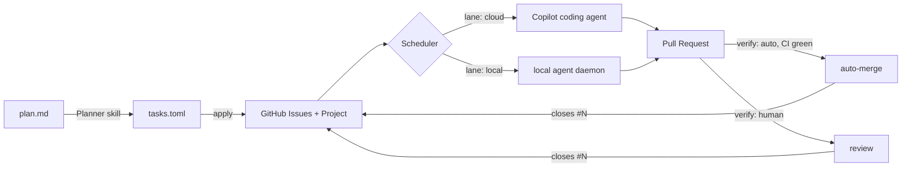

# Context

Agentic coding is really good at doing tasks with clear boundaries. So the daily routine of a developer becomes more and more like project management, where tasks are broken into smaller sub-tasks, and these sub-tasks are dispatched, tracked, reviewed and completed manually.

To make it more efficient, an automated pipeline can be established to handle the dispatch, tracking, and completion of these sub-tasks, reducing the manual overhead and improving overall productivity.

## Current GitHub Utilities

- **GitHub Actions**: Automates workflows for CI/CD, testing, and deployment.
- **GitHub Projects**: Provides project management features like task boards, issue tracking, and automation for organizing and prioritizing work.
- **GitHub Issues**: Allows for tracking tasks, bugs, and feature requests, with support for labels, milestones, and assignees to manage workflow efficiently.

## What we need

- A skill to create GitHub Issues for the sub tasks defined in a plan, and manage their dependencies through GitHub Projects.
- A dispatcher that could assign dependency-resolved sub-tasks to the appropriate coding agents automatically: cloud agents, local agents.

---

# Technical Design

## Overview

Three pieces, each with a single responsibility:

| Piece         | Where                                                | Responsibility                                                                             |
| ------------- | ---------------------------------------------------- | ------------------------------------------------------------------------------------------ |
| **Planner**   | `.agents/skills/task-dispatch/SKILL.md`              | Plan markdown → task graph file → GitHub Issues + Project items (one-shot, human-reviewed) |
| **Scheduler** | `src/dispatchkit/` + `.github/workflows/dispatch.yml` | Recompute the ready set from issue state; assign ready tasks to an agent lane              |
| **Runners**   | Copilot coding agent (cloud) / local daemon          | Execute one issue, open a PR that closes it                                                |

GitHub is the only state store — no external DB. Issues hold the task, the Project holds
the derived scheduling state, and everything the scheduler needs is recomputable from them.



## Planner: deriving the graph

Decomposition quality decides everything downstream — an over-split plan drowns in per-task
overhead, an under-split one runs serially and buys nothing. Neither is fixed by asking a model
for "the right number of subtasks", so the planner is grounded in rules that are checkable
instead.

### From requirements to milestones

**No acceptance criterion, no plan.** A requirement is only plannable once it can be stated as a
command with a binary exit code. If that command can't be written yet, the requirement goes back
for sharpening rather than into a graph. This is the same discipline as
[implementation_plan.md](implementation_plan.md)'s "every milestone ends in one command with a
binary exit code", and it is what later makes `verify: auto` possible at all.

From there:

- **A milestone is one acceptance criterion flipping red to green.** Each milestone names the
  AC(s) it turns. A milestone that turns none is scaffolding — permitted, but it must say which
  later AC it unblocks.
- **Verifiers land before the code they guard**, and are observed failing first. A gate that has
  never been seen to fail proves nothing, and auto-merge is only safe on gates that have.
- Existing plans are the calibration fixtures. [refactor_requirements.md](refactor_requirements.md)
  (R1–R8, AC1–AC10) and its M0–M9 execution plan are fed to the planner as worked examples, not
  described in prose.

### Milestone is not task

A **milestone is a verification checkpoint**; a **task is a dispatch unit**. Keeping them as two
layers is what allows a legible proof narrative _and_ a wide dispatch graph at the same time —
one milestone may fan out into five parallel tasks, and three tiny serial milestones may collapse
into one task. Conflating them forces a choice between the two.

### When a task boundary is justified

Tasks are the unit of routing and verification, not of work. A boundary between two adjacent
pieces of work must earn itself on at least one of:

1. **Parallelism** — they can run concurrently, widening the graph
2. **Routing** — different `requires`/lane, so a different runner is needed
3. **Verification** — different `verify` or `spend`, so a different gate is needed
4. **Size** — merged, they would not fit one cloud agent session
5. **Revertability** — they should be independently revertable

If none applies, merge them. The cost model behind the rule is blunt: makespan is roughly
critical-path length × (work + overhead), where overhead — issue, agent boot, clone, install, CI,
merge queue — is fixed and far from free. Splitting one node into two **parallel** nodes shortens
the schedule; splitting it into two **serial** nodes lengthens it by exactly one overhead and buys
nothing. Hence the flat rule: **never split a serial chain.**

### Manufacturing parallelism

Width is designed, not discovered. The reliable move is **interface-first**: land the shared
contract as one small task, then fan out implementations that depend on it and not on each other.
The layering already gives the seams — `application/ports.py` first, then every adapter in
`infrastructure/adapters/` in parallel with disjoint `touches`.

The counterpart is the `for` field on every dependency edge. Ordering things by narrative
plausibility rather than data dependency is the most common decomposition error, and it silently
serialises the graph. Requiring each edge to name the artifact, interface, or file it waits on
makes spurious edges visible; every one deleted widens the graph.

### Structural lints

`validate` computes and reports, so the review gate is quantitative rather than a vibe check:

| Signal                                         | Meaning                                |
| ---------------------------------------------- | -------------------------------------- |
| `count == 1`                                   | No decomposition happened              |
| `width == 1` (max antichain)                   | A chain wearing a graph's clothes      |
| `depth` close to `count`                       | Mostly serial; look for spurious edges |
| Serial pair, no other dependents, same routing | Merge candidate                        |
| Estimated work below ~3× overhead              | Task is under the economic floor       |

These are warnings, not hard errors — the human ratifies the graph anyway, and the point is to
make that ratification informed. Alongside them the planner emits the plan's shape:
`12 tasks, depth 4, width 5, 3 human-verify, est. 2 review sessions`.

### Calibration from outcomes

Dispatch history is the feedback loop, and the two failure modes have distinct signatures:

| Too coarse                      | Too fine                          |
| ------------------------------- | --------------------------------- |
| Tasks hit the agent session cap | Overhead dominates wall-clock     |
| High `Attempts`, large diffs    | Many trivial PRs                  |
| Scope drift against `touches`   | High depth, low width             |
| —                               | Merge-queue churn on shared files |

"Share of tasks hitting the session cap" is the single most useful dial: it measures the ceiling
directly. Once enough history exists, a calibration summary is folded back into the planner skill
so later plans are sized against observed behaviour rather than a guess.

None of this makes the planner correct. It makes it auditable and self-correcting — which is the
achievable bar, and the reason the human ratification gate stays.

## Task graph format

The planner's intermediate artifact, committed under `docs/plans/<plan>.tasks.toml`. It is the
reviewable unit: a human edits this, not the issues.

```toml
[[task]]
id        = "m5a-values"          # stable slug, unique per plan
title     = "Value objects for ClipId/Duration"
milestone = "M5a"                 # the verification checkpoint this serves
lane      = "cloud"               # cloud | local — planner proposes, human ratifies
requires  = []                    # capability tags the runner must provide
verify    = "auto"                # auto | human — governs merge, default human
spend     = false                 # true → needs `spend:approved` before dispatch
touches   = ["src/podkit/domain/**"]     # advisory file scope — see conflicts
acceptance = "uv run pytest -m unit && uv run lint-imports"
body_file = "docs/plans/m5a-values.md"   # optional long-form spec

# every edge names the artifact it waits on — unjustifiable edges get deleted
depends = [{ on = "m2-cassette", for = "CassetteStore.get() signature" }]
```

Invariants checked before anything is pushed: unique ids, every `depends` resolves, the graph
is acyclic (Kahn's algorithm; a cycle is a hard error naming the cycle), every edge carries a
non-empty `for`, and `acceptance` is non-empty. `id` is the idempotency key — re-running `apply`
updates the existing issue rather than creating a second one.

`lane` and `verify` are both **planner proposals**. The planner emits its best guess with a
one-line rationale in a `# why:` comment; neither takes effect until a human has reviewed and
merged the graph file. This is the single human gate in the whole pipeline, and it is placed
here deliberately — reviewing one table of routing decisions up front is cheap, whereas
reviewing every PR afterwards is the bottleneck we are trying to remove. The `requires` tags
make that review checkable rather than a matter of opinion: the validator rejects
`lane = "cloud"` on any task whose `requires` the cloud lane cannot satisfy.

## GitHub representation

- **Issue** — one per task. Body ends with a fenced machine block so the scheduler never has to
  parse prose:

  ```yaml
  <!-- dispatchkit
  id: m5a-values
  plan: refactor
  milestone: M5a
  lane: cloud
  requires: []
  verify: auto
  spend: false
  depends: [m2-cassette]
  touches: ["src/podkit/domain/**"]
  -->
  ```

  Labels mirror it for cheap filtering: `dispatchkit`, `plan:refactor`, `lane:cloud`,
  `verify:auto`.

- **Project (v2)** — a **single board for all plans**, custom fields:
  - `Status`: `Blocked` → `Ready` → `Dispatched` → (`In Review` | `Auto-merging`) → `Done`
  - `Lane`: `cloud` | `local`
  - `Verify`: `auto` | `human`
  - `Task ID`: text, mirrors the slug
  - `Attempts`: number, incremented on each dispatch

  The Project is a **derived view**. If it is deleted, the scheduler can rebuild it from the
  issues alone; state lives in issue open/closed + the machine block. One board keeps the
  scheduler to a single query, defines the fields once, and lets concurrency caps bound total
  in-flight work across every plan at once; `plan:*` labels drive per-plan filtered views.

- **Dependency edges** live only in the machine block. GitHub's native "blocked by" links are
  intentionally not used: they are not exposed uniformly across REST/GraphQL and cannot be
  round-tripped from a committed file.

## Scheduler

A single idempotent pass, safe to run repeatedly:

1. **Load** — one GraphQL query pulls all `label:dispatchkit` issues with state, assignees, linked
   PRs, and Project field values.
2. **Resolve** — a task is _ready_ iff it is open, unassigned, and every id in `depends` maps to
   a closed issue. Everything else is `Blocked`.
3. **Reconcile** — write back `Status` for every item so the board is always truthful, not just
   for the ones being dispatched.
4. **Admit** — take ready tasks in plan order, subject to per-lane concurrency caps
   (`cloud: 3`, `local: 1` by default, configurable in `dispatchkit.toml`) and the file-scope
   exclusion below. Caps are what keep review load bounded and PRs from stacking into conflict.
5. **Dispatch** — per lane, below.

Dispatch is the only mutating step, and it is guarded by assignment: assigning the issue _is_
the lock. Two concurrent scheduler runs converge because step 2 re-reads assignees, and a
double-assign attempt is a no-op.

### Lane routing

Lanes differ by **runner capability**, not by subject matter or by cost. A cloud coding agent is
an ephemeral, sandboxed, time-boxed container; the local lane is a real workstation. That is the
whole distinction:

| Constraint         | cloud (hosted coding agent)        | local (dev workstation)                |
| ------------------ | ---------------------------------- | -------------------------------------- |
| Session wall-clock | hard cap around an hour            | unbounded                              |
| OS                 | ephemeral Linux container          | whatever the workstation runs          |
| Network            | firewall allowlist, no free egress | unrestricted                           |
| Filesystem         | fresh clone, no host state         | full tree, caches, large local data    |
| Hardware           | no GPU, no peripherals             | GPU, audio/video devices, peripherals  |
| Interactivity      | none                               | can drive a UI or a human-in-the-loop  |
| Secrets            | only what the platform injects     | the workstation's own credential store |

A task declares what it needs as `requires` tags — `long-run`, `os:macos`, `os:windows`, `gpu`,
`device`, `net:unrestricted`, `local-data`, `interactive`. The routing rule is one line:

> A task may run in the cloud lane iff its `requires` is empty. Any tag that no cloud runner
> advertises forces `local`.

Stating it as capabilities rather than as a hand-maintained list of "local-ish work" is what
keeps this general. Adding a self-hosted runner later means advertising `gpu` or `os:macos` on a
new lane and changing no task definitions; the routing rule already accommodates it.

Dispatch per lane:

- **cloud** — assign the issue to the coding agent via the GraphQL `replaceActorsForAssignable`
  mutation. The agent opens a draft PR; CI is the gate.
- **local** — label the issue `dispatch:local` and stop; a daemon on the workstation picks it up
  (see [Local daemon](#local-daemon)).

### Spend is orthogonal to lane

Cost is a separate axis. A cloud task can burn paid API credits and a local task can be free, so
`spend` is its own flag rather than a reason to route somewhere. When `spend = true`, **either**
lane refuses to dispatch until a human adds the `spend:approved` label. Conflating the two would
mean either that paid work is stuck on one machine or that free work inherits an approval gate
it doesn't need.

### Triggers

`.github/workflows/dispatch.yml`:

```yaml
on:
  issues: { types: [closed, reopened, labeled] }
  pull_request: { types: [closed] }
  schedule: [{ cron: "7,37 * * * *" }] # safety net; offset off the busy :00/:30
  workflow_dispatch:
```

Event-driven for latency, cron for self-healing. Because the pass is idempotent, an extra run
costs one API round trip and changes nothing.

## Parallel work and file conflicts

Non-overlapping file scope is **not** a hard requirement, and trying to make it one would be a
mistake. File sets can't be known accurately before an agent starts work, so a declared scope is
either over-broad (serialising everything and destroying the parallelism we're buying) or
under-broad (giving false confidence). Worse, the granularity is wrong in both directions: two
tasks can edit different functions in one file and merge cleanly, while two tasks in entirely
separate files can still conflict semantically when one renames a symbol the other calls.

So conflicts are handled in four layers, weakest and cheapest first:

1. **Decomposition (primary).** `depends` is the real conflict-avoidance lever, not just logical
   ordering. If two tasks would rewrite the same module, the planner should chain them instead of
   letting them race. Reviewing that is part of the graph review gate.
2. **Advisory exclusion (scheduling hint).** `touches` holds glob patterns. Admission skips a
   ready task whose `touches` intersects that of any already-`Dispatched` task; it waits for the
   next pass. Cheap, and it degrades gracefully — worst case is extra serialisation, never a bad
   merge. Omitting `touches` means "unknown scope", which excludes nothing.
3. **Merge queue (authoritative).** Required-up-to-date branch protection plus a GitHub merge
   queue means every PR is rebased onto the tip and re-tested in order before it lands. A textual
   conflict becomes a mechanical failure; a semantic conflict becomes a red test. This is the
   layer that actually guarantees correctness, and it is why layer 2 can stay advisory.
4. **Scope drift check.** After a PR opens, the scheduler diffs its changed files against the
   declared `touches`. Drift is reported on the issue, and for `verify = "auto"` tasks it
   withholds auto-merge — an agent that wandered outside its declared blast radius is exactly the
   case a human should look at. Over time this also tells us which planner decompositions were
   wrong.

A PR that can't be rebased cleanly is returned to the agent as a normal failure: comment,
`Attempts += 1`, and after the retry budget it lands in `dispatch:stuck` for a human.

## Local daemon

The scheduler runs in Actions, but the `local` lane needs a long-lived process on the machine
that provides the capabilities the cloud sandbox lacks. `src/dispatchkit/daemon.py`:

**Lifecycle.** Start as a foreground `make dispatch-daemon` while the loop is still being
trusted — it is observable and trivially killable. Promote to a macOS `launchd` user agent
(`~/Library/LaunchAgents/com.artstrategy.dispatchkit.plist`, `RunAtLoad` + `KeepAlive`, logs to
`~/Library/Logs/dispatchkit/`) only once it has run unattended without surprises. A `flock` on
`~/.dispatchkit/daemon.lock` enforces one instance, so a stray terminal can't double-run it.

**Claiming.** GitHub is the only shared state, and assignment is not compare-and-swap, so the
daemon assigns itself and then **re-reads** the issue to confirm it actually won; on a lost race
it drops the task and moves on.

**Isolation.** Each task runs in its own `git worktree` under `~/.dispatchkit/work/<task-id>` on a
fresh branch from `origin/main`, removed on success and retained on failure for inspection.
Default concurrency is 1, which keeps resource contention and log interleaving manageable.

### Liveness: how GitHub can monitor a process it cannot see

There is no GitHub feature that health-checks an external process — no inbound ping, no agent
registration, nothing that reaches your workstation. GitHub is **passive storage**. So liveness
is built out of two active parties writing to and reading from it:

1. **The daemon writes a heartbeat.** Every 5 minutes it overwrites a timestamped record on
   GitHub. Concretely: a single pinned issue titled `dispatchkit: daemon status`, holding one
   comment per host, edited in place via `updateIssueComment` so it never grows. The comment body
   is a small JSON block — `host`, `pid`, `version`, `last_seen`, `current_task`. Editing one
   comment is a single API call, is human-readable in the browser, and needs no Project field
   plumbing. (A Project `Last Seen` date field is the alternative, but it only describes a
   claimed item, so it can't tell you an _idle_ daemon is alive.)
2. **The scheduler reads it and judges.** The cron pass already runs every 30 minutes. It
   compares `now - last_seen` for each host and treats anything past 30 minutes as dead: tasks
   claimed by that host are unassigned, `Attempts` is incremented, and they return to `Ready`.

That is the entire mechanism — a **dead man's switch**. The daemon proves it is alive by
repeatedly saying so; silence is the failure signal. Nothing pushes toward your laptop, and the
daemon is never asked a question it might be too dead to answer. The scheduler, not GitHub, is
the monitor; GitHub is just the mailbox they share.

One caveat worth designing around: `schedule:` triggers are best-effort — they can be delayed
under load, and GitHub disables them entirely after 60 days of repository inactivity. A silently
disabled cron is a monitor that has itself died, so the alerting path below treats "no scheduler
run in 24h" as its own alertable condition rather than assuming the cron is running.

**Observability.** Each run appends to a local JSONL log; on completion the daemon posts the tail
to the issue, so the trace lives on GitHub rather than only on one workstation. A
`dispatch:pause` repo label, checked every poll, stops both the daemon and the cloud scheduler
without anyone having to find the process.

## Alerting

Both halves of the system fail in ways that are invisible until someone opens the board, so
failures are pushed to a Feishu/Lark group via a **custom bot** webhook.
Reference: [Custom bot usage guide][lark-bot].

[lark-bot]: https://open.feishu.cn/document/client-docs/bot-v3/add-custom-bot

**Transport.** `POST` JSON to `https://open.feishu.cn/open-apis/bot/v2/hook/<token>`. Two message
shapes cover everything we need:

```jsonc
// routine alert
{ "msg_type": "text", "content": { "text": "dispatchkit alert: #123 retries exhausted" } }

// alert with a jump link to the issue
{ "msg_type": "interactive", "card": { /* button with an open_url behavior */ } }
```

The scheduler reads `LARK_WEBHOOK_URL` from Actions secrets; the daemon reads it from the
workstation credential store.

**Configuration.** The webhook URL is `https://open.feishu.cn/open-apis/bot/v2/hook/<token>`,
where the token alone is enough to post to the group. It is therefore never committed — not to
this document, not to `dispatchkit.toml`, not to a `.env` that could be staged. Both halves read it
by name:

```sh
# cloud scheduler
gh secret set LARK_WEBHOOK_URL      # paste at the prompt, never as an argv
gh secret set LARK_WEBHOOK_SECRET   # signing secret from the bot's security settings

# local daemon (macOS keychain)
security add-generic-password -a "$USER" -s dispatchkit-lark-webhook -w
security add-generic-password -a "$USER" -s dispatchkit-lark-secret  -w
```

Piping the value in as a command argument would leave it in shell history and in process
listings, so both forms above read from a prompt instead.

**Security setting: signature, not IP allowlist.** The bot offers custom keywords, an IP
allowlist, and signature verification. The allowlist is a non-starter here — it caps at 10
entries while hosted Actions runners egress from a large, rotating address range, and a
workstation is usually behind a dynamic address too. So we enable **signature verification**:
sign with `timestamp + "\n" + secret` as the HMAC-SHA256 _key_ over an empty message, base64 the
digest, and send `timestamp` and `sign` alongside `msg_type`. The timestamp must be within an
hour, so a workstation with a badly skewed clock fails with `19021` — worth recognising rather
than debugging as a network problem.

**Rate and size limits shape the design.** A bot is capped at 100 messages/minute and 5/second,
the body must stay under 20 KB, and the platform explicitly warns that sending on the hour or
half hour risks `11232` throttling under load. Two consequences:

- The cron trigger is offset to `7,37 * * * *` rather than `0,30`, so scheduled alerts don't pile
  onto the platform's busiest moments.
- Alerts carry issue numbers and error classes, never log dumps. The 20 KB ceiling agrees with
  the security argument for the same rule.

**Check the body, not just the status.** A rejected request still returns HTTP 200 with a
non-zero `code` (`19021` bad signature, `19022` IP blocked, `19024` keyword missing, `11232`
throttled, `9499` malformed body). Treating HTTP 200 as success would silently swallow every
misconfiguration, so the client asserts `code == 0`.

**Who alerts about what.** The two sides cover each other's blind spots:

| Condition                            | Detected by | Why that side                        |
| ------------------------------------ | ----------- | ------------------------------------ |
| Task failed / retries exhausted      | scheduler   | It owns `Attempts`                   |
| Daemon heartbeat stale               | scheduler   | A dead daemon cannot report itself   |
| Agent produced no PR in time         | scheduler   | Only visible from repo state         |
| Task crashed, tooling broken locally | daemon      | It has the stack trace and the log   |
| Scheduler run missing for 24h        | daemon      | A disabled cron cannot report itself |

That last row is the point: a monitor that only runs inside the thing it monitors has no way to
report its own death, so each side watches for the other's silence.

**Not a spam cannon.** The scheduler pass is idempotent and runs every 30 minutes, so naive
alerting would re-send the same failure indefinitely. Alerts fire on **state transition only**,
recorded by an `alert:sent` label on the issue that is removed when the condition clears. A
per-run cap in `dispatchkit.toml` bounds the worst case, well under the 100/minute ceiling.

**No acknowledge button.** A custom bot's cards support only `open_url` jumps — they cannot post
back to a server, and the bot cannot read replies or recall its own messages. So an alert links
to the issue and acknowledgement happens on GitHub. Anything richer would mean building a full
bot application, which is not worth it for an alert channel.

**Best-effort.** Delivery runs with a short timeout and never fails a dispatch pass. An alerting
outage must not become a pipeline outage.

## Completion and unblocking

A task is done when its PR merges with `Closes #N`, which closes the issue, which makes
dependents ready on the next pass. There is no separate "mark complete" step to forget.

The `acceptance` command from the task graph is injected into the issue body as the definition
of done, so both agent lanes run the same check the reviewer will run. A PR that fails CI leaves
the issue open and assigned — it stays out of the ready set until a human intervenes, which is
the intended failure mode.

## Merge policy

Human review on every PR would cap the pipeline's throughput at the reviewer's attention, which
defeats the point. So merge authority is per-task, decided by `verify`:

- **`verify = "auto"`** — the task is fully machine-verifiable. Once the PR is non-draft and all
  required checks are green, the scheduler enables GitHub auto-merge (squash). The issue closes,
  dependents unblock, no human touches it.
- **`verify = "human"`** — the task's correctness is not expressible as a check: prompt/voice
  quality, API design, anything judged by taste or by listening to output. The scheduler requests
  a reviewer, sets `Status: In Review`, and stops. It never merges.

`human` is the default; `auto` must be opted into in the graph file and survive the review gate.

Three guardrails keep `auto` honest:

1. **Acceptance must be a subset of CI.** The validator rejects `verify = "auto"` unless the
   task's `acceptance` command is one the CI workflow already runs, so "green CI" literally
   means "acceptance passed" rather than "some unrelated checks passed".
2. **Blast-radius fence.** Auto-merge is refused for any PR touching `.github/workflows/`,
   `dispatchkit.toml`, or `docs/plans/*.tasks.toml` — the pipeline may not rewrite its own rules,
   its own routing, or its own merge permissions unattended.
3. **Branch protection is the real enforcement.** The scheduler's token has no admin bypass, so
   auto-merge can only ever fire on a genuinely green, protected branch. A misconfigured
   scheduler fails closed.

Any task whose acceptance can only be stated in prose is a signal the task was decomposed too
coarsely — splitting it until the machine-checkable part can be `auto` is what actually grows
throughput over time.

## Failure handling

| Failure                           | Behavior                                                       |
| --------------------------------- | -------------------------------------------------------------- |
| Agent opens no PR in 24h          | Cron pass unassigns, `Attempts += 1`, returns task to `Ready`  |
| `Attempts >= 3`                   | Label `dispatch:stuck`, never auto-dispatched again            |
| Dependency issue deleted          | Dependents stay `Blocked`; validator flags the dangling id     |
| Cycle introduced by hand-edit     | `apply` refuses to push and names the cycle                    |
| Rate limit / partial write        | Next pass reconciles; no local state to go stale               |
| `auto` PR red, or fence tripped   | Auto-merge withheld, falls back to `In Review` for a human     |
| PR conflicts / fails rebase       | Merge queue ejects it; comment, `Attempts += 1`, back to agent |
| Local daemon dies mid-task        | Stale heartbeat → cron reclaims the issue after 30 min         |
| Two tasks race the same files     | `touches` exclusion defers one; merge queue catches the rest   |
| Cloud agent hits its time cap     | No PR → normal retry; repeated hits mean `requires` was wrong  |
| Scheduler cron disabled by GitHub | Daemon sees no run in 24h and alerts                           |

## Security

- Workflow runs with a least-privilege token: `issues: write`, `repository-projects: write`,
  `contents: read`. Never `contents: write` — only PRs mutate the tree.
- Issue bodies are attacker-influencable text. The machine block is parsed as YAML with a safe
  loader and validated against a strict schema; unknown keys and non-slug ids are rejected.
  Nothing from an issue body is ever interpolated into a shell command — `acceptance` is
  executed as an argv list by the runner, not through a shell.
- The local daemon holds the workstation's credentials; the cloud lane never sees them. It
  authenticates via `gh`'s keychain credential, not a PAT sitting in a file. Paid work in either
  lane additionally requires the human-applied `spend:approved` label.
- The Lark webhook URL and its signing secret are bearer credentials: Actions secrets on one
  side, credential store on the other, never logged and never echoed into an issue. A leaked
  webhook lets anyone spam the group, which is why signature verification is enabled rather than
  left off. Alert bodies carry issue numbers and error classes, not log dumps, so agent-authored
  text can't be relayed into the chat channel.

## Verification

Three separable things get verified, and only the last one needs real work dispatched:

| What                                                        | Verified by                             | Cost          |
| ----------------------------------------------------------- | --------------------------------------- | ------------- |
| **Mechanism** — graph → issues → dispatch → merge → unblock | Synthetic graphs, recorded API fixtures | Free, offline |
| **Planner judgment** — is the decomposition any good        | Diff against known-good human plans     | Free, offline |
| **End-to-end value** — does it reduce project overhead      | One real plan, actually executed        | Real          |

### Synthetic tasks, but never no-ops

A test task that appends a line to a file exercises the state machine and proves nothing. Every
interesting failure is about friction — the agent overruns its session, two PRs conflict, CI goes
red, the diff drifts outside `touches`, the issue body was ambiguous — and a no-op passes all of
them by construction. So test tasks are drawn from **real, small, independently useful chores**
that produce real diffs, real CI time and real review load.

### Verify the failures, not the successes

"A task completed" is the least informative outcome available. The acceptance list for dispatchkit is
therefore the failure table, each row provoked deliberately:

| Scenario                         | Provocation                                              |
| -------------------------------- | -------------------------------------------------------- |
| Agent never opens a PR           | Dispatch, then never produce a branch; assert reclaim    |
| Daemon dies mid-task             | `kill -9` the daemon; assert reclaim after the window    |
| Acceptance fails                 | A task whose `acceptance` exits non-zero                 |
| Scope drift                      | A task that edits a file outside its `touches`           |
| Concurrent edit of the same file | Two overlapping tasks dispatched deliberately            |
| Alert storm                      | N cron passes over one failure; assert exactly one alert |

Most of these run against recorded fixtures rather than live.

### Dogfooding, safely

Once D5 lands, D6–D9 can be dispatched by the partially built system. The obvious hazard — a buggy
dispatcher merging its own broken fix — is already closed by the blast-radius fence: anything
touching `.github/workflows/` or `dispatchkit.toml` can never auto-merge, so dispatchkit's own tasks are
`verify: human` by construction.

Live trials run in **dispatchkit's own repository**, not in a project it is managing. Failed
experiments otherwise leave permanent debris in someone's issue numbers, Project board and
`main` history. Here, debris is on-brand: the issues are the tool's own backlog, and they are
real chores on real code rather than no-ops.

## Build order

| Step | Deliverable                                            | Proven by                                                                                     |
| ---- | ------------------------------------------------------ | --------------------------------------------------------------------------------------------- |
| D1   | Task graph schema + validator (parse, cycle, dangling) | Unit tests, no network                                                                        |
| D2   | Structural lints + plan-shape metrics                  | Synthetic graphs: chain, star, diamond, singleton                                             |
| D3   | `apply` (graph → issues/project), idempotent           | Replay tests against a recorded GitHub API fixture                                            |
| D4   | Readiness resolver as a pure function                  | Unit tests over synthetic graphs incl. diamond, cycle                                         |
| D5   | Cloud dispatch + workflow                              | One real task end-to-end on a throwaway plan                                                  |
| D6   | Local daemon: claim, worktree, heartbeat, spend gate   | One real capability-gated task end-to-end                                                     |
| D7   | Timeout/retry/stuck + stale-heartbeat reclaim          | Fixture with a stalled dispatch and a dead daemon                                             |
| D8   | Lark alerting with transition-only dedupe              | Fixture asserting one alert, not one per cron pass, plus a non-zero `code` treated as failure |
| D9   | `verify: auto` merge + subset/fence/drift guardrails   | Negative tests: red CI, fenced path, scope drift                                              |

### D1 decision record — schema + validator (shipped)

`src/dispatchkit/` splits along the same seam the rest of the repo uses: `model.py` holds pure
frozen value objects (`TaskId`, `Lane`, `Verify`, `Dependency`, `Task`, `TaskGraph`) with no I/O,
`parse.py` does strict TOML → graph, `validate.py` does semantic invariants, and `cli.py` is the
only module that touches argv or the filesystem. `make dispatch-validate GRAPH=<file>` (or
`uv run dispatchkit validate <file>`) is the binary-exit-code command: 0 valid,
1 invalid graph, 2 unreadable file — "couldn't read it" is kept distinct from "read it and it's
wrong" because a workflow wants different responses to the two.

Four choices worth recording:

- **The schema is closed.** Unknown keys are errors, not ignored. A typo'd `verifiy = "auto"`
  that silently parses as `human` would only surface as a merge that never happens.
- **Both halves report every issue at once.** The graph file is the human review gate, so
  fail-fast would turn one review into N. Parse-level problems (shape, type, enum, unknown key)
  raise `GraphError` carrying the whole list; semantic ones are returned as a list.
- **Cycle detection is suppressed when an edge is dangling or self-referential.** Those already
  explain the malformed shape, and a cycle report on top of them is noise. Reported cycles name
  the path (`a -> b -> a`), per "a cycle is a hard error naming the cycle".
- **The routing rule is checked, not just documented.** `lane = "cloud"` with any `requires` tag
  is `lane-capability-mismatch`; unknown tags are rejected against the capability list, so the
  lane review is checkable rather than a matter of opinion.

`empty-acceptance` is an error rather than a lint, since "no acceptance criterion, no plan" is
what makes `verify: auto` possible at all. Structural lints and plan-shape metrics stay out of
D1 on purpose: they are warnings that inform a human, which is a different contract from an
invariant that blocks a push, and they are D2.

### D2 decision record — lints + plan shape (shipped)

`metrics.py` computes the shape (`plan_shape`, `levels`, `max_antichain`), `lints.py` the
warnings; both are pure functions over a validated graph, and `validate` now prints the shape
line plus any lints. Lints stay warnings — `--strict` promotes them to exit 1 for a caller that
wants the harder gate, but the default keeps D1's invariants as the only thing that blocks.

- **`width` is the exact maximum antichain, not the widest layer.** Longest-path layering is only
  a lower bound on how wide a graph can run (`a→b→c`, `d→c`, `a→e` layers 2 wide but has the
  antichain `{b, d, e}`), and a metric whose whole job is to expose parallelism must not
  under-report it. Computed via Dilworth — max antichain = n − maximum bipartite matching on the
  transitive closure — with König's construction returning the witness set, so a report can name
  which tasks the claim rests on. Graphs are dozens of nodes, so the cubic cost is free.
- **`depth` counts tasks on the critical path**, using longest-path levels: a task is only
  reachable once its slowest prerequisite chain lands.
- **Review sessions are batched by level, not counted per task.** Human-verify tasks sitting at
  the same level are reviewable in one sitting, so the estimate counts distinct levels — which is
  what makes the documented `12 tasks, depth 4, width 5, 3 human-verify, est. 2 review sessions`
  arithmetic work.
- **`merge-candidate` is suppressed on a chain.** Every adjacent pair of a chain is a merge
  candidate, so emitting them alongside `chain-graph` would bury one real finding under N
  restatements of it. Same reason `mostly-serial` defers to `chain-graph`.
- **The economic-floor lint needs an estimate, so `estimate_minutes` became an optional schema
  key.** Where estimates come from is open question 3; absent one the lint says nothing rather
  than guessing, and the floor is derived (`floor_multiple × overhead_minutes`, default 3 × 10m)
  rather than hard-coded, so it can be recalibrated from dispatch history later.

### D3 decision record — `apply` (shipped)

`block.py` renders and parses the machine block, `github.py` holds the state snapshot, the
operation union and the `GitHubApi` port, `apply.py` is the pure planner plus a thin executor,
and `gh_cli.py` is the adapter. `dispatch apply <graph>` is a **dry run unless `--push`** is
given, and on a dry run no client is constructed at all, so it cannot reach the network even by
mistake. Proven by replay tests against a recorded fixture, with the network blocked.

- **Idempotency is proven by convergence, not asserted.** Planning is a pure function of
  `(graph, RepoState)`; the test applies the plan to an in-memory double, re-reads the state,
  plans again, and requires the second plan to be empty. That is a stronger claim than "the code
  looks idempotent", and it is what catches an unstable body renderer — hence the separate test
  that rendering is byte-stable, since `apply` diffs bodies to decide whether to update.
- **The block is parsed by a closed grammar, not a YAML loader.** Issue bodies are
  attacker-influencable, and the block is `key: value` with scalars and flow lists — a fixed key
  set plus a fixed value grammar is a smaller attack surface than a safe loader plus a schema
  check, and it needs no dependency. Output remains valid YAML. Two blocks in one body is a hard
  error rather than "use the first", because "the first" is exactly what an injected second block
  would rely on; the free-form `touches` values are escaped so a smuggled `-->` cannot terminate
  the block early.
- **`apply` never writes `Status` or `Attempts`.** They are derived scheduling state the
  scheduler recomputes every pass, so writing a readiness guess here would only create a value
  that goes stale between passes.
- **`apply` never deletes, and never touches a closed issue.** Closed means done; an issue whose
  task has left the graph is reported as `orphan-issue` for a human. Both follow from the
  least-privilege token and from the rule that only PRs mutate the tree.
- **Label ownership is explicit.** `apply` owns `dispatchkit`, `plan:*`, `lane:*` and `verify:*`, and
  an update replaces exactly those while preserving `spend:approved`, `dispatch:stuck` and
  anything else a human or the scheduler applied. Stale owned labels ride along in the operation
  as `remove_labels`, so the adapter needs no extra read.
- **Nothing reaches a shell.** Every `gh` call is an argv list, and issue bodies go over stdin
  rather than argv — they contain newlines and backticks and would otherwise sit in the process
  table.

One honest gap: `tests/fixtures/dispatch/search_issues.json` is GraphQL-shaped but was generated
from the renderer, not recorded from the real API, since no repository or Project board exists
yet. It must be re-recorded from a live `gh api graphql` response when D5 stands up the scratch
repo; until then `GhCli`'s subprocess paths — particularly the Project field/option id lookups —
are unverified, and only its pure halves (payload parsing, argv construction) are under test.

### D4 decision record — readiness resolver (shipped)

`resolve.py` is the scheduler's brain with no I/O in it: `build_items` turns a repo snapshot into
`TaskItem`s, `resolve` derives every task's `Status`, `reconcile_ops` says what the board should
be told, and `admit` chooses what to start. `config.py` reads `dispatchkit.toml`. `dispatch resolve
--state <payload.json> --plan <name>` runs the whole pass against a recorded snapshot and is
read-only in every mode — dispatching is D5's job, so nothing here can start work by accident.
Proven by unit tests over synthetic items (chain, star, diamond, cycle) plus CLI tests over a
recorded payload, with the network blocked.

- **Status is derived, never stored.** It is recomputed from the issues on every pass, so the
  Project board is a projection: delete it and it rebuilds, hand-edit it and the next pass
  overwrites it. There is no state machine to get wedged because there is no state — which is
  what makes the whole scheduler a pure function of GitHub's own data.
- **Assignment is the lock.** A task is ready only while it is *unassigned*, so dispatching it
  removes it from the ready set. Two schedulers racing on one repo therefore converge instead of
  double-dispatching, with no lease, lockfile or mutex: GitHub's own write is the mutual
  exclusion. The local lane has no assignee to use, so it claims with a `dispatch:local` label,
  which the resolver treats identically.
- **Readiness is one step, not a recursive walk.** "Are my direct dependencies closed?" — nothing
  more. A hand-edited cycle (which `validate` would have rejected) is then harmless: every task
  in it stays `Blocked` and the pass still terminates. A dependency with no issue at all — never
  applied, or deleted — is not closed, so its dependents stay blocked. Failing safe beats
  guessing, and both cases are pinned by tests.
- **Admission is separate from status.** A task waiting on spend approval, or sitting at its
  retry budget, is still `Ready`: the work is unblocked, we are simply choosing not to start it.
  Folding those into `Status` would invent board values the plan does not define and would lose
  the distinction between *cannot run* and *will not run yet*. Deferrals are reported with a
  reason (`stuck`, `awaiting-spend-approval`, `lane-cap`, `file-scope-conflict`) so an idle board
  always explains itself.
- **In-flight work counts against the cap.** Caps bound what an agent is *doing*, not what this
  pass adds, so already-dispatched and in-review tasks occupy slots. Otherwise every pass would
  admit a fresh cap's worth and the queue would grow without bound.
- **File-scope exclusion compares literal prefixes, deliberately crudely.** Two ready tasks whose
  `touches` prefixes nest are serialised; disjoint trees run together; an empty `touches` means
  *unknown scope* and excludes nothing, because reading it as "conflicts with everything" would
  serialise the entire board. The heuristic errs toward over-serialising: an unnecessary wait
  costs minutes, a bad merge costs a human's afternoon.
- **Plan order is ascending issue number.** That is the order `apply` created them, which is the
  order they appear in the graph file — so the author's ordering is the tie-break and the choice
  is reproducible across passes.
- **`dispatchkit.toml`'s schema is closed, like the graph's.** Caps are the one dial that changes how
  much parallel work exists; a typo'd key silently reverting to a default is exactly the failure
  worth an error. An unconfigured lane admits nothing rather than defaulting to unlimited, and
  `cloud = 0` is the documented way to pause a lane without editing the graph.

The recorded payload gained `assignees` and `timelineItems` so the resolver's inputs are parsed
from realistic shapes, and `parse_state` tolerates their absence — an older recording degrades to
"nothing in flight" instead of failing mid-pass. The fixture is still renderer-generated, so D3's
gap stands: it must be re-recorded live at D5.

### D5 decision record — cloud dispatch + workflow (shipped, pending one live run)

`tick.py` is the pass: `plan_tick` is pure (snapshot in, operations out), `execute_tick` is the
only mutating half, `gh_cli` gained the agent-assignment path, and `.github/workflows/dispatch.yml`
runs it. `dispatch tick --plan <name> --state <payload.json>` is an offline dry run; `--push`
requires `--repo` and `--project` and is the only form that constructs a client.

- **Assignment is the lock, and the mutation is `replaceActorsForAssignable`.** *Replace*, not
  *add*: a pass that loses a race re-sends the same single actor, which is a no-op, rather than
  accumulating assignees. Combined with "ready ⇒ unassigned", that is the whole concurrency
  story — no lease, no lockfile. Proven by a test that runs two passes off the same snapshot and
  asserts exactly one assignment.
- **Operation order is load-bearing: dispatch first, record second.** Dying between the two
  leaves an assigned issue whose board entry is one pass stale, which the next pass fixes. The
  reverse — a board claiming `Dispatched` with nobody assigned — would let the next pass dispatch
  the same task again. The cheap failure is the one we choose.
- **A task dispatched this pass is recorded as `Dispatched`, not `Ready`.** Writing the resolved
  status would leave the board contradicting the issue for up to half an hour. The next pass
  derives the same value from the assignee, so the projection converges without a second write —
  which is what keeps the idempotency test honest.
- **A pass never creates, edits, or closes an issue.** `DispatchOperation` is deliberately
  narrower than `apply`'s `Operation` union: assign, label, set `Status`. `apply` owns the
  graph's shape and only a merged PR closes work, so the type system carries the rule rather than
  a comment.
- **The local lane is dispatched by label and nothing else.** The scheduler cannot reach the
  workstation, so `dispatch:local` *is* the handover; the daemon picks it up on its own schedule
  (D6). That keeps both lanes on one admission path instead of two schedulers.
- **The node id rides along in the snapshot.** The state query now selects `id`, so assignment
  costs no extra round trip. A snapshot without one — only reachable from a stale recording —
  produces a `missing-node-id` notice and no dispatch, rather than a lookup branch that nothing
  offline could exercise.
- **The workflow installs nothing.** `src/dispatchkit` is pure standard library, so the job that
  holds a token which can assign work runs no freshly resolved third-party tree. A test walks the
  package's imports and fails if that ever stops being true.
- **No `${{ }}` inside a `run:` script.** Expressions are substituted before the shell parses the
  line, so a value carrying a quote becomes a command. Everything arrives through `env:`, and a
  test asserts it. The workflow's permissions (`issues: write`, `repository-projects: write`,
  `contents: read` — never `contents: write`), its cron offset and its `cancel-in-progress: false`
  are asserted the same way, because all three are design decisions rather than formatting.
- **The token is `secrets.DISPATCHKIT_TOKEN`, not `GITHUB_TOKEN`.** The default token cannot assign
  the coding agent and cannot write a user- or org-level Project. `GhCli` fails loudly if the
  agent is not among the repository's assignable actors, naming the local lane as the alternative,
  rather than silently leaving work unassigned.

Two fixture bugs fell out of writing this, both worth naming. The synthetic issues shared one
Project item id, so a status write for one task landed on another — invisible until the
idempotency test refused to converge. And the first draft of the reconciliation test asserted
`Ready` for a task the same pass had just dispatched, contradicting the rule above; the test was
wrong, not the code.

**The gap:** the "one real task end-to-end on a throwaway plan" half of D5 has not been run —
it needs a repository, a Project board and an agent seat that do not exist yet. Everything
mechanical is proven offline, but `GhCli.assign_agent`, the Project field lookups, and the
workflow's own trigger wiring are still unexecuted code. `search_issues.json` also remains
renderer-generated. Standing the board up is the first task of the live run, and re-recording that
fixture from a real `gh api graphql` response is the second.

D1–D4 are pure and testable offline; only D5 onward needs a real repository. The planner skill
itself is evaluated separately and for free: run it against a requirements document that already
has a human-authored milestone breakdown, and diff its graph against that answer key. D9 lands
last on purpose: auto-merge is the only step that can mutate `main` unattended, so it ships only
after the dispatch loop has been observed working with a human on every merge, and after D8 can
tell us when it misbehaves. Enabling the merge queue and required-up-to-date branch protection is
a prerequisite for D9, not part of it.

### Extraction: dispatchkit becomes its own repository (post-D5)

D1–D5 were built inside `art_strategy`, the podcast/video project whose backlog motivated them.
They were extracted into this repository before D6.

- **Extract before D6, not after.** D6 adds a workstation daemon — a second install target with
  its own lifecycle — and the local lane's ergonomics are an adopter concern, not a host-project
  one. More importantly the machine block is a *wire format* written into other people's issues:
  every decision about it gets more expensive once issues exist. Nothing was live, so this was the
  cheapest hour it would ever be.
- **A tool that manages any repository cannot live inside one repository.** Nothing in D1–D5 knew
  about podcasts, but the packaging did: the CLI was `python -m tools.dispatch`, the config was a
  file in someone else's repo root, and the test tiering inherited the host's conventions.
  Adoption pressure was going to force the split regardless; doing it under pressure means doing
  it with issues already in flight.
- **Renamed in product and distribution.** `taskflow` is taken on PyPI (OpenStack's, 6.4.0).
  `dispatchkit` was free and matches the house style. The rename covered the wire format too —
  label, block marker and query filter — precisely because that is only free while unused.
- **Distribution is a reusable workflow first, a package second.** The unit of distribution should
  match the unit of execution. Most adopters need one workflow file and a config; only the D6
  daemon needs an installable package. The zero-dependency rule is what makes the workflow form
  viable at all.
- **Caps stay per-repo.** Per-owner caps would model spend more accurately but would force the
  state query from `repository.issues` to `ProjectV2.items`, coupling readiness to board hygiene
  rather than to issue truth. An adopter with several repos gets several independent caps; that is
  a documented limit, not a bug.

The extraction left three conventions that are now presumptuous and should become configuration
before the first outside adopter: the root `dispatchkit.toml` location, the
`docs/plans/<plan>.tasks.toml` graph path, and the hardcoded blast-radius fence paths — which,
having been written against the old config filename, no longer cover the config file itself.

## First real plan

Dispatchkit is the priority; video generation is its payload. Two unfinished systems built at once
is how each one's bugs get blamed on the other, so the ordering is explicit: the video generation
requirements (`docs/video_generation_requirements.md` in the `art_strategy` repo, dispatchkit's
first adopter) wait, and are used as the first genuine plan rather than being hand-run in
parallel.

It is a strong candidate because it already clears the gate that blocks most requirements —
**every phase ends in a command with a binary exit code** — along with a risk register, AC11/AC12,
and an explicit human-involvement table. The expensive human judgment is already spent.

But most of it is a poor _first_ trial: Remotion/Chromium, ffmpeg, a 34 GB content tree and a
gigabyte of gitignored reference MP4s put it squarely in the local lane, and much of it is
`verify: human` by nature (background art, wave sign-off, still calibration). Its **Phase 0** is
the exception and is close to ideal: pure Python, no Node, no network, no spend, operating on
artifacts already on disk, ending in a differential test. It also has real width — vendor
fonts/music, calibrate style tokens, derive the wave mask, freeze the `spec.json` schema, build
`VideoSpec` — and is textbook interface-first, with the schema landing before the fan-out.

Worth noting for routing: that plan's own step of reducing the differential oracle to a ~1 KB
numbers file is what makes downstream tasks cloud-eligible. Before it they need the gigabyte
MP4s and carry `local-data`; after it they don't.

| When             | Trial                                                             |
| ---------------- | ----------------------------------------------------------------- |
| Now, before code | Hand-run the planner on it; diff against human instinct           |
| After D1–D2      | `validate` a hand-written Phase 0 graph — shape only, no dispatch |
| After D5         | Dispatch Phase 0's cloud-eligible tasks for real                  |
| After D6         | Phase 1 and the W spike, exercising the local daemon              |
| After D8–D9      | Phases 2–3, where render cost and human sign-off matter           |

### The planner's golden fixture

That document keeps its original hand-written requirement verbatim as Part 1 alongside the
derived design as Part 2. Feeding the planner the finished phase table proves little — it would be
copying. Feeding it **Part 1** and seeing whether it arrives at anything resembling Part 2's phases
is a real decomposition test with a human-authored answer key in the same file. That pairing, not
the phase table, is the fixture worth pinning.

## Decisions

- **Lane is proposed, not decided, by the planner.** It emits `lane` with a rationale; the human
  review of `*.tasks.toml` ratifies it. No lane assignment ever reaches GitHub unreviewed.
- **Merge authority is per-task, not global.** `verify = "auto"` lets the scheduler merge on
  green CI; `verify = "human"` (the default) always stops for review. Blanket human review would
  make the reviewer the throughput ceiling, so the design pushes work toward machine-checkable
  acceptance instead.
- **One Project board for all plans.** One query for the scheduler, one definition of the custom
  fields, and concurrency caps that bound total in-flight work rather than per-plan work.
  `plan:*` labels provide the per-plan views. Revisit only if independent burndown per plan
  becomes a real need.
- **Disjoint file scope is advisory, not enforced.** `touches` biases scheduling away from
  collisions; the merge queue, not the scheduler, is what guarantees a clean `main`. Making scope
  a hard constraint would trade real parallelism for a guarantee it can't actually deliver.
- **Lanes are defined by runner capability, not by domain or cost.** `requires` tags describe
  what a task needs (time beyond the cloud session cap, a specific OS, a GPU, unrestricted
  network, local data, interactivity); the cloud lane takes anything with no tags. `spend` is a
  separate axis, gated by `spend:approved` in either lane.
- **Liveness is a dead man's switch, not a health check.** The daemon writes heartbeats to a
  pinned status issue; the cron scheduler judges staleness. Each side alerts on the other's
  silence, because neither can report its own death.
- **Milestones and tasks are separate layers.** A milestone is a verification checkpoint defined
  by an acceptance criterion going green; a task is a dispatch unit sized by routing,
  verification and parallelism. Merging the two concepts would force a choice between a legible
  proof narrative and a wide dispatch graph.
- **Task boundaries must be justified, never chosen.** A split earns its overhead only through
  parallelism, routing, verification, size or revertability — so a serial chain is never split.
  Granularity is then reported as lints and plan-shape metrics rather than argued about.
- **Dependency edges must name the artifact they wait on.** Ordering by narrative plausibility
  rather than data dependency is the most common decomposition error and silently serialises the
  graph; an edge that can't name what it needs is deleted.
- **Dispatchkit before video generation.** Video generation is the payload that proves dispatchkit, not
  a parallel effort. Building both at once makes every failure ambiguous between them.
- **Test tasks are real chores, and the acceptance list is the failure table.** No-op tasks pass
  every interesting scenario by construction; a completed task is the least informative outcome
  the system can produce.

## Open questions

1. Retry budget of 3, the 30-minute heartbeat window, and the 24-hour missing-scheduler window
   are guesses; all three want tuning against real behaviour once D6–D8 are running.
2. Should a self-hosted Actions runner advertising `os:macos` / `gpu` eventually replace the
   local daemon, collapsing two lanes into one dispatch mechanism?
3. Where do per-task effort estimates come from? The economic floor lint needs one, and neither
   planner guesses nor historical medians are obviously good enough.
